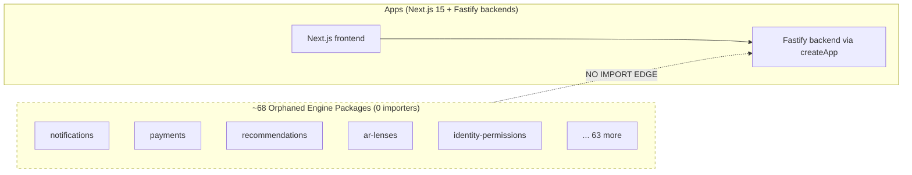
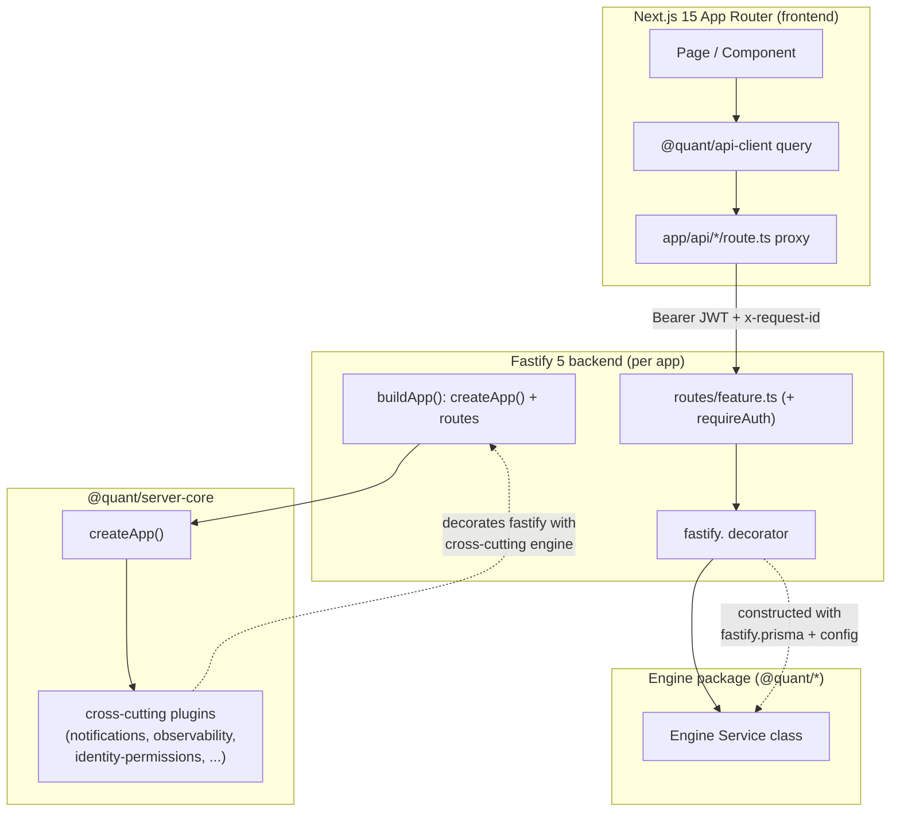
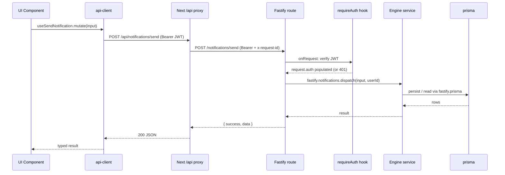
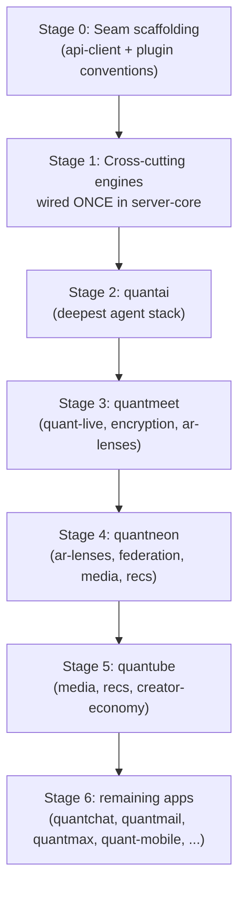

# Design Document: Engine Integration Wiring

## Overview

The Quant-Ecosystem is a TypeScript pnpm/Turborepo monorepo (17 apps, ~90 packages, 8 services) that was "assembled from individually-plausible parts that were never connected." Approximately **68 engine packages are real, production-quality code with zero importers** — they compile and unit-test green but no app actually consumes them at runtime. This feature wires those orphaned engines into their intended target apps so the ecosystem becomes a single connected product.

The runtime foundation this work depends on is already in place (Phase 83): `@quant/server-core` `createApp()` decorates `fastify.prisma` (via `plugins/prisma.ts`), defines and globally enforces `requireAuth` (via `plugins/auth.ts`), and the previously-dead frontends now declare `next@15`. This design therefore assumes a working Fastify-5-via-`createApp()` backend and a Next.js-15-App-Router frontend proxy as the substrate.

This is overwhelmingly **wiring + integration-seam work, not rewrites**. The core deliverable is a single, repeatable _integration seam pattern_ (engine → `server-core` plugin/decorator → Fastify route → Next.js API proxy → `api-client` query) applied 68 times, sequenced **cross-cutting-first** so shared engines are wired once in `server-core` before per-app feature engines are wired deepest-first. Each wiring is governed by an explicit, machine-checkable Definition of Done.

## Goals and Non-Goals

### Goals

- Define **one canonical wiring seam** that every engine integration follows, using the existing `prisma.ts` plugin as the reference template.
- Wire **cross-cutting engines once** through `server-core` so all apps inherit them.
- Wire **per-app feature engines** into their target apps, deepest-first.
- Provide a **categorization of all 68 engines** (cross-cutting vs per-app) with a concrete dependency/sequencing order.
- Define a **per-engine Definition of Done (DoD)** that proves a wiring is real (importer exists, route reachable, frontend consumes it, test covers the seam).

### Non-Goals (Out of Scope)

- **Replacing the 39 `@simulated` cores** (LLM pilots, ML pipeline, SFU, CSAM, search). Wiring an engine that internally calls a simulated core is in scope; de-simulating that core is a separate effort (roadmap Phase 90).
- **Killing the 27 mock-data screens** (`mock-debt.csv`). Related but separate (Phase 87); a wired engine may still be displayed by a screen that later needs its fixtures removed.
- **Deployability** — Dockerfiles, Helm charts, CI deploy matrix, Prisma migrations (Phase 84).
- **The deferred thin scaffolds**: `service-discovery`, `co-presence`, `universal-capture`, `voice-input`, `quant-flow`. Not real enough to wire yet.
- Net-new product features, schema redesigns, or engine rewrites.

## Architecture

### Current state (the problem)



The engines exist as islands. CI is green because unit tests exercise the engines in isolation and never traverse the runtime seam.

### Target state (the seam closed)



### Two wiring lanes

| Lane                | Where the seam lives                                                                             | Wired how often                  | Examples                                                                                                                                                                                         |
| ------------------- | ------------------------------------------------------------------------------------------------ | -------------------------------- | ------------------------------------------------------------------------------------------------------------------------------------------------------------------------------------------------ |
| **Cross-cutting**   | `@quant/server-core` plugins, registered in `createApp()`                                        | **Once** — every app inherits it | notifications, observability, performance, error-monitoring, identity-permissions, teams, api-client, command-palette, onboarding, contextual-sidekick, universal-timeline, wellbeing, bharat-ai |
| **Per-app feature** | The target app's `backend/app.ts` (decorator) + `backend/routes/*` + Next proxy + frontend query | **Per target app**               | payments, agent-runtime, ar-lenses, encryption, federation, recommendations, quant-live, media, creator-economy, ...                                                                             |

The two lanes use the _same_ mechanical seam (decorate → route → proxy → query); they differ only in whether the decoration happens in `server-core` (shared) or in the app's `buildApp()` (local).

## The Standard Integration Seam Pattern

This is the reference pattern every engine wiring follows. It has five layers. The canonical template is the existing Prisma plugin (`packages/server-core/src/plugins/prisma.ts`): decorate the instance, register in the factory, declare the type via module augmentation, clean up on close.

### Layer 1 — Engine package (already exists, do not rewrite)

Engines are barrel-exported service classes (e.g., `@quant/notifications` exports `NotificationFanout`, `PreferenceService`, `CrossAppDispatcher`). The package's `package.json` `name` is the import specifier. **No change** beyond possibly adding the engine to the consumer's `dependencies` as `workspace:*`.

### Layer 2 — The decorator/plugin (the heart of the seam)

A `fastify-plugin` constructs the engine's service(s) — injecting `fastify.prisma` and config — and decorates the instance, exactly mirroring `prisma.ts`.

**Cross-cutting engine** → plugin lives in `packages/server-core/src/plugins/<engine>.ts` and is registered inside `createApp()` (after `prismaPlugin`, so `fastify.prisma` is available):

```typescript
// packages/server-core/src/plugins/notifications.ts  (cross-cutting lane)
import fp from 'fastify-plugin';
import type { FastifyInstance } from 'fastify';
import { NotificationFanout, PreferenceService } from '@quant/notifications';

declare module 'fastify' {
  interface FastifyInstance {
    notifications: NotificationFanout;
  }
}

async function notificationsPlugin(fastify: FastifyInstance) {
  // prismaPlugin must be registered first so fastify.prisma is defined
  const preferences = new PreferenceService(fastify.prisma);
  const fanout = new NotificationFanout(preferences, { logger: fastify.log });
  fastify.decorate('notifications', fanout);
  fastify.addHook('onClose', async () => {
    await fanout.shutdown?.();
  });
}

export default fp(notificationsPlugin, { name: 'notifications', dependencies: ['prisma'] });
```

**Per-app feature engine** → decoration happens in the app's `buildApp()` (same shape, local scope):

```typescript
// apps/quantai/backend/app.ts  (per-app lane, excerpt)
import { AgentRuntime } from '@quant/agent-runtime';

export async function buildApp(config?: AppConfig) {
  const app = await createApp(config ?? getConfig());          // prisma + auth already wired
  app.decorate('agentRuntime', new AgentRuntime({ prisma: app.prisma, ai: /* @quant/ai */ }));
  await app.register(agentRuntimeRoutes, { prefix: '/agents' });
  return app;
}
```

### Layer 3 — Fastify route (surface the engine over HTTP)

Routes consume the decorated engine and are protected by the global auth hook (and optional scope checks). `createApp()` already enforces `requireAuth` on every non-public path, so routes simply read `request.auth`.

```typescript
// apps/<app>/backend/routes/<feature>.ts
import type { FastifyInstance } from 'fastify';
import { z } from 'zod';

export default async function featureRoutes(fastify: FastifyInstance) {
  fastify.post(
    '/send',
    {
      preHandler: fastify.requireAuth({ scopes: ['notifications:write'] }), // optional fine-grained scope
      schema: { body: SendSchema },
    },
    async (request) => {
      const result = await fastify.notifications.dispatch({
        ...request.body,
        userId: request.auth.userId,
      });
      return { success: true, data: result };
    },
  );
}
```

### Layer 4 — Next.js API proxy (bridge frontend → backend)

A Next App Router route handler forwards the request to the matching Fastify backend, propagating the `Authorization` bearer and `x-request-id`. The backend URL comes from a single env var whose default equals the backend's `PORT`.

```typescript
// apps/<app>/src/app/api/<feature>/route.ts
import { NextRequest, NextResponse } from 'next/server';

const BACKEND = process.env.NEXT_PUBLIC_ < APP > _BACKEND_URL ?? 'http://localhost:<backendPort>';

export async function POST(req: NextRequest) {
  const res = await fetch(`${BACKEND}/<feature>/send`, {
    method: 'POST',
    headers: {
      'content-type': 'application/json',
      authorization: req.headers.get('authorization') ?? '',
      'x-request-id': req.headers.get('x-request-id') ?? crypto.randomUUID(),
    },
    body: await req.text(),
  });
  return new NextResponse(await res.text(), {
    status: res.status,
    headers: { 'content-type': 'application/json' },
  });
}
```

### Layer 5 — Frontend consumption (`@quant/api-client`)

The UI calls the engine through a typed `api-client` query/mutation — never `fetch` inline — so the import edge from frontend → engine-backed endpoint is explicit and testable.

```typescript
// apps/<app>/src/features/<feature>/use<Feature>.ts
import { useApiMutation } from '@quant/api-client';

export function useSendNotification() {
  return useApiMutation<SendInput, SendResult>('/api/notifications/send');
}
```

### Seam sequence (one request, end to end)



## Definition of Done (per engine)

A wiring is **only "done"** when all four seam invariants hold and are evidenced by a check. This is the acceptance gate the requirements and tasks phases will enforce.

| #         | Invariant                                                                                                                 | How it is proven (automatable check)                                                                                                                       |
| --------- | ------------------------------------------------------------------------------------------------------------------------- | ---------------------------------------------------------------------------------------------------------------------------------------------------------- |
| **DoD-1** | **Importer exists** — at least one app/`server-core` module statically imports the engine's package specifier.            | Grep/import-graph: `@quant/<engine>` appears in a non-test `.ts` under `apps/**` or `packages/server-core/**`; engine is in the consumer's `dependencies`. |
| **DoD-2** | **Route reachable** — an authenticated HTTP route backed by the engine responds 2xx with a valid JWT and 401 without one. | Integration test against `buildApp()` (inject): `inject({ method, url, headers: { authorization } })` → 2xx; same without header → 401.                    |
| **DoD-3** | **Frontend consumes it** — a Next `app/api/*` proxy forwards to that route and a UI surface calls it via `api-client`.    | Proxy route file exists for the feature; `api-client` hook references the proxy path; frontend build passes.                                               |
| **DoD-4** | **Test covers the seam** — a test traverses proxy→route→engine (not just the engine in isolation).                        | A seam test exists that exercises the route with the engine decorated (real or test double of external I/O only).                                          |

"Real enough to wire" gate (entry condition): the engine exports a constructible service whose dependencies are `prisma`/config/other wired engines (not an unbuilt external). Engines failing this (the five thin scaffolds) are deferred.

## Sequencing Strategy: Cross-Cutting First, Then Per-App Deepest-First



**Rationale:**

1. **Cross-cutting first** — engines every app needs (notifications, observability, performance, error-monitoring, identity-permissions, api-client) are wired once into `server-core`. Every app then inherits them through `createApp()`, eliminating N× duplicate work and giving later per-app wirings a consistent, observable, authorized substrate.
2. **Deepest-first per app** — `quantai` has the largest, most interdependent engine stack (agent-runtime, agent-swarm, quant-tools, browser-agent, code-agent), so wiring it first surfaces the hardest seam issues early and establishes patterns the shallower apps reuse.
3. **Dependency-honoring** — identity-permissions (RBAC) and teams extend the auth substrate, so they precede any per-app engine that needs fine-grained scopes; api-client precedes all frontend consumption.

## Engine Categorization (the 68 engines)

### Category A — Cross-cutting (wired once in `server-core`)

Wired as `server-core` plugins registered in `createApp()`; inherited by all apps.

| Engine                      | Seam role                                | Notes / dependency order                                                                           |
| --------------------------- | ---------------------------------------- | -------------------------------------------------------------------------------------------------- |
| api-client                  | Frontend consumption substrate (Layer 5) | **First** — all frontend wiring depends on it                                                      |
| identity-permissions (RBAC) | Extends auth: scope/permission checks    | Before any scoped per-app route                                                                    |
| teams                       | Multi-actor authz context                | After identity-permissions                                                                         |
| observability               | `onRequest`/`onResponse` tracing+metrics | Plugin already exists (`plugins/observability.ts`), **registered? NO** — register in `createApp()` |
| performance                 | Timing/budget instrumentation            | Cross-cutting hook                                                                                 |
| error-monitoring            | Error capture → Sentry-style sink        | Hook into `error-handler` plugin                                                                   |
| notifications               | `fastify.notifications` decorator        | Depends on `prisma`                                                                                |
| onboarding                  | First-run flow surface                   | All apps                                                                                           |
| command-palette             | Global action surface                    | All apps (frontend-led)                                                                            |
| contextual-sidekick         | In-app assistant surface                 | All apps                                                                                           |
| universal-timeline          | Cross-app activity surface               | All apps                                                                                           |
| wellbeing                   | Usage/wellbeing controls                 | All apps                                                                                           |
| bharat-ai                   | Localization/India-market layer          | All apps                                                                                           |

> Note: `plugins/observability.ts`, `plugins/feature-flags.ts`, `plugins/audit.ts`, and `plugins/organizations.ts` already exist in `server-core` but are **not registered** in `createApp()`. Registering them is part of the cross-cutting lane (a decorate-already-written, register-now case).

### Category B — Per-app feature engines (wired into target app[s])

| Engine                                                                                  | Target app(s)                                  | Stage        |
| --------------------------------------------------------------------------------------- | ---------------------------------------------- | ------------ |
| agent-runtime, agent-swarm, quant-tools, browser-agent, code-agent, user-owned-ai       | quantai                                        | 2            |
| quant-live (voice)                                                                      | quantmeet, quantai                             | 2–3          |
| encryption (E2EE)                                                                       | quantchat, quantmail, quantmeet                | 3            |
| ar-lenses                                                                               | quantneon, quantchat, quantmeet                | 3–4          |
| federation                                                                              | quantneon, quantchat, quantmail                | 4            |
| recommendations + ranking + ml-pipeline + ml-runtime + triton-client                    | quantube, quantneon, quantmax (feeds)          | 4–5          |
| media, generative-media, photos, cross-publish                                          | quantube, quantedits, quantneon                | 4–5          |
| creator-economy                                                                         | quantube, quantneon                            | 5            |
| payments (real Stripe)                                                                  | quant-commerce, creator-economy, all paid apps | per paid app |
| maps, quant-health, device-control, iot-control, wearables, voice-first-os, local-first | quant-mobile                                   | 6            |

> The category lists above name the engines explicitly called out in the integration audit (§3). The requirements/tasks phases will enumerate the full 68-row table by reconciling `@quant/*` packages against import-graph evidence; any engine that does not yet expose a constructible service is routed to the **Deferred** set below rather than forced into a lane.

### Deferred (not wired in this feature)

`service-discovery`, `co-presence`, `universal-capture`, `voice-input`, `quant-flow` — thin scaffolds; revisit when a host app concretely needs them.

## Components and Interfaces

### Component 1: Cross-cutting engine plugin (`server-core`)

**Purpose**: Construct a shared engine once and decorate every Fastify instance via `createApp()`.

**Interface** (the convention every cross-cutting plugin satisfies):

```typescript
import fp from 'fastify-plugin';
import type { FastifyInstance } from 'fastify';

// 1. Augment the instance type (mirrors prisma.ts / auth.ts)
declare module 'fastify' {
  interface FastifyInstance {
    /* <engine>: EngineService */
  }
}

// 2. Plugin declares dependencies so registration order is enforced
export default fp(
  async (fastify: FastifyInstance) => {
    // construct with fastify.prisma + env config; decorate; onClose cleanup
  },
  { name: '<engine>', dependencies: ['prisma'] },
);
```

**Responsibilities**: build engine services, decorate instance, register cleanup, declare `dependencies` for ordering. Registered in `createApp()` after `prismaPlugin` and `authPlugin`.

### Component 2: Per-app engine binding (`apps/<app>/backend/app.ts`)

**Purpose**: Decorate the app instance with a feature engine and register its routes.

**Interface**:

```typescript
export async function buildApp(config?: AppConfig): Promise<FastifyInstance> {
  const app = await createApp(config ?? getConfig()); // inherits prisma, auth, cross-cutting engines
  app.decorate('<engine>', constructEngine(app));
  await app.register(<engine>Routes, { prefix: '/<feature>' });
  return app;
}
```

**Responsibilities**: own the engine lifecycle for that app, register feature routes, keep the global auth hook intact.

### Component 3: Feature route module (`apps/<app>/backend/routes/<feature>.ts`)

**Purpose**: Expose engine capabilities over authenticated HTTP with Zod schemas.

**Responsibilities**: validate input (Zod), call the decorated engine, return the standard `{ success, data | error }` envelope, attach `requireAuth({ scopes })` where fine-grained authz is needed.

### Component 4: Next.js API proxy (`apps/<app>/src/app/api/<feature>/route.ts`)

**Purpose**: Forward frontend requests to the matching backend, propagating auth + request id.

**Responsibilities**: read `NEXT_PUBLIC_<APP>_BACKEND_URL` (default = backend `PORT`), pass through `authorization` + `x-request-id`, relay status and body verbatim.

### Component 5: Frontend query hook (`@quant/api-client`)

**Purpose**: Typed, cache-aware access to the proxied endpoint.

**Responsibilities**: expose `useApiQuery`/`useApiMutation` against the proxy path; surface typed request/response; be the _only_ call path from UI to engine.

## Data Models

This feature introduces **no new persistent schema**; it wires existing engine models to existing routes. The data structures below are integration-time contracts (the seam metadata that the DoD checks and tasks operate on).

```typescript
type WiringLane = 'cross-cutting' | 'per-app';

interface EngineWiring {
  engine: string; // package specifier, e.g. "@quant/notifications"
  lane: WiringLane;
  targets: string[]; // app dirs, or ["server-core"] for cross-cutting
  stage: number; // sequencing stage 0..6
  dependsOn: string[]; // other engines/plugins that must be wired first
  status: 'deferred' | 'pending' | 'decorated' | 'routed' | 'proxied' | 'done';
}

interface SeamArtifacts {
  // the files a complete wiring produces/edits
  pluginOrDecorator: string; // server-core plugin path OR app buildApp() edit
  routeModule: string; // apps/<app>/backend/routes/<feature>.ts
  proxyRoute: string; // apps/<app>/src/app/api/<feature>/route.ts
  clientHook: string; // api-client hook path
  seamTest: string; // integration test path
}

interface DoDResult {
  // computed evidence per engine
  importerExists: boolean; // DoD-1
  routeReachableAuthed: boolean; // DoD-2 (2xx with JWT)
  routeRejectsUnauthed: boolean; // DoD-2 (401 without JWT)
  frontendConsumes: boolean; // DoD-3
  seamTested: boolean; // DoD-4
}
```

**Validation rules:**

- A `cross-cutting` wiring MUST have `targets === ['server-core']` and be registered in `createApp()`.
- A `per-app` wiring MUST list at least one app dir in `targets`.
- `status: 'done'` requires every `DoDResult` field `true`.
- An engine MUST NOT depend on a thin-scaffold (deferred) engine; if it does, it is itself deferred.

## Correctness Properties

- **P1 — No orphan after done**: For every engine with `status: 'done'`, `DoD-1` holds (a non-test importer exists). Formally: `∀ e. done(e) ⟹ ∃ module ∈ (apps ∪ server-core). imports(module, e)`.
- **P2 — Auth invariant preserved**: For every engine-backed route `r` (excluding the public allowlist), an unauthenticated request yields 401 and an authenticated request reaches the engine. `∀ r ∉ PUBLIC_PATHS. noJwt(r) → 401 ∧ validJwt(r) → reachesEngine(r)`.
- **P3 — Cross-cutting wired once**: For every cross-cutting engine, exactly one registration site exists (in `createApp()`), and no app re-registers it. `∀ e ∈ A. |registrations(e)| == 1 ∧ site(e) == createApp`.
- **P4 — Dependency ordering**: A plugin/decorator is registered only after all entries in its `dependsOn` are registered (e.g., every engine decorator runs after `prisma`). `∀ e. ∀ d ∈ dependsOn(e). registeredBefore(d, e)`.
- **P5 — Frontend path uniqueness**: Each frontend feature reaches its engine through exactly one `api-client` → proxy → route chain (no inline `fetch`, no duplicate proxy).
- **P6 — Idempotent inheritance**: Wiring a cross-cutting engine in `server-core` does not require edits to apps that already call `createApp()`; they inherit it automatically.
- **P7 — Scope safety**: A route declaring `requireAuth({ scopes })` rejects a valid JWT lacking those scopes with 403 (consistent with `auth.ts`).

## Error Handling

| Scenario                  | Condition                                        | Response                                                                                   | Recovery                                                                    |
| ------------------------- | ------------------------------------------------ | ------------------------------------------------------------------------------------------ | --------------------------------------------------------------------------- |
| Engine missing dependency | Plugin constructs before `prisma`/dep registered | `createApp()`/`buildApp()` throws at boot (fail fast)                                      | `dependencies: ['prisma']` on `fp()` enforces order; fix registration order |
| Unauthenticated request   | No/invalid Bearer on protected route             | 401 `{ success:false, error:{ code:'UNAUTHORIZED' } }` (from `auth.ts`)                    | Client refreshes token via QuantMail OAuth2                                 |
| Insufficient scope        | Valid JWT lacks required scope                   | 403 `{ code:'FORBIDDEN' }`                                                                 | Request elevated scope; identity-permissions governs grant                  |
| Engine internal failure   | Engine throws (incl. simulated-core failure)     | Mapped to standard error envelope via `error-handler` plugin; captured by error-monitoring | Retry/backoff for transient; surfaced to observability                      |
| Proxy target unreachable  | Backend down / wrong `*_BACKEND_URL`             | Proxy returns 502; logged with `x-request-id`                                              | Correct env default (= backend `PORT`); health check                        |
| Engine not yet "real"     | Service not constructible (thin scaffold)        | Not wired; `status: 'deferred'`                                                            | Revisit when host app needs it                                              |

## Testing Strategy

### Unit testing

Engines already have unit tests (kept as-is). New unit tests cover **plugin/decorator construction**: given a fake `prisma`, the plugin decorates the instance with a usable service and registers `onClose`.

### Seam / integration testing (the new emphasis — DoD-2 & DoD-4)

Use Fastify `inject()` against `buildApp()` to traverse route → decorated engine without a network:

- **Authed happy path**: valid JWT → 2xx and engine invoked (assert via spy on the engine's external I/O boundary only; internal logic stays real).
- **Unauthed path**: missing/invalid JWT → 401.
- **Scope path**: valid JWT missing scope → 403.
- **Cross-cutting inheritance**: an app that only calls `createApp()` exposes the cross-cutting capability without local registration (proves P6).

**Property-based testing**: For the DoD evaluator and `EngineWiring` state machine, use **fast-check** (TS ecosystem standard) to assert P1/P3/P4 over generated wiring sets (e.g., random `dependsOn` graphs never produce a `done` engine registered before its dependency).

### Frontend testing (DoD-3)

- Proxy route unit test: forwards method/body, propagates `authorization` + `x-request-id`, relays status.
- `api-client` hook test against a mocked proxy; assert the UI surface uses the hook (no inline `fetch`).

### Static / import-graph checks (DoD-1)

A repo-level check (script or test) asserts each `done` engine has a non-test importer and is listed in the consumer's `dependencies`.

## Performance Considerations

- Cross-cutting plugins run in request hooks (`onRequest`/`onResponse`); keep them allocation-light (the existing `observability.ts` records duration via `performance.now()` and adds metrics — model new hooks on it).
- Engine services are constructed **once at boot** (decorated singletons), not per-request, avoiding per-call construction cost.
- OTel is import-gated behind `OTEL_EXPORTER_OTLP_ENDPOINT` so observability adds ~zero overhead when disabled.
- Proxy hops add one network round-trip per request; co-locate backend ports and reuse keep-alive where possible.

## Security Considerations

- The global `onRequest` auth hook in `createApp()` already enforces JWT verification on all non-public paths; wiring MUST NOT bypass it (no new public allowlist entries without review).
- `identity-permissions` (RBAC) and `requireAuth({ scopes })` govern fine-grained access; engine routes default to authenticated and add scopes where the engine is sensitive (payments, identity, federation).
- `encryption` (E2EE) wiring for quantchat/quantmail/quantmeet must keep key material client-side; the seam transports ciphertext only.
- `payments` requires live Stripe keys + webhook signature verification handled via secrets vault (procurement is out of scope here, but the seam must read keys from config, never hardcode).
- Propagate `x-request-id` through the proxy so error-monitoring/observability can correlate across the seam.

## Dependencies

- **Runtime foundation (Phase 83, done)**: `server-core` `createApp()` with `prisma` + `auth` plugins; frontends declaring `next@15`.
- **`@quant/server-core`** — host of cross-cutting plugins and `createApp()`.
- **`@quant/database`** (prisma singleton) — injected into engine services.
- **`@quant/api-client`** — must itself be wired first (Stage 0/1) as the frontend substrate.
- **`@quant/common`**, **`@quant/auth`** — shared types (`AuthContext`, `PermissionScope`, `QuantApp`).
- **`fastify-plugin`**, **Fastify 5**, **Next.js 15 App Router**, **Zod**, **fast-check** (property tests).
- Per-engine third-party deps already declared in each engine's `package.json` (e.g., `firebase-admin`/`web-push` for notifications, `stripe` for payments).

## Open Questions (to resolve in Requirements)

1. Should cross-cutting frontend surfaces (command-palette, contextual-sidekick, universal-timeline) ship as a shared layout wrapper in `shared-ui`, or be wired per-app?
2. For multi-target engines (encryption, ar-lenses, federation), is one shared decorator acceptable, or does each app need app-specific config?
3. Does `payments` wiring block on real Stripe keys (Phase 90 procurement), or can it be wired against Stripe test mode now to satisfy DoD without live keys?
