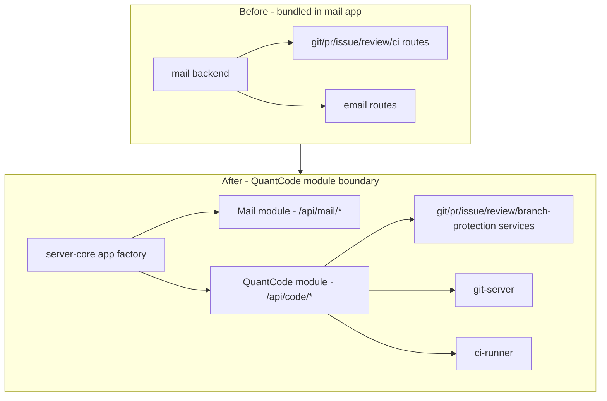
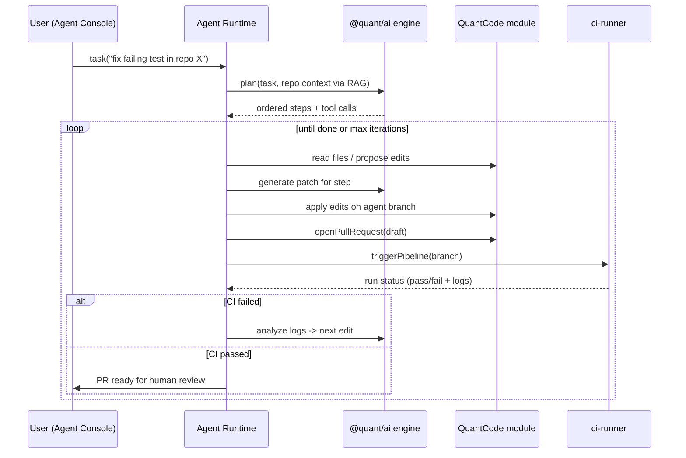
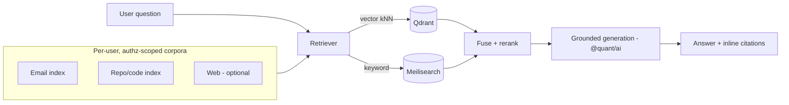
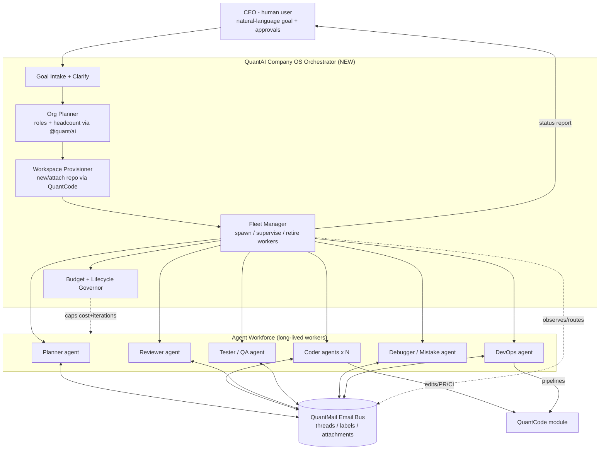
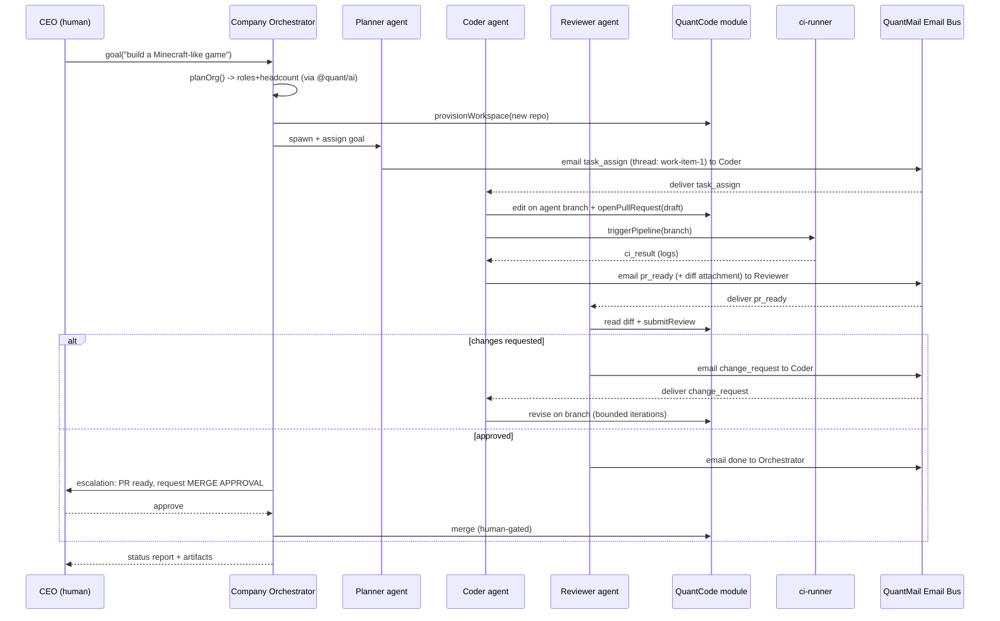
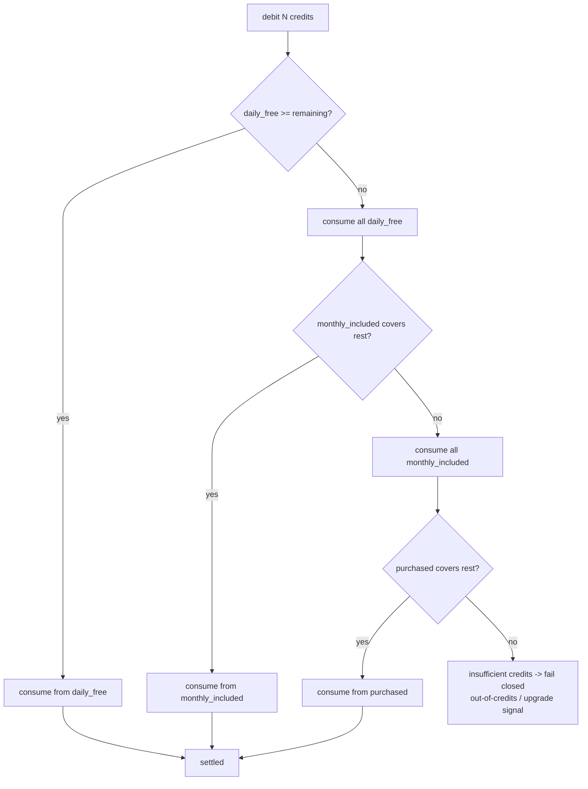
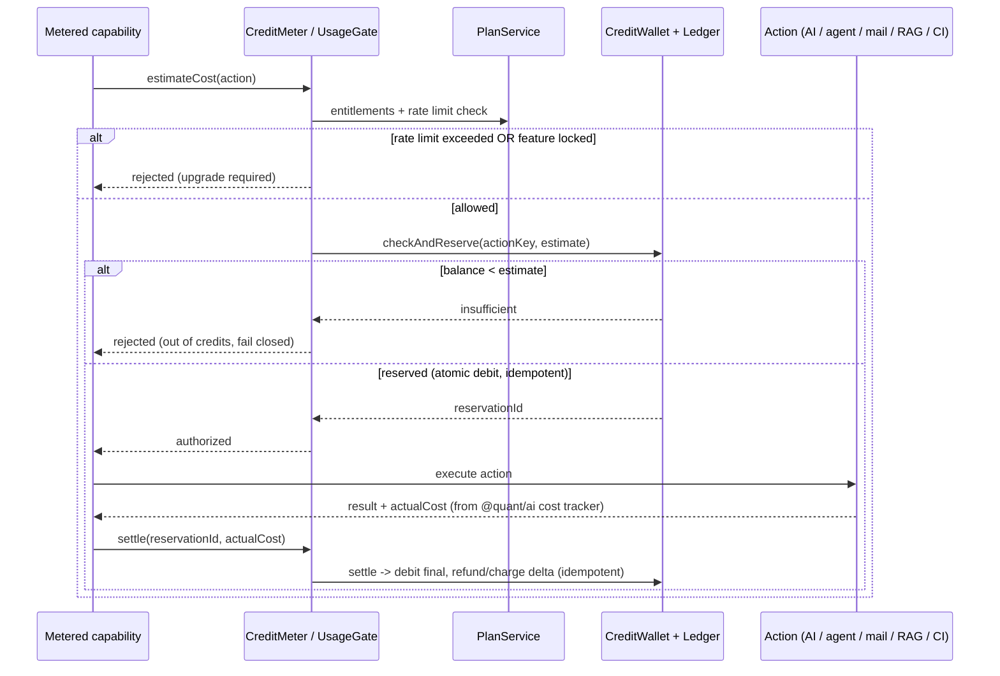
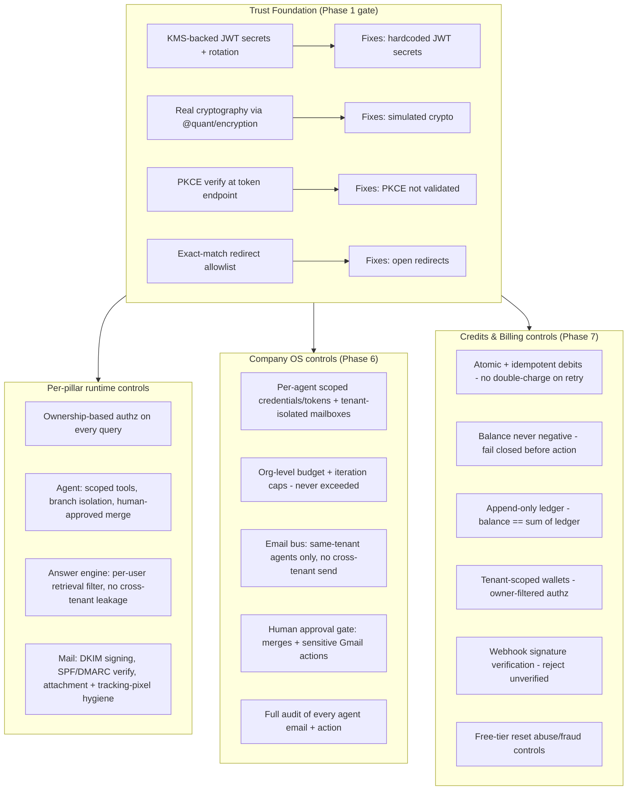
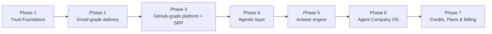

# Design Document: QuantMail SuperHub

## Overview

QuantMail is already the most-built and most central application in the Quant Ecosystem: it is the OAuth2/identity provider for every other app, it ships 14 App-Router pages, 36 API routes, 33 backend services (~17 of them AI services), and 36 test files, sitting at roughly 70% completeness on a real Prisma-backed Fastify backend. This design evolves that existing app into a single unified **SuperHub** organized around four product pillars — **Gmail** (full email + real delivery), **GitHub** (a developer platform), **Claude Code / Codex** (a repo-aware autonomous coding agent), and **Perplexity** (a cited, RAG-grounded answer engine).

The guiding principle is **build on what exists, do not rewrite**. The frontend is already on a single Next.js 15 App Router with proxy API routes into a Fastify backend assembled from `@quant/server-core`; the AI layer (`@quant/ai`) is already a real Vercel AI SDK engine with OpenAI/Anthropic/Google adapters, circuit breakers, retry, semantic cache, a safety pipeline, and a cost tracker. The work is therefore mostly about (a) closing the trust/security gap, (b) replacing simulation fallbacks and missing pipelines with production-grade implementations, (c) untangling the Git/CI concern from the email app to respect the Single Responsibility Principle, and (d) layering the agentic and answer-engine pillars on top of the now-trustworthy foundation.

On top of those four pillars this design adds a fifth, integrative capability — the **Agent Workforce / Company OS orchestration layer**. Where the four pillars are *capabilities*, the Company OS is the *operating model* that wires them together into an autonomous software company. The human user is the **CEO**: they state a high-level goal in natural language ("build a Minecraft-like game", "modernize this repo", "run my inbox"), and **QuantAI** — the ecosystem AI hub acting as the orchestrator or "company brain" — autonomously decides what work is needed, designs an org of specialized AI agent **roles** (planners, coders, reviewers, testers, debuggers, upgraders, devops), provisions a workspace (a fresh or attached repo via the QuantCode module), and deploys a fleet of long-lived agent workers. Each agent has its own QuantMail **mailbox identity**, and the agents coordinate **by sending each other email** — QuantMail's existing threads/labels/attachments become the agent message bus, so the email pillar does double duty for human and machine correspondence. The same orchestrator can also act as an **autonomous Gmail handler** for the CEO's real inbox under explicit approval guardrails. The strategic intent is a Meta-like company whose employees are agents and whose substrate is QuantMail — so that IT teams depend on QuantMail rather than on a standalone coding agent.

This layer is deliberately **additive and incremental**: it introduces no greenfield platform, reusing `@quant/ai` for planning/model-routing, the QuantCode module for repos/PRs/CI, the email pipelines for the agent bus, the agent loop for execution, and the answer engine for grounding. It ships last, as Phase 6, only after the foundations it stands on are real.

This document is a **high-level (Diagrams & Interfaces) design**: it provides system diagrams, a component breakdown per pillar, the orchestration layer, data models, integration points, a consolidated security model, and a six-phase rollout. It deliberately stops short of application code. Where interface contracts are shown, they use language-agnostic pseudocode because no implementation language change is being proposed — the codebase is and remains TypeScript.

> **Scope guard:** This design does **not** touch QuantChat, which is owned by another agent. Any cross-app concern (shared auth, shared search, shared AI engine) is referenced only at the package boundary the two apps already share.

---

## Architecture

### Current vs Target topology

QuantMail today bundles four concerns into one deployable. The target keeps a single user-facing SuperHub front door but separates the **QuantCode** developer-platform domain behind a clean service boundary, and adds two new domains (the **Agent** runtime and the **Answer Engine**) as first-class modules that reuse the existing AI engine and data plane.

```mermaid
graph TD
    subgraph Client["SuperHub Frontend - Next.js 15 App Router (existing)"]
        MailUI[Mail / Compose / Thread / Search]
        CodeUI[Repos / Pull Requests / Issues / Pipelines]
        AgentUI[Agent Console - NEW]
        AskUI[Ask / Answer Engine - NEW]
        CeoUI[CEO Console + Org/Model Picker - NEW Phase 6]
    end

    subgraph Proxy["Next API Proxy Routes (existing pattern)"]
        NP[/app/api/* -> backend/]
    end

    subgraph Backend["QuantMail Fastify Backend (@quant/server-core)"]
        direction TB
        Orchestrator[Company OS Orchestrator - NEW Phase 6<br/>QuantAI Company Brain<br/>goal -> org plan -> provision -> spawn -> supervise]
        Identity[Identity & OAuth2 Pillar<br/>auth.ts / oauth.ts]
        MailDomain[Mail Domain<br/>email/thread/folder/contact services<br/>+ Agent Email Bus - NEW]
        CodeDomain[QuantCode Domain<br/>git/pr/issue/review/branch-protection<br/>SRP-extracted module]
        AgentDomain[Agent Runtime<br/>plan -> edit -> PR -> CI -> iterate]
        AnswerDomain[Answer Engine<br/>retrieve -> ground -> cite]
        InboxAuto[Autonomous Gmail Handler - NEW Phase 6<br/>triage/draft/reply under guardrails]
    end

    subgraph Shared["Shared Packages (existing)"]
        AIeng[@quant/ai - real LLM engine]
        Sec[@quant/security / security-advanced]
        Enc[@quant/encryption]
        Q[@quant/queue - BullMQ]
        Obs[@quant/observability - OTel]
    end

    subgraph Services["Infra Services (existing, to be wired)"]
        SMTPin[smtp-inbound]
        SMTPout[smtp-outbound - NEW/derived]
        Git[git-server]
        CI[ci-runner]
        Idx[search-indexer]
        CDC[cdc-relay]
    end

    subgraph Data["Data Plane (existing)"]
        PG[(PostgreSQL + pgvector)]
        Redis[(Redis / BullMQ)]
        Kafka[Kafka CDC]
        Meili[Meilisearch]
        Qdrant[Qdrant]
    end

    Client --> Proxy --> Backend
    Identity --> Sec
    Orchestrator --> AIeng
    Orchestrator --> CodeDomain
    Orchestrator --> AgentDomain
    Orchestrator --> MailDomain
    Orchestrator --> InboxAuto
    InboxAuto --> MailDomain
    MailDomain --> SMTPin
    MailDomain --> SMTPout
    CodeDomain --> Git
    CodeDomain --> CI
    AgentDomain --> AIeng
    AgentDomain --> CodeDomain
    AnswerDomain --> AIeng
    AnswerDomain --> Qdrant
    Backend --> AIeng
    Backend --> Data
    Services --> Data
    CDC --> Kafka --> Idx --> Meili
    Idx --> Qdrant
```

### Pillar interaction model

The four pillars are not silos: the Agent pillar drives the Code pillar, the Answer Engine indexes Mail + Code, and all of them share the Identity pillar for authz and the AI engine for inference.

```mermaid
graph LR
    Identity[Identity & OAuth2] --> Mail
    Identity --> Code
    Identity --> Agent
    Identity --> Answer
    Mail[Gmail Pillar] -->|emails as RAG corpus| Answer[Perplexity Pillar]
    Code[GitHub Pillar] -->|repos as RAG corpus| Answer
    Code -->|repo tools| Agent[Claude Code Pillar]
    Agent -->|opens PR, triggers CI| Code
    Answer -->|grounded answers| Mail
    Company[Company OS Orchestrator] -->|plans org| AIengine
    Company -->|provisions repo| Code
    Company -->|spawns workers running| Agent
    Company -->|agent message bus| Mail
    Company -->|grounding context| Answer
    AIengine[(@quant/ai engine)] --- Mail
    AIengine --- Code
    AIengine --- Agent
    AIengine --- Answer
```

### Architectural decisions

- **AD-1 — Single deployable, modular domains.** Keep QuantMail as one Next.js + Fastify deployable (preserving the SSO front door and the existing proxy pattern), but enforce module boundaries inside the backend so QuantCode, Agent, and Answer are independently testable and independently extractable later.
- **AD-2 — SRP for the developer platform.** The Git/PR/Issue/Review/CI concern is moved out of "mail" into a self-contained **QuantCode** domain module with its own service namespace and route prefix (`/api/code/*`), backed by the existing `git-server` and `ci-runner` infra services. The email domain must not import code-platform services and vice versa.
- **AD-3 — Reuse the real AI engine.** `@quant/ai` already performs real inference; the per-feature `ai-*.service.ts` files already call `this.ai.infer()`. The fix is configuration and fallback policy (see Phase 1), not a new engine.
- **AD-4 — Delivery is a pipeline, not a flag.** Today `EmailService.send()` only flips `isDraft`/`isSent` flags. Real outbound delivery becomes a queued pipeline (BullMQ) that signs (DKIM), resolves MX, and tracks delivery state; inbound reuses the `smtp-inbound` service.
- **AD-5 — Security is the gate, not a phase add-on.** No new pillar ships before the 17 critical vulnerabilities and simulated cryptography are resolved (Phase 1 is a hard gate).
- **AD-6 — The Company OS is orchestration, not a new engine.** The Agent Workforce layer is a thin orchestrator over existing assets: it uses `@quant/ai` for org planning and per-role model routing, the QuantCode module for repo/PR/CI, the mail domain for the agent message bus, and the Agent Runtime (Pillar 3) for execution. An `AgentWorker` is a long-lived supervised entity that *runs* `AgentSession`s; it adds no parallel coding engine.
- **AD-7 — Email is the agent message bus.** Agent-to-agent coordination travels over real QuantMail email (threads, labels, attachments), not a bespoke RPC channel. This exercises and showcases the mail pillar, gives every handoff a durable audit trail, and makes human and agent comms first-class in the same inbox model — distinguished by structured headers/labels and per-agent mailbox identities.
- **AD-8 — Agents are tenant-scoped identities.** Every agent is a scoped QuantMail identity with its own mailbox and OAuth scope, derived from (and isolated within) the CEO's tenant. Agent credentials can never read another user's mail or repos; cross-tenant authz is enforced at the same ownership-filter layer the pillars already use.

---

## Components and Interfaces

### Pillar 1 — Gmail (Email client + real delivery)

**Purpose:** Turn the existing email client (compose, threads, folders, labels, search, contacts, drafts, AI compose/reply/summarize) into a real mail system with genuine inbound and outbound SMTP, authenticated by SPF/DKIM/DMARC, with deliverability tracking.

**Builds on (existing):** `email.service.ts`, `thread.service.ts`, `folder.service.ts`, `contact.service.ts`, `attachment.service.ts`, `email-aliases.service.ts`, `disposable-email.service.ts`, `smart-send-time.service.ts`, `undo-send.service.ts`, `tracking-pixel-stripper.service.ts`, `pgp-encryption.service.ts`, AI services (`ai-compose`, `ai-reply`, `ai-summarize`, `ai-triage`, `ai-tone-shift`, `ai-followup`, `ai-meeting-extract`, `ai-attachment-summary`, `ai-unsubscribe`, `ai-style-learner`), routes `emails.ts`/`threads.ts`/`folders.ts`/`labels.ts`/`attachments.ts`/`contacts.ts`/`ai.ts`/`e2ee.ts`/`federation.ts`, and the `smtp-inbound` infra service.

**New components:**
- **OutboundDeliveryPipeline** — queued sender that DKIM-signs, resolves recipient MX, performs SMTP delivery, and records per-recipient delivery state (queued/sent/deferred/bounced).
- **InboundIngestAdapter** — bridges `smtp-inbound` into the mail domain: SPF/DKIM/DMARC verification, spam classification hook, thread stitching, folder routing.
- **DeliverabilityAuthService** — manages domain DKIM keypairs, publishes/validates SPF and DMARC alignment.

```pascal
INTERFACE OutboundDeliveryPipeline
  // Enqueue a previously-composed draft for real delivery.
  PROCEDURE enqueueSend(userId, emailId, options) RETURNS DeliveryJobId
    PRECONDITION: email exists, email.userId = userId, email is a valid draft
    POSTCONDITION: a durable BullMQ job exists; email.status = 'queued'

  // Worker step: sign, resolve MX, transmit, record outcome per recipient.
  PROCEDURE processDelivery(job) RETURNS DeliveryReceipt
    POSTCONDITION: each recipient has a terminal-or-deferred state recorded

INTERFACE InboundIngestAdapter
  PROCEDURE ingest(rawMessage) RETURNS Email
    PRECONDITION: rawMessage passed SPF/DKIM/DMARC checks OR is quarantined
    POSTCONDITION: email persisted, threaded, routed to a folder, indexed

INTERFACE DeliverabilityAuthService
  PROCEDURE getDkimSigner(domain) RETURNS Signer
  FUNCTION verifyInbound(rawMessage) RETURNS AuthVerdict  // spf/dkim/dmarc results
END
```

**Responsibilities:** real send/receive, authentication of mail, deliverability state, and preservation of all existing AI email intelligence (which already calls the real engine).

### Pillar 2 — GitHub (Developer platform, SRP-extracted)

**Purpose:** Provide git repo hosting, pull requests, issues, code review, CI/CD pipelines, and branch protection — extracted out of the "mail" concern into a cohesive **QuantCode** domain.

**Builds on (existing):** `pr.service.ts`, `review.service.ts`, `issue.service.ts`, `branch-protection.service.ts`, `ai-code-review.service.ts`, `ai-code-search.service.ts`, `ai-commit-message.service.ts`, `ai-pr-description.service.ts`, `ai-ci-fix.service.ts`, `ai-security-scan.service.ts`, `ai-devtools.ts`, routes `git.ts`/`pull-requests.ts`/`issues.ts`/`reviews.ts`/`ci.ts`, frontend pages `repos`/`pipelines`, and the `git-server` + `ci-runner` infra services.

**SRP refactor (no behavior loss):**



```pascal
INTERFACE QuantCodeModule
  // Repos
  PROCEDURE createRepo(userId, spec) RETURNS Repo
  PROCEDURE pushRefs(userId, repoId, packfile) RETURNS RefUpdateResult
    PRECONDITION: caller has write scope on repoId
    POSTCONDITION: branch protection rules evaluated before refs advance

  // Pull requests + review
  PROCEDURE openPullRequest(userId, repoId, head, base, meta) RETURNS PullRequest
  PROCEDURE submitReview(userId, prId, verdict, comments) RETURNS Review
  FUNCTION evaluateMergeEligibility(prId) RETURNS MergeDecision  // checks CI + protection + reviews

  // CI/CD
  PROCEDURE triggerPipeline(repoId, ref, trigger) RETURNS PipelineRun
  FUNCTION getRunStatus(runId) RETURNS RunStatus
END
```

**Responsibilities:** own all repo/PR/issue/review/CI state and enforce branch protection; expose a stable internal API the Agent pillar can drive; never depend on the mail domain.

### Pillar 3 — Claude Code / Codex (Autonomous coding agent)

**Purpose:** A repo-aware agent that executes a **plan → edit files → open PR → run CI → iterate** loop using a real tool-execution loop over the QuantCode module and the real `@quant/ai` engine.

**Builds on (existing):** `@quant/ai` `UniversalAssistant`, `ToolRegistry`, `IntentRouter`, `ActionExecutor`, `CodeGenerationService`; QuantCode module from Pillar 2; `ai-ci-fix.service.ts` for failing-pipeline remediation.



```pascal
INTERFACE AgentRuntime
  PROCEDURE startTask(userId, repoId, instruction) RETURNS AgentSession
    PRECONDITION: user has write scope on repoId; budget available
    POSTCONDITION: session created with status 'planning'

  PROCEDURE step(sessionId) RETURNS StepResult
    // one iteration: choose tool, execute, observe, record transcript
    INVARIANT: every file mutation happens on an isolated agent branch, never base
    INVARIANT: iteration count never exceeds session.maxIterations
    POSTCONDITION: an auditable transcript entry is appended

  FUNCTION availableTools() RETURNS ToolDescriptor[]  // read_file, edit_file, open_pr, run_ci, search_repo
END

INTERFACE ToolExecutionLoop
  FUNCTION selectTool(state, plan) RETURNS ToolCall
  PROCEDURE execute(ToolCall) RETURNS Observation
    POSTCONDITION: side effects confined to the QuantCode module's scoped APIs
END
```

**Responsibilities:** safe, bounded, auditable autonomy. The agent only ever acts through the QuantCode module's scoped tool APIs, only writes to agent branches, always lands changes via a PR that a human approves, and respects per-session iteration and AI-cost budgets.

### Pillar 4 — Perplexity (RAG-grounded answer engine)

**Purpose:** An AI answer engine that returns answers **with citations**, grounded by retrieval over the user's own data — their email, their repos, and (optionally) the web — using pgvector / Qdrant.

**Builds on (existing):** pgvector in Postgres, Qdrant vector store, `search-indexer` (already consumes Kafka CDC and writes to Meilisearch + Qdrant), `@quant/ai` engine, `ai-code-search.service.ts`.



```pascal
INTERFACE AnswerEngine
  FUNCTION ask(userId, question, sources) RETURNS GroundedAnswer
    PRECONDITION: retrieval restricted to documents the user owns (authz filter)
    POSTCONDITION: every claim maps to >=1 citation; empty-evidence -> "no answer found"

INTERFACE Retriever
  FUNCTION retrieve(userId, query, sources, k) RETURNS RankedChunk[]
    POSTCONDITION: results carry source provenance (emailId / repo+path / url)

STRUCTURE GroundedAnswer
  text: String
  citations: Citation[]    // each links a text span to a source chunk
  confidence: Float
END
```

**Responsibilities:** retrieve only authz-permitted data, fuse vector + keyword results, generate grounded text where every claim is attributable, and refuse to fabricate when evidence is absent.

### Pillar 0 — Identity & OAuth2 (shared foundation)

**Purpose:** Remains the ecosystem SSO provider. This is where Phase 1 security hardening concentrates.

**Builds on (existing):** `@quant/auth` (`TokenService`, secrets, PKCE helpers), `oauth.ts`, `auth.ts`, `@quant/security`, `@quant/security-advanced`, `@quant/encryption`.

```pascal
INTERFACE IdentityPillar
  PROCEDURE authorize(userId, clientId, redirectUri, codeChallenge, method, scope, state) RETURNS AuthCode
    PRECONDITION: redirectUri is exact-match against the registered client (open-redirect safe)
    POSTCONDITION: stored auth code binds codeChallenge + method

  PROCEDURE exchangeToken(code, codeVerifier, clientId, redirectUri) RETURNS TokenPair
    PRECONDITION: SHA256(codeVerifier) MUST equal stored codeChallenge   // PKCE enforced
    PRECONDITION: redirectUri MUST equal the one bound at authorize time
    POSTCONDITION: single-use code consumed; tokens signed with a real, rotated secret
END
```

> **Note on current state:** `oauth.ts` already resolves redirect URIs against the DB allowlist and HTML-escapes the consent screen (open-redirect + reflected-XSS partially addressed). The remaining gap to close is **PKCE verification at the token endpoint** (the `authorization_code` branch currently ignores `code_verifier`) and **removing hardcoded/weak JWT secrets** in favor of a managed, rotated secret source.

---

## Agent Workforce / Company OS Orchestration Layer

> **Status:** NEW (Phase 6). This layer composes the four pillars + identity into an autonomous software company. It introduces no new engine — only an orchestrator, an agent-identity model, and an email-bus protocol layered over existing assets.

### Concept: the CEO and the company brain

The human is the **CEO**. They express a goal in natural language and approve high-stakes actions. **QuantAI** (the Company OS Orchestrator) is the company brain: it plans the org, provisions the workspace, hires (spawns) agents, supervises them to completion, and reports back. The "employees" are **AgentWorkers** — long-lived, role-specialized, each with its own model and its own QuantMail mailbox. Work coordination happens over **email**.



### Component: Company OS Orchestrator (QuantAI Company Brain)

**Purpose:** Turn one CEO goal into a running, self-coordinating agent org and drive it to a reviewed, CI-green outcome.

**Builds on (existing/prior pillars):** `@quant/ai` (org planning + per-role model routing), QuantCode module (Pillar 2) for repo creation/attachment, AgentRuntime (Pillar 3) for per-worker execution, Mail domain (Pillar 1) for the email bus, AnswerEngine (Pillar 4) for grounding context, Identity (Pillar 0) for scoped agent identities.

**Lifecycle:** `goal intake → org planning → workspace provisioning → fleet spawning → supervision → completion`.

```pascal
INTERFACE CompanyOrchestrator
  // 1. Intake a CEO goal and (optionally) clarify scope.
  PROCEDURE intakeGoal(ceoUserId, goalText, options) RETURNS AgentOrg
    PRECONDITION: ceoUserId is an authenticated tenant owner
    POSTCONDITION: AgentOrg created with status 'planning', bound to ceoUserId's tenant

  // 2. Plan the org: decide roles + headcount, sized to the goal (bigger goal => bigger org).
  FUNCTION planOrg(orgId) RETURNS OrgPlan
    POSTCONDITION: plan lists {role, count, defaultModel, toolScope, budgetShare} per role
    POSTCONDITION: SUM(role budgets) <= org.budgetCap   // org-level cost ceiling

  // 3. Provision the workspace: new repo OR attach existing, via QuantCode.
  PROCEDURE provisionWorkspace(orgId, repoSpecOrRef) RETURNS Workspace
    PRECONDITION: if attaching, ceo has write scope on the target repo
    POSTCONDITION: repo exists/attached; default branch + protection configured

  // 4. Spawn the fleet: each worker gets a role, a model (user-overridable), a tool scope,
  //    and its OWN scoped QuantMail mailbox identity.
  PROCEDURE spawnFleet(orgId, plan) RETURNS AgentWorker[]
    POSTCONDITION: every worker has a unique mailboxIdentity scoped to the org's tenant
    INVARIANT: count(workers) matches the approved plan (CEO may override per-role model)

  // 5. Supervise: observe the email bus, route handoffs, enforce budgets, detect stalls.
  PROCEDURE supervise(orgId) RETURNS SupervisionTick
    INVARIANT: org.costSpent <= org.budgetCap          // hard org budget
    INVARIANT: org.totalIterations <= org.maxIterations
    POSTCONDITION: stalled/looping/over-budget workers are paused or retired

  // 6. Complete: gather artifacts, request CEO approval for merges/sensitive actions.
  FUNCTION reportCompletion(orgId) RETURNS OrgOutcome
    POSTCONDITION: merges and sensitive Gmail actions remain pending until CEO approves
END
```

### Component: Agent Role model and Role Catalog

Each agent is defined by a **role** (its job description, default toolset, and default model), instantiated as one or more **AgentWorkers**. The orchestrator picks roles and headcount per goal; the CEO may override the model for any role or individual worker via the model-selection UI. `@quant/ai` already supports multi-model routing across OpenAI/Anthropic/Google, so per-agent model assignment is a routing choice, not new infrastructure.

| Role | Responsibility | Typical tools | Default model class |
|---|---|---|---|
| **Planner** | Decompose the goal into work items, assign to coders, sequence handoffs | bus email, read_repo, AnswerEngine | strong reasoning |
| **Coder** | Implement work items on isolated branches, open PRs | QuantCode edit/PR, read_file, run_ci | strong coding |
| **Reviewer** | Review PRs, request changes, approve (advisory; human still gates merge) | QuantCode review, read_diff, bus email | strong reasoning |
| **Tester / QA** | Write/run tests, file defects as work items | run_ci, QuantCode issue, bus email | mid coding |
| **Debugger / Mistake** | Diagnose CI failures + defects, propose fixes | read logs, ai-ci-fix, bus email | strong reasoning |
| **Upgrader** | Dependency/version/modernization passes | QuantCode edit/PR, run_ci | mid coding |
| **DevOps** | Pipelines, environments, release prep | QuantCode CI, branch protection | mid |

```pascal
STRUCTURE AgentRole
  key: ENUM(planner, coder, reviewer, tester, debugger, upgrader, devops)
  description, defaultToolScope: ToolDescriptor[], defaultModel: ModelRef
  maxConcurrentWorkers
END

INTERFACE RoleCatalog
  FUNCTION listRoles() RETURNS AgentRole[]
  FUNCTION resolveModel(orgId, roleKey, ceoOverrides) RETURNS ModelRef
    // CEO override wins; else orchestrator default for the role
    POSTCONDITION: returned model is one @quant/ai can route to (fail closed otherwise)
END
```

### Component: Agents as scoped QuantMail identities

Each `AgentWorker` is provisioned a dedicated mailbox identity, extending the existing alias/identity + OAuth-scope model rather than inventing a new auth system. Agent identities are **tenant-scoped**: derived from the CEO's tenant, isolated from human mailboxes and from other tenants' agents.

```pascal
INTERFACE AgentIdentityProvisioner
  PROCEDURE createAgentMailbox(orgId, workerId, roleKey) RETURNS MailboxIdentity
    PRECONDITION: org belongs to a single tenant (ceoUserId)
    POSTCONDITION: address is unique + clearly agent-namespaced
                   (e.g. coder-3.{orgId}@agents.{tenant-domain})
    POSTCONDITION: identity granted ONLY agent-bus scope + the worker's tool scope
    INVARIANT: agent scope can never read the CEO's human inbox or other tenants' data

  PROCEDURE revokeAgentMailbox(workerId) RETURNS Void
    POSTCONDITION: tokens revoked on retire; mailbox archived for audit
END
```

### Email-as-message-bus protocol

Agents coordinate by emailing each other through the existing mail domain. Agent mail is distinguished from human mail by structured headers and a reserved label so it can be filtered, observed, and audited without polluting the human inbox.

- **Identification:** every bus message carries headers `X-Quant-Agent-Org`, `X-Quant-Agent-From-Role`, `X-Quant-Agent-Msg-Type` (e.g. `task_assign`, `pr_ready`, `change_request`, `ci_result`, `status`, `escalation`) and a reserved system label `agent-bus`.
- **Threading:** a work item maps to an email thread; handoffs are replies in that thread, giving a natural, durable conversation log per task.
- **Attachments as artifacts:** diffs, plans, logs, and reports travel as attachments (reusing the existing attachment service), so artifacts are versioned alongside the conversation.
- **Observation/routing:** the orchestrator's Fleet Manager subscribes to the `agent-bus` label, routes messages to the addressed worker(s), and uses message metadata to detect stalls, loops, and budget pressure.

```pascal
STRUCTURE AgentBusMessage      // a structured view over a normal Email
  emailId, orgId, threadId, workItemId
  fromWorkerId, fromRole, toWorkerIds[]
  msgType: ENUM(task_assign, pr_ready, change_request, ci_result, status, escalation, done)
  artifacts: Attachment[]      // diff | plan | log | report
  VALIDATION: message MUST carry label 'agent-bus' AND header X-Quant-Agent-Org = orgId
  VALIDATION: sender + recipients MUST be agent identities within the SAME org/tenant

INTERFACE AgentEmailBus
  PROCEDURE send(fromWorkerId, toWorkerIds, msgType, body, artifacts) RETURNS AgentBusMessage
    POSTCONDITION: delivered via the normal mail pipeline; threaded to the work item
    INVARIANT: recipients are same-tenant agent identities (no cross-tenant send)
  FUNCTION poll(workerId) RETURNS AgentBusMessage[]   // worker reads its mailbox
  PROCEDURE observe(orgId) RETURNS AgentBusMessage[]   // orchestrator routes/audits
END
```

#### Multi-agent task flow over email + QuantCode



### Component: Autonomous Gmail Handler

The orchestrator can also operate the CEO's **real** inbox on their behalf, reusing the existing AI email services (`ai-triage`, `ai-reply`, `ai-compose`, `ai-followup`, `smart-send-time`, `undo-send`). It is governed by an explicit **policy/guardrail** model that classifies each proposed action as auto-executable or requiring human approval, and every action is audited.

```pascal
STRUCTURE InboxAutomationPolicy   // per CEO user, opt-in
  userId, enabled
  autoTriage: Bool                       // labeling/sorting is low risk
  autoReplyMode: ENUM(off, draft_only, auto_below_threshold)
  approvalThreshold: SensitivityLevel    // actions above this REQUIRE human approval
  allowedActions: ENUM[](label, archive, draft, reply, schedule_send, followup)
  VALIDATION: any send/reply to an EXTERNAL recipient above approvalThreshold -> requires approval

INTERFACE GmailHandler
  FUNCTION proposeActions(userId, inboxState) RETURNS ProposedAction[]
    // uses ai-triage etc.; classifies each action's sensitivity
  PROCEDURE execute(userId, action) RETURNS ActionResult
    PRECONDITION: action.sensitivity <= policy.approvalThreshold
                  OR action has explicit human approval
    POSTCONDITION: action recorded in audit log; undo-send window respected
    INVARIANT: no autonomous action exceeds the policy without approval
END
```

### How this reuses each prior pillar

| Company OS need | Reused asset |
|---|---|
| Org planning + per-role model routing | `@quant/ai` multi-model engine (Pillar 1 keys) |
| Repo creation / attach / PR / CI | QuantCode module (Pillar 2) |
| Agent message bus (email) | Mail domain delivery + threads/labels/attachments (Pillar 2 delivery) |
| Per-worker execution loop | AgentRuntime `AgentSession` (Pillar 3) |
| Context/grounding for planning + Gmail handling | AnswerEngine RAG (Pillar 4) |
| Agent identities + scopes | Identity/OAuth2 alias + scope model (Pillar 0) |

---

## Credits, Plans & Billing Economy

> **Status:** NEW (Phase 7). An ecosystem-wide metering + monetization layer. Because QuantMail is the OAuth2/identity hub that every Quant app authenticates through, credits, plans, and billing live at this **shared identity layer** — so a single wallet, plan, and ledger govern AI/agent usage across the *whole* ecosystem (QuantMail, QuantCode, the Answer Engine, the Company OS), not just one app. It introduces **no new engine**: metering derives from the existing `@quant/ai` cost tracker, enforcement reuses the existing ownership-based authz, payments hide behind a provider port, and data models extend the existing Prisma schema additively.

> **Scope guard:** QuantChat is untouched. The credit/plan system is ecosystem-wide at the identity layer; existing quantads / creator-economy wallet concepts are referenced only where naturally relevant and are *not* the basis for this layer (which is a distinct, authz-scoped usage wallet).

### Concept

Every **metered action** — AI inference, an agent-org run, an email send, a RAG/answer query, a CI minute, storage — passes through a single **CreditMeter / UsageGate** that **checks-and-debits credits *before* the action executes** and **fails closed** (rejects with an "out of credits / upgrade" signal) when the balance is insufficient. Each user (and each organization/tenant for Team plans) owns a **CreditWallet** backed by an **append-only ledger**; the wallet balance is *always* the sum of its ledger entries. Users receive a **recurring daily free credit allowance** (reset each UTC day, Claude-Code-style), can **top up** with purchased credits that do not expire on the daily cycle, and subscribe to **plans** that set the daily allowance, included monthly credits, per-feature rate limits, and which premium models/features are unlocked — applied ecosystem-wide. The Company OS `AgentOrg.budgetCap` / `AgentWorker.budgetShare` are **expressed in and backed by credits**, so an agent org can never spend beyond the CEO's available credit balance.

### Credit consumption order

When an action is debited, credits are drawn in a fixed, deterministic order so behavior is predictable and the recurring free allowance is always spent first:

1. **Daily free allowance** (resets each UTC day; unused remainder does not roll over).
2. **Plan-included monthly credits** (granted on each billing cycle; expiry per plan policy).
3. **Purchased top-up balance** (pay-as-you-go; does not expire on the daily cycle, expiry per defined policy).



### Component diagram

The Billing/Credits service sits *inside* the shared Identity layer. Every capability that costs money calls the **UsageGate** first; the gate consults the **PlanService** for entitlements/rate limits, the **PricingEngine** to convert a cost driver into credits (sourced from the `@quant/ai` cost tracker), and the **CreditWallet/Ledger** to reserve and settle. Purchases and subscriptions flow through a vendor-neutral **PaymentProvider port**.

```mermaid
graph TD
    subgraph Identity["Identity & OAuth2 layer (shared front door)"]
        Authz[Ownership-based authz]
        subgraph Billing["Billing / Credits service - NEW Phase 7"]
            Gate[CreditMeter / UsageGate<br/>estimate -> checkAndReserve -> settle]
            Plan[PlanService<br/>entitlements + rate limits]
            Price[PricingEngine<br/>cost driver -> credits]
            Wallet[CreditWallet<br/>+ append-only Ledger]
            Bill[BillingService<br/>checkout / subscriptions / webhooks]
        end
    end

    subgraph Metered["Metered actions (every cost driver passes the gate)"]
        AIact[AI inference @quant/ai]
        OrgRun[Agent-org run - Company OS workers]
        MailSend[Email send / delivery volume]
        RAGq[RAG / Answer-engine query]
        CImin[CI minutes]
        Store[Storage]
    end

    CostTrk[(@quant/ai cost tracker<br/>tokens -> $ -> credits)]
    Port[[PaymentProvider port<br/>Stripe-style adapter]]

    AIact --> Gate
    OrgRun --> Gate
    MailSend --> Gate
    RAGq --> Gate
    CImin --> Gate
    Store --> Gate

    Gate --> Plan
    Gate --> Price
    Gate --> Wallet
    Price -. tokens/cost .-> CostTrk
    Gate -. authz filter .-> Authz
    Bill --> Port
    Bill --> Plan
    Bill --> Wallet
    Port -. webhooks .-> Bill
```

### Metered-action flow (estimate → reserve → execute → settle)

The gate uses a **reserve-then-settle** pattern so a debit is committed *before* execution (fail closed), then reconciled against the *actual* measured cost afterward — refunding or topping up the difference. Reservations and settlements are **idempotent** by an action key so retries never double-charge.



### Interfaces

```pascal
INTERFACE CreditWallet
  // Balance is DERIVED, never stored authoritatively: balance == sum(ledger).
  FUNCTION getBalance(ownerRef) RETURNS CreditBalance   // {daily, monthly, purchased, total}
    PRECONDITION: caller owns ownerRef OR is tenant admin (ownership-based authz)
    POSTCONDITION: total == SUM(amount of all ledger entries for ownerRef)
    INVARIANT: total >= 0                                // balance never goes negative

  // Recurring daily free grant; idempotent per (ownerRef, utcDay).
  PROCEDURE grantDaily(ownerRef, utcDay) RETURNS CreditLedgerEntry
    PRECONDITION: no daily_grant entry already exists for (ownerRef, utcDay)
    POSTCONDITION: appends ONE daily_grant entry sized to the plan's dailyAllowance
    INVARIANT: at most one daily_grant per ownerRef per UTC day (reset exactly once/day)

  // Atomic, idempotent debit keyed by actionKey (consumption order applied).
  PROCEDURE debit(ownerRef, amount, actionKey, reason) RETURNS CreditLedgerEntry
    PRECONDITION: amount > 0
    PRECONDITION: getBalance(ownerRef).total >= amount   // else REJECT (fail closed)
    POSTCONDITION: appends one debit entry; balance decreases by exactly `amount`
    INVARIANT: balance never goes below 0
    INVARIANT: replaying the same actionKey is a no-op (idempotent under retries)

  // Grant/refund credits (purchase, monthly include, refund, correction).
  PROCEDURE credit(ownerRef, amount, kind, sourceRef) RETURNS CreditLedgerEntry
    PRECONDITION: amount > 0; kind IN (purchase, monthly_grant, refund, adjustment)
    POSTCONDITION: appends one credit entry; balance increases by exactly `amount`
    INVARIANT: ledger is append-only (entries are never mutated or deleted)
END

INTERFACE CreditMeter   // a.k.a. UsageGate — the single choke point for all metered actions
  // Map a cost driver to a credit cost (tokens -> credits via @quant/ai cost tracker).
  FUNCTION estimateCost(action) RETURNS Credits
    POSTCONDITION: cost derived from the active PricingRule for action.kind
                   (AI: projected tokens x rate; mail: per-message; CI: per-minute; etc.)

  // Check entitlements + reserve credits BEFORE the action runs.
  FUNCTION checkAndReserve(ownerRef, action) RETURNS Reservation
    PRECONDITION: PlanService.entitlements(ownerRef) permits action.kind (else reject: upgrade)
    PRECONDITION: getBalance(ownerRef).total >= estimateCost(action)  // else reject: out of credits
    POSTCONDITION: a hold/debit is recorded keyed by action.actionKey (atomic, idempotent)
    INVARIANT: NO metered action proceeds without a successful reservation (fail closed)

  // Reconcile the reservation against measured actual cost after execution.
  PROCEDURE settle(reservation, actualCost) RETURNS CreditLedgerEntry
    PRECONDITION: reservation exists and is not already settled
    POSTCONDITION: final debit == actualCost; positive/negative delta refunded or charged
    INVARIANT: settling the same reservation twice is a no-op (idempotent)
END

INTERFACE PlanService
  FUNCTION getPlan(ownerRef) RETURNS Plan                 // resolves user or tenant plan
  FUNCTION entitlements(ownerRef) RETURNS Entitlements
    // {dailyAllowance, monthlyIncludedCredits, rateLimits[], unlockedModels[], unlockedFeatures[]}
    POSTCONDITION: entitlements reflect the currently active Subscription, ecosystem-wide
  PROCEDURE changePlan(ownerRef, newPlanId, effective) RETURNS Subscription
    PRECONDITION: caller owns ownerRef OR is tenant admin
    POSTCONDITION: upgrade/downgrade recorded; proration delegated to BillingService
    POSTCONDITION: new dailyAllowance applies from the next daily reset (or immediately on upgrade)
END

INTERFACE BillingService   // wraps the vendor-neutral PaymentProvider port
  PROCEDURE createCheckout(ownerRef, item) RETURNS CheckoutSession
    // item = credit top-up pack OR a plan subscription
    POSTCONDITION: returns a provider-hosted checkout handle; no card data touches our system

  PROCEDURE handleWebhook(signedEvent) RETURNS Void
    PRECONDITION: provider signature verified (reject unverified events)
    POSTCONDITION: on payment_success -> credit() top-up OR activate/renew Subscription (idempotent by event id)
    POSTCONDITION: on payment_failure -> mark PaymentRecord failed; no credits granted
    INVARIANT: a webhook event is applied at most once (idempotent by provider event id)

  PROCEDURE manageSubscription(ownerRef, op) RETURNS Subscription
    // op IN (upgrade, downgrade, cancel, resume); proration computed by the provider
    POSTCONDITION: entitlements via PlanService reflect the change at the effective boundary
END

INTERFACE PaymentProvider   // PORT — no vendor committed at the high-level design
  FUNCTION createCheckoutSession(ownerRef, lineItems) RETURNS ProviderCheckout
  FUNCTION verifyAndParseWebhook(rawPayload, signature) RETURNS ProviderEvent
  PROCEDURE updateSubscription(providerSubId, change) RETURNS ProviderSubscription
END
```

### Data Models (additive Prisma extensions)

These extend the existing Prisma schema (`@quant/database`) additively — nothing is replaced. Wallets are **owner-scoped** (`ownerType` = `user` | `org`) to support both individual users and Team/Business tenants, consistent with the existing ownership-based authz.

```pascal
STRUCTURE Plan            // NEW - a subscription tier, ecosystem-wide
  id, key: ENUM(free, pro, team, enterprise), displayName
  dailyAllowance: Credits           // recurring daily free credits granted at UTC reset
  monthlyIncludedCredits: Credits   // credits granted each billing cycle
  rateLimits: RateLimit[]           // per-feature ceilings (e.g. RAG queries/min, agent orgs)
  unlockedModels: ModelRef[]        // premium models this plan may route to via @quant/ai
  unlockedFeatures: String[]        // gated features (e.g. autonomous Gmail, large agent orgs)
  priceMonthly, currency
  VALIDATION: dailyAllowance >= 0 AND monthlyIncludedCredits >= 0

STRUCTURE Subscription    // NEW - an owner's active plan
  id, ownerType: ENUM(user, org), ownerId, planId
  status: ENUM(active, past_due, canceled, trialing)
  currentPeriodStart, currentPeriodEnd
  providerSubId                     // opaque ref into the PaymentProvider
  VALIDATION: exactly one active|trialing subscription per ownerRef at a time

STRUCTURE CreditWallet    // NEW - one wallet per owner (user OR tenant/org)
  id, ownerType: ENUM(user, org), ownerId
  // Balance buckets are PROJECTIONS of the ledger, cached for reads only:
  dailyRemaining, monthlyRemaining, purchasedRemaining
  lastDailyResetUtcDay
  VALIDATION: (dailyRemaining + monthlyRemaining + purchasedRemaining) == SUM(ledger.amount)
  VALIDATION: every bucket >= 0                       // balance never negative
  INVARIANT: authoritative balance is sum(ledger); buckets are reconcilable, not source-of-truth

STRUCTURE CreditLedgerEntry   // NEW - append-only; the source of truth for balance
  id, walletId, seq                 // monotonically increasing per wallet
  type: ENUM(daily_grant, purchase, debit, refund, adjustment)
  amount: Credits                   // +grant/purchase/refund, -debit (signed)
  bucket: ENUM(daily, monthly, purchased)
  actionKey                         // idempotency key for debits/settlements
  reason, sourceRef                 // e.g. ai inference id, paymentRecordId, orgId
  createdAt
  VALIDATION: entries are immutable (append-only; never updated or deleted)
  VALIDATION: a given actionKey appears at most once per wallet (idempotent debit)
  VALIDATION: for type=daily_grant, at most one per (walletId, utcDay)

STRUCTURE PricingRule     // NEW (a.k.a. CreditCost) - maps a cost driver -> credit cost
  id, actionKind: ENUM(ai_inference, agent_org_run, email_send, rag_query, ci_minute, storage_gb_day)
  unit: ENUM(per_1k_tokens, per_message, per_query, per_minute, per_gb_day, per_run)
  creditsPerUnit: Credits
  modelClass?                       // for ai_inference, rate may vary by model tier
  source: ENUM(quant_ai_cost_tracker, static)   // AI rates derive from the @quant/ai cost tracker
  VALIDATION: creditsPerUnit >= 0
  // tokens -> credits: credits = ceil(tokens/1000 * creditsPerUnit) for ai_inference

STRUCTURE PaymentRecord   // NEW (a.k.a. Invoice) - a purchase or subscription charge
  id, ownerType, ownerId
  kind: ENUM(credit_topup, subscription_charge)
  amountMoney, currency, creditsGranted?
  status: ENUM(pending, succeeded, failed, refunded)
  providerEventId                   // idempotency key for webhook application
  createdAt
  VALIDATION: a providerEventId is applied at most once (idempotent webhook)
  VALIDATION: creditsGranted is written to the ledger only when status=succeeded
END
```

#### Tie-in: Company OS budgets are denominated in credits

The existing `AgentOrg.budgetCap` / `AgentWorker.budgetShare` (see the Company OS data models above) are **denominated in credits** and **backed by the CEO's wallet**. Provisioning an org reserves `budgetCap` credits from the CEO wallet; each worker's spend draws against its `budgetShare`; the org can never collectively spend more than the reserved, CEO-funded cap — which itself can never exceed the CEO's available balance.

```pascal
STRUCTURE AgentOrg        // EXISTING - clarified: budgets are credits backed by the CEO wallet
  // ...existing fields...
  budgetCap: Credits                // reserved from ceoUserId's CreditWallet at provisioning
  costSpent: Credits                // sum of credit debits attributed to this org
  VALIDATION: budgetCap <= CreditWallet(ceoUserId).reservableBalance   // cannot over-commit the CEO
  VALIDATION: costSpent <= budgetCap                                   // hard org credit ceiling

STRUCTURE AgentWorker     // EXISTING - clarified: budgetShare is credits
  // ...existing fields...
  budgetShare: Credits              // slice of the org budgetCap, in credits
  costSpent: Credits
  VALIDATION: SUM(worker.budgetShare for org) <= AgentOrg.budgetCap
END
```

---

## Data Models

Models extend the existing Prisma schema (`@quant/database`) rather than replacing it. New fields/tables are additive.

### Mail pillar

```pascal
STRUCTURE Email          // EXISTING - extended
  id, userId, folderId, threadId, inReplyTo
  fromAddress, fromName, toAddresses[], ccAddresses[], bccAddresses[]
  subject, bodyHtml, bodyPlain, snippet, attachments[]
  isDraft, isSent, isRead, isStarred, isTrash, deletedAt
  sentAt, receivedAt
  // NEW for real delivery:
  deliveryStatus: ENUM(draft, queued, sent, deferred, bounced, delivered)
  messageId: String             // RFC 5322 Message-ID
  authResults: AuthVerdict      // SPF/DKIM/DMARC outcome on inbound

STRUCTURE DeliveryAttempt   // NEW
  id, emailId, recipient
  status: ENUM(queued, sent, deferred, bounced)
  smtpResponse: String, attemptedAt, nextRetryAt

STRUCTURE DomainAuthKey     // NEW
  domain, dkimSelector, publicKey, privateKeyRef   // private key in @quant/encryption KMS, never plaintext
  spfRecord, dmarcPolicy
  VALIDATION: privateKeyRef MUST resolve via KMS; never stored as plaintext
END
```

### QuantCode pillar (existing tables, re-namespaced — not new)

```pascal
STRUCTURE Repo            // EXISTING
  id, ownerId, name, visibility, defaultBranch
STRUCTURE PullRequest     // EXISTING
  id, repoId, authorId, headRef, baseRef, status, mergeability
STRUCTURE Issue / Review / BranchProtectionRule   // EXISTING
STRUCTURE PipelineRun     // EXISTING (ci)
  id, repoId, ref, trigger, status, logsRef, startedAt, finishedAt
END
```

### Agent pillar (new)

```pascal
STRUCTURE AgentSession    // NEW
  id, userId, repoId, instruction
  status: ENUM(planning, running, awaiting_review, done, failed, cancelled)
  branchRef                       // isolated agent working branch
  maxIterations, iterationCount, costSpent
  linkedPrId
  VALIDATION: iterationCount <= maxIterations    // bounded autonomy
  VALIDATION: branchRef != repo.defaultBranch    // never writes to base

STRUCTURE AgentTranscript // NEW - audit trail
  id, sessionId, seq, role(plan|tool_call|observation|message)
  toolName, payload, tokensUsed, timestamp
END
```

### Answer-engine pillar (new + existing vectors)

```pascal
STRUCTURE DocumentChunk   // NEW - unifies vector index metadata
  id, userId, sourceType: ENUM(email, repo, web)
  sourceRef                        // emailId | repo+path+commit | url
  text, embeddingId(Qdrant point)  // vector lives in Qdrant; pgvector mirror optional
  VALIDATION: userId scopes every retrieval (no cross-tenant leakage)

STRUCTURE AnswerLog       // NEW
  id, userId, question, answerText, citations[], confidence, latencyMs, createdAt
END
```

### Agent Workforce / Company OS pillar (new, additive)

These models are **additive** and build on the existing `AgentSession`/`AgentTranscript` from the Agent pillar — an `AgentWorker` runs one or more `AgentSession`s. Nothing in the existing schema is replaced.

```pascal
STRUCTURE AgentOrg        // NEW - the "company" spun up for one CEO goal
  id, ceoUserId, tenantId, goalText
  status: ENUM(planning, provisioning, running, awaiting_approval, done, failed, cancelled)
  workspaceRepoId                  // provisioned/attached via QuantCode
  budgetCap, costSpent             // org-level cost ceiling
  maxIterations, totalIterations   // org-level autonomy bound
  VALIDATION: costSpent <= budgetCap          // hard org budget, never exceeded
  VALIDATION: totalIterations <= maxIterations
  VALIDATION: every AgentWorker in this org shares tenantId = ceoUserId's tenant

STRUCTURE AgentWorker     // NEW - a long-lived "employee"
  id, orgId, role: AgentRole.key
  modelRef                         // user-overridable; default from RoleCatalog
  mailboxIdentityId                // scoped QuantMail identity (1:1)
  toolScope: ToolDescriptor[]
  status: ENUM(idle, working, blocked, paused, retired)
  budgetShare, costSpent
  VALIDATION: mailboxIdentityId is unique per worker AND scoped to orgId's tenant
  VALIDATION: toolScope is a subset of the role's allowed tools

STRUCTURE AgentWorkItem   // NEW - a unit of company work, == an email thread
  id, orgId, assignedWorkerId, busThreadId
  title, spec, status: ENUM(open, assigned, in_progress, in_review, blocked, done)
  linkedSessionId                  // the AgentSession executing it (Pillar 3)
  linkedPrId
  VALIDATION: busThreadId references an agent-bus email thread

STRUCTURE AgentBusEmailMeta   // NEW - metadata sidecar over an Email used as bus message
  emailId, orgId, workItemId, fromWorkerId, toWorkerIds[]
  msgType: ENUM(task_assign, pr_ready, change_request, ci_result, status, escalation, done)
  VALIDATION: linked Email carries label 'agent-bus' + header X-Quant-Agent-Org = orgId
  VALIDATION: from/to are agent identities within the same org/tenant (no cross-tenant)

STRUCTURE InboxAutomationPolicy   // NEW - per-user opt-in Gmail handler guardrails
  id, userId, enabled
  autoTriage, autoReplyMode: ENUM(off, draft_only, auto_below_threshold)
  approvalThreshold: SensitivityLevel
  allowedActions: ENUM[](label, archive, draft, reply, schedule_send, followup)
  VALIDATION: action.sensitivity > approvalThreshold => requires human approval

STRUCTURE AgentActionAudit   // NEW - unified audit for all agent + Gmail-handler actions
  id, orgId?, workerId?, userId
  actionType, target, sensitivity, approvedByHuman: Bool, timestamp, payloadRef
  VALIDATION: sensitive actions (merge, external send above threshold) MUST have approvedByHuman = true
END
```

**Validation rules (cross-cutting):** every retrieval and every tool action is filtered by `userId` ownership (matching the existing ownership-based authz already used in `email.service.ts`); private keys and secrets are referenced via KMS, never persisted in plaintext.

---

## Integration Points

| Integration | Existing asset reused | New wiring |
|---|---|---|
| Inbound mail | `services/smtp-inbound` | `InboundIngestAdapter` + SPF/DKIM/DMARC verification |
| Outbound mail | `@quant/queue` (BullMQ) | `OutboundDeliveryPipeline` worker + MX resolution + DKIM signing |
| AI inference | `@quant/ai` real engine (OpenAI/Anthropic/Google adapters) | provision provider keys; disable mock-response fallback in prod |
| Git hosting | `services/git-server` | QuantCode module scoped API |
| CI/CD | `services/ci-runner` | pipeline trigger + status feedback into Agent loop |
| Search / RAG | `services/search-indexer`, Meilisearch, Qdrant, pgvector | `Retriever` + fuse/rerank + grounded generation |
| Identity SSO | `@quant/auth`, `oauth.ts` | PKCE enforcement + KMS-backed secret rotation |
| Eventing | Kafka CDC, `cdc-relay` | index new mail/repo events into vector corpora |
| Observability | `@quant/observability` (OTel) | spans for delivery, agent steps, retrieval, per-pillar SLOs |
| Org planning + model routing | `@quant/ai` multi-model engine | orchestrator `planOrg` + per-role/per-worker model selection |
| Workspace provisioning | QuantCode module (Pillar 2) | orchestrator creates/attaches repo, sets default branch + protection |
| Agent message bus | Mail domain delivery + threads/labels/attachments | `agent-bus` label, structured headers, per-worker mailbox identities |
| Agent execution | AgentRuntime `AgentSession` (Pillar 3) | each `AgentWorker` runs sessions on isolated branches |
| Agent identities | Identity/OAuth2 alias + scope model (Pillar 0) | scoped, tenant-isolated agent mailboxes |
| Autonomous Gmail | existing `ai-triage`/`ai-reply`/`ai-compose`/`ai-followup`/`smart-send-time`/`undo-send` | `InboxAutomationPolicy` guardrails + approval gate + audit |
| Credit metering of AI | `@quant/ai` cost tracker (tokens -> $) | `PricingEngine` converts tracked tokens/cost into credits; `UsageGate` reserves/settles per inference |
| Credit metering of agents/mail/RAG/CI | Company OS workers, mail delivery pipeline, Answer Engine, `ci-runner` | each cost driver routed through the single `CreditMeter`/`UsageGate` before executing |
| Company OS budgets | `AgentOrg.budgetCap` / `AgentWorker.budgetShare` (Phase 6) | budgets denominated in credits, reserved from and backed by the CEO's `CreditWallet` |
| Payments & subscriptions | `@quant/auth` identity layer (owner/tenant scope) | `BillingService` + vendor-neutral `PaymentProvider` port (checkout, signed webhooks, plan changes/proration) |
| Plan entitlements | Identity/OAuth2 owner + tenant model (Pillar 0) | `PlanService` resolves ecosystem-wide entitlements (daily allowance, included credits, rate limits, unlocked models/features) |

---

## Security Model

Security is the **gate** for every later pillar. The model below maps each known blocker to a concrete control.



- **Authentication & tokens.** Replace any hardcoded/weak JWT secret with a managed secret resolved at runtime (KMS), support rotation, and keep the existing `TokenService` access/refresh split.
- **OAuth2 / PKCE.** Enforce `SHA256(code_verifier) == stored code_challenge` and rebind `redirect_uri` at exchange time. Keep the already-correct DB allowlist redirect resolution and consent-screen escaping.
- **Cryptography.** Route all signing/encryption through `@quant/encryption` (real primitives + KMS); eliminate the `@simulated` crypto paths. PGP email encryption (`pgp-encryption.service.ts`) and E2EE routes use real keys.
- **Authorization.** Preserve and extend the existing ownership checks (`email.userId !== userId -> 403`) across all four pillars; the Answer Engine and Agent inherit the same filter so a user can never retrieve or act on another user's data.
- **Agent safety.** Bounded iterations, isolated branches, scoped tool APIs, mandatory human PR approval before merge, and full transcript audit.
- **Mail trust.** DKIM-sign outbound, verify SPF/DKIM/DMARC inbound, retain the existing tracking-pixel stripper and disposable-email controls.
- **De-simulation.** Systematically replace the ~75 ecosystem `@simulated` stubs that touch QuantMail's pillars (crypto, AI fallback, delivery) with real implementations, and make the AI engine fail closed (error) rather than silently returning mock responses in production.
- **Company OS / agent-org safety (Phase 6).**
  - *Scoped agent credentials:* each `AgentWorker` gets its own tenant-derived OAuth scope + mailbox identity; agent tokens cannot read the CEO's human inbox or any other tenant's mail/repos.
  - *Org budget + iteration caps:* `AgentOrg.costSpent <= budgetCap` and `totalIterations <= maxIterations` are hard invariants enforced by the Budget/Lifecycle Governor; an org that hits a cap pauses rather than overspends.
  - *Branch isolation:* every coding worker writes only to agent branches (inherited from the Pillar 3 invariant); base branches are never directly mutated.
  - *Human approval gates:* PR merges and any Gmail action above the policy threshold require explicit CEO approval — autonomy stops at the irreversible/sensitive boundary.
  - *Tenant isolation on the bus:* agent emails may only be sent between agent identities within the same org/tenant; cross-tenant addressing is rejected, so one CEO's agent org can never message or touch another user's mail or repos.
  - *Full audit:* every agent bus email and every agent/Gmail-handler action is recorded in `AgentActionAudit`; sensitive actions carry `approvedByHuman = true`.
- **Credits & billing safety (Phase 7).**
  - *Atomic, idempotent debits:* every metered debit/settlement is keyed by an `actionKey` (and webhooks by `providerEventId`), so retries can never double-charge or double-grant.
  - *No negative balance / fail closed:* `UsageGate.checkAndReserve` rejects any action whose cost exceeds the available balance *before* it executes; a metered action never runs without a successful prior reservation.
  - *Append-only ledger:* `CreditLedgerEntry` rows are immutable; the authoritative balance is `sum(ledger)`, and cached wallet buckets must reconcile to it.
  - *Tenant-scoped wallets:* wallets are owner-scoped (`user` | `org`) and read/written only through the existing ownership-based authz; one owner can never debit or read another owner's wallet.
  - *Webhook integrity:* `PaymentProvider` webhook events are signature-verified and applied at most once; unverified events are rejected and grant no credits.
  - *Free-tier abuse controls:* daily resets are idempotent per `(wallet, UTC day)` and monitored for reset-farming/multi-account abuse; no plaintext card data ever touches the system (provider-hosted checkout).

---

## Phased Rollout

Each phase is independently shippable and gated by the previous one.



> **Note on metering placement:** the lightweight metering *hooks* (the `UsageGate` choke point + `PricingEngine` reading the `@quant/ai` cost tracker) should ideally be introduced **alongside the AI/agent phases (4–6)** so usage is measurable from the start; the **full plans / payments / billing economy** (wallets, ledger, daily resets, subscriptions, payment provider) ships as its own dedicated phase below.

- **Phase 1 — Security/trust foundation + real LLM + real crypto (HARD GATE).**
  Resolve the 17 critical vulnerabilities: KMS-backed rotating JWT secrets, real cryptography via `@quant/encryption`, PKCE verification at the token endpoint, and confirmed exact-match redirect handling. Provision real LLM provider keys and make `@quant/ai` fail closed (no silent mock fallback in prod). Exit criteria: zero critical vulns, no simulated crypto, AI features verified against a real provider.

- **Phase 2 — Gmail-grade delivery.**
  Add `OutboundDeliveryPipeline` (queued, DKIM-signed, MX-resolved, delivery-state tracked) and `InboundIngestAdapter` (SPF/DKIM/DMARC verify, threading, routing) on top of `smtp-inbound`. Preserve all existing AI email intelligence. Exit criteria: a real email leaves and arrives, authenticated, with delivery state recorded.

- **Phase 3 — GitHub-grade developer platform + SRP extraction.**
  Carve the Git/PR/Issue/Review/CI concern into the **QuantCode** module behind `/api/code/*`, wired to `git-server` and `ci-runner`, with branch protection enforced. No mail↔code import coupling remains. Exit criteria: clean module boundary, full repo→PR→review→CI→merge path works.

- **Phase 4 — Claude Code / Codex agentic layer.**
  Build the `AgentRuntime` tool-execution loop on the real AI engine and the QuantCode module: plan → edit (on agent branch) → open PR → run CI → iterate, with bounded iterations, cost budgets, transcript audit, and human-approved merges. Exit criteria: an agent session lands a CI-green PR for a real task under supervision.

- **Phase 5 — Perplexity answer engine.**
  Build the `Retriever` + fuse/rerank + grounded-generation `AnswerEngine` over per-user email and repo corpora (Qdrant/pgvector + Meilisearch via `search-indexer`), with mandatory citations and authz-scoped retrieval. Exit criteria: cited answers grounded in the user's own data, with "no answer found" when evidence is absent.

- **Phase 6 — Agent Company OS (autonomous agent workforce).**
  Built on top of Phases 1-5: it needs real AI keys (P1) for org planning + per-role model routing, the Gmail-grade delivery pipeline (P2) for the agent email bus, the QuantCode module (P3) for repo provisioning/PRs/CI, the bounded agent loop (P4) for per-worker execution, and the RAG answer engine (P5) for planning/Gmail context. Deliver the `CompanyOrchestrator` (goal intake → org planning → workspace provisioning → fleet spawning → supervision → completion), the `RoleCatalog` + per-agent model selection, tenant-scoped agent mailbox identities, the `agent-bus` email protocol, and the policy-guarded `GmailHandler`. Enforce org-level budget/iteration caps, branch isolation, human approval gates, and full audit.
  **Exit criteria:** a single CEO goal spawns a multi-agent org that, coordinating purely via QuantMail email, lands a CI-green PR in an auto-provisioned (or attached) repo under human-approved merge; and an opt-in autonomous Gmail handler operates the CEO's real inbox under approval guardrails, with every agent email and action audited and no cross-tenant leakage.

- **Phase 7 — Credits, Plans & Billing Economy.**
  Build the ecosystem-wide metering + monetization layer at the shared identity layer. Deliver the `CreditWallet` + append-only `CreditLedgerEntry`, the recurring daily-free grant with UTC reset, purchased top-up credits with the defined consumption order (daily → monthly-included → purchased), the `PlanService` tiers (Free/Pro/Team/Enterprise) with entitlements + rate limits + unlocked models/features, the `PricingEngine` mapping cost drivers to credits (AI inference derived from the `@quant/ai` cost tracker, plus agent-org runs, email volume, RAG queries, CI minutes, storage), the single `CreditMeter`/`UsageGate` check-and-debit choke point with reserve-then-settle, and the `BillingService` + vendor-neutral `PaymentProvider` port (checkout, signed webhooks, subscription upgrade/downgrade/proration). Denominate the Company OS `AgentOrg.budgetCap` / `AgentWorker.budgetShare` in credits backed by the CEO's wallet. Metering hooks may land earlier (alongside Phases 4–6); the full plans/payments/billing system ships here.
  **Exit criteria:** daily credits reset (exactly once per UTC day) and gate AI usage; users can top up credits and subscribe to a plan; every metered action checks-and-debits credits and **fails closed** when the balance is empty; an agent org's total credit spend never exceeds the CEO-funded `budgetCap`; and the append-only ledger plus payment-provider webhooks reconcile correctly (balance == sum of ledger, webhooks applied at most once).

---

## Testing Strategy

- **Unit:** extend the existing 36-test suite per service; cover the new delivery pipeline state machine, PKCE verification, agent iteration bounds, and retrieval authz filtering.
- **Property-based:** invariants such as "agent iterationCount never exceeds maxIterations", "every answer claim has a citation", "retrieval never returns another user's documents", and "delivery state transitions are monotonic toward a terminal state". For the Company OS layer (Phase 6): "an agent org's `costSpent` never exceeds `budgetCap` and `totalIterations` never exceeds `maxIterations`", "an agent mailbox identity can never read or be addressed across tenants (authz never leaks across orgs/tenants)", and "every autonomous Gmail action whose sensitivity exceeds the policy threshold has `approvedByHuman = true`". For the Credits & Billing layer (Phase 7): "a credit balance never goes negative", "a wallet balance always equals the sum of its ledger entries", "a metered action never executes without a successful prior debit/reservation", "the daily allowance resets exactly once per UTC day", "an agent org's total credit spend never exceeds its CEO-funded `budgetCap`", and "debits (and webhook applications) are idempotent under retries — replaying the same `actionKey`/`providerEventId` leaves the balance unchanged". (Library: the ecosystem's existing JS property-testing tool, e.g. fast-check.)
- **Integration:** end-to-end mail send/receive against a test SMTP sink; repo→PR→CI→merge through the QuantCode module; an agent session driving a real (sandboxed) repo; a grounded Q&A round-trip; and a full Company OS round-trip — a CEO goal spawns an org, agents hand off work over the email bus, a CI-green PR is produced in a provisioned repo, and the merge waits for human approval.
- **Security:** regression tests asserting each of the 17 vulnerability classes is closed (no hardcoded secret, PKCE rejects mismatched verifier, redirect rejects non-allowlisted URI, no simulated crypto path reachable).

## Dependencies

Existing: `@quant/server-core`, `@quant/auth`, `@quant/ai`, `@quant/database` (Prisma + pgvector), `@quant/encryption`, `@quant/queue` (BullMQ), `@quant/security` / `@quant/security-advanced`, `@quant/observability`, `@quant/realtime`, `@quant/federation`; infra services `smtp-inbound`, `git-server`, `ci-runner`, `search-indexer`, `cdc-relay`; Postgres + pgvector, Redis, Kafka, Meilisearch, Qdrant. New work is wiring and hardening — no greenfield platform dependency is introduced.
