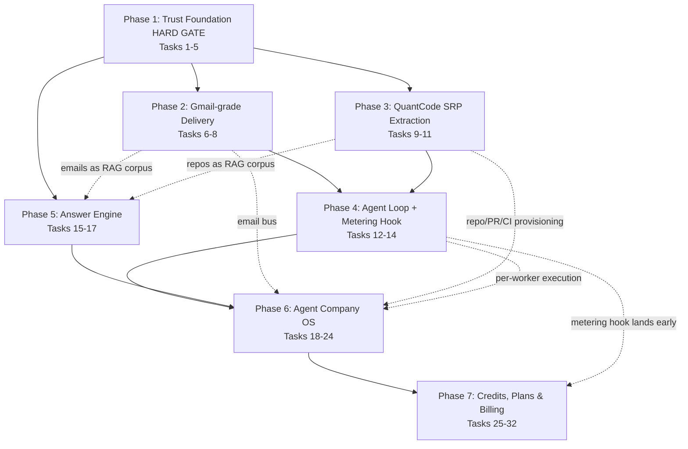

# Implementation Plan: QuantMail SuperHub

## Overview

This plan converts the QuantMail SuperHub design into incremental coding tasks against the **existing ~70%-complete TypeScript monorepo** (Next.js 15 App Router + Fastify `@quant/server-core`, Prisma `@quant/database`, `@quant/ai`, `@quant/encryption`, `@quant/queue`, infra services `smtp-inbound` / `git-server` / `ci-runner` / `search-indexer` / `cdc-relay`). The guiding rule is **harden / de-simulate / wire existing assets — never greenfield-rewrite**. Implementation language is TypeScript throughout (no language change is proposed by the design).

Tasks are sequenced to honor the design's **phase gating**: Phase 1 (security/trust foundation) is a **HARD GATE** and ships first; no later pillar is enabled until it passes. Phases 2–7 then build strictly on the phase before. Per the design's metering note, lightweight credit-metering **hooks** (`UsageGate` choke point + `PricingEngine` reading the `@quant/ai` cost tracker) are introduced alongside the AI/agent phases (4–6), while the full Plans/Payments/Billing economy ships in Phase 7.

**Scope guard:** QuantChat is **not** touched. Shared packages are referenced only at their existing boundaries.

Property-based tests reference the invariants in the design's Testing Strategy (P1–P13, indexed in Notes). Security regression tests assert each of the 17 vulnerability classes (V1–V17, mapped in Notes) is closed. Test sub-tasks are marked `*` (optional/skippable for a faster MVP); core implementation sub-tasks are never optional.

---

## Tasks

### Phase 1 — Security / Trust Foundation + Real LLM + Real Crypto (HARD GATE)

- [x] 1. Harden the Identity & OAuth2 pillar (PKCE, redirect binding, single-use codes)
  - [x] 1.1 Enforce PKCE verification at the token endpoint in `oauth.ts`
    - In the `authorization_code` branch, compute `SHA256(code_verifier)` and grant tokens only if it equals the stored `code_challenge` (and matches the bound challenge method); bind `code_challenge` + method at `authorize` time
    - Reject the exchange with no tokens issued on mismatch or missing verifier
    - _Requirements: 1.1, 1.2, 1.3_
  - [x]* 1.2 Write property test: PKCE rejects mismatched verifier
    - **Property P1: PKCE soundness** — for any random `code_verifier`/`code_challenge` pair where `SHA256(verifier) != challenge`, the token exchange is rejected and issues no tokens; for a matching pair it succeeds
    - **Validates: Requirements 1.2, 1.3**
  - [x] 1.3 Enforce exact-match `redirect_uri` rebinding and single-use auth codes in `oauth.ts`
    - Require the token-exchange `redirect_uri` to equal the value bound at authorize time; reject on mismatch
    - Confirm/keep exact-match resolution against the per-client `Redirect_Allowlist` and mark codes consumed so a replayed code is rejected
    - _Requirements: 1.4, 1.5, 1.6_
  - [x]* 1.4 Write unit tests for redirect binding and code replay
    - Cover non-allowlisted redirect rejection, redirect mismatch at exchange, and double-exchange of one code
    - _Requirements: 1.4, 1.5, 1.6_

- [x] 2. Replace simulated cryptography with KMS-backed real crypto
  - [x] 2.1 Resolve `JWT_Secret` from KMS at runtime with rotation in `@quant/auth` `TokenService`
    - Remove any hardcoded/static literal secret; resolve via `@quant/encryption` KMS at signing/verify time
    - Support key rotation: verify tokens under the previous key until expiry while signing with the rotated key; preserve the existing access/refresh split
    - _Requirements: 2.1, 2.2_
  - [x] 2.2 Route all signing/encryption through `@quant/encryption` and remove reachable `@simulated` crypto paths
    - De-simulate crypto in `pgp-encryption.service.ts` and the E2EE routes (`e2ee.ts`) to use real key material resolved via KMS
    - Persist only KMS-resolvable references for domain private keys / secrets — never plaintext (`DomainAuthKey.privateKeyRef`)
    - _Requirements: 2.3, 2.4, 2.5_
  - [x]* 2.3 Write unit tests for KMS resolution, rotation, and no-plaintext storage
    - Assert rotation keeps old tokens valid until expiry; assert persisted key fields hold only references
    - _Requirements: 2.1, 2.2, 2.4_

- [x] 3. Make the `@quant/ai` engine fail closed in production
  - [x] 3.1 Disable silent mock-response fallback paths in production and source provider credentials at runtime
    - When a configured provider call cannot complete in production, return an explicit error rather than a mock/simulated response
    - Source OpenAI/Anthropic/Google credentials from runtime config so AI features run against a real provider
    - _Requirements: 3.1, 3.2, 3.3_
  - [x]* 3.2 Write unit tests for fail-closed behavior
    - Assert production path raises an explicit error on provider failure and never returns a simulated payload
    - _Requirements: 3.1, 3.3_

- [x]* 4. Write Phase-1 security regression suite (HARD-GATE assertions)
  - Assert each Phase-1 vulnerability class is closed: V1 no hardcoded/weak JWT secret reachable, V2 no reachable `@simulated` crypto path, V3 PKCE rejects mismatched verifier, V4 non-allowlisted redirect rejected, V5 consent-screen output escaped (reflected-XSS), V6 redirect rebind enforced at exchange, V7 auth-code replay rejected, V8 no plaintext private-key persistence, V9 AI engine fails closed (no silent mock) in prod
  - _Requirements: 1.1, 1.2, 1.3, 1.4, 1.5, 1.6, 2.1, 2.3, 2.4, 3.1, 24.1_

- [x] 5. Phase 1 hard-gate checkpoint
  - Ensure all tests pass and the Phase-1 exit criteria hold (zero critical vulns, no simulated crypto, AI verified against a real provider). Ask the user if questions arise. Do NOT enable later phases until this gate is green.
  - _Requirements: 24.1, 24.3_

### Phase 2 — Gmail-grade Delivery

- [x] 6. Build the outbound delivery pipeline
  - [x] 6.1 Implement `OutboundDeliveryPipeline.enqueueSend` over `@quant/queue` (BullMQ)
    - Replace the flag-only `EmailService.send()` behavior in `email.service.ts`: create a durable queued job for a valid draft the caller owns and set `Email.deliveryStatus = queued`
    - Enforce ownership: reject and create no job if `email.userId !== userId`
    - _Requirements: 4.1, 4.2_
  - [x] 6.2 Implement the delivery worker `processDelivery` with DKIM signing and MX resolution
    - Add `DeliverabilityAuthService.getDkimSigner(domain)`; DKIM-sign, resolve recipient MX, attempt SMTP transmission, and record a per-recipient `DeliveryAttempt`
    - Record a terminal-or-deferred `Delivery_State` for each recipient on completion
    - _Requirements: 4.3, 4.4_
  - [x]* 6.3 Write property test: delivery state transitions are monotonic
    - **Property P2: monotonic delivery state** — for any sequence of delivery events, each recipient's `Delivery_State` only advances toward a terminal state (queued → sent/deferred → bounced/delivered) and never regresses
    - **Validates: Requirements 4.5**
  - [x]* 6.4 Write unit test: enqueue ownership rejection
    - Assert enqueuing an email owned by another user creates no job (V10 cross-owner enqueue closed)
    - _Requirements: 4.2_

- [x] 7. Build the inbound ingest adapter
  - [x] 7.1 Implement `InboundIngestAdapter.ingest` bridging `smtp-inbound`
    - Evaluate SPF/DKIM/DMARC via `DeliverabilityAuthService.verifyInbound`, record the combined `AuthVerdict` on the email, then persist, thread-stitch, folder-route, and index passing mail
    - Quarantine messages that fail DMARC alignment instead of routing to the inbox folder
    - _Requirements: 5.1, 5.2, 5.3_
  - [x] 7.2 Verify existing AI email intelligence runs against the real engine
    - Confirm `ai-compose`, `ai-reply`, `ai-summarize`, `ai-triage`, `ai-tone-shift`, `ai-followup`, `ai-meeting-extract`, `ai-attachment-summary`, `ai-unsubscribe`, `ai-style-learner` call `this.ai.infer()` with no mock fallback (inherits Phase-1 fail-closed)
    - _Requirements: 5.4_
  - [x]* 7.3 Write unit tests for inbound auth + quarantine routing
    - Cover AuthVerdict recording, threading/routing on pass, and quarantine on DMARC failure
    - _Requirements: 5.1, 5.2, 5.3_

- [x] 8. Phase 2 checkpoint
  - Ensure all tests pass and a real email can leave and arrive authenticated with delivery state recorded. Ask the user if questions arise.
  - _Requirements: 24.3_

### Phase 3 — GitHub-grade Developer Platform + SRP Extraction (QuantCode)

- [x] 9. Extract the QuantCode module behind a clean SRP boundary
  - [x] 9.1 Carve repo/PR/issue/review/branch-protection/CI services into a `/api/code/*` module
    - Move `pr.service.ts`, `review.service.ts`, `issue.service.ts`, `branch-protection.service.ts` and routes `git.ts`/`pull-requests.ts`/`issues.ts`/`reviews.ts`/`ci.ts` under the QuantCode module in the `server-core` app factory; preserve behavior
    - Enforce the boundary: mail domain must not import QuantCode services and vice versa
    - _Requirements: 6.1, 6.2_
  - [x]* 9.2 Write a module-boundary test
    - Assert no cross-imports exist between the mail domain and the QuantCode module
    - _Requirements: 6.2_

- [x] 10. Wire QuantCode operations to `git-server` and `ci-runner`
  - [x] 10.1 Implement `pushRefs` write-scope + branch-protection enforcement
    - Require the caller to hold write scope on the repo; evaluate `Branch_Protection` rules before any protected ref advances
    - _Requirements: 6.3_
  - [x] 10.2 Implement `evaluateMergeEligibility` and pipeline trigger/status
    - Return a `MergeDecision` accounting for CI status, branch-protection rules, and review verdicts; implement `triggerPipeline`/`getRunStatus` against `ci-runner` producing a `PipelineRun`
    - _Requirements: 6.4, 6.5_
  - [x]* 10.3 Write unit tests for push authz, branch protection, and merge eligibility
    - Cover write-scope rejection, protected-ref gating, and merge decisions across CI/review states
    - _Requirements: 6.3, 6.4, 6.5_

- [x] 11. Phase 3 checkpoint
  - Ensure all tests pass and the full repo → PR → review → CI → merge path works with a clean module boundary. Ask the user if questions arise.
  - _Requirements: 24.3_

### Phase 4 — Claude Code / Codex Agentic Layer

- [x] 12. Build the bounded, branch-isolated Agent Runtime
  - [x] 12.1 Implement `AgentRuntime.startTask` with write-scope + budget preconditions
    - Require the user to hold write scope on the repo and an available budget; create an `AgentSession` with status `planning` on an isolated agent branch (`branchRef != repo.defaultBranch`)
    - _Requirements: 7.1, 7.2_
  - [x] 12.2 Implement the `step` tool-execution loop with iteration bounds and transcript audit
    - Reuse `@quant/ai` `UniversalAssistant`/`ToolRegistry`/`ActionExecutor`; one iteration = select tool → execute → observe; append an auditable `AgentTranscript` entry per step
    - Keep `iterationCount <= maxIterations`; stop the session when `maxIterations` is reached; mutate files only on the agent branch
    - _Requirements: 7.2, 7.3, 7.4_
  - [x]* 12.3 Write property test: iteration bound is never exceeded
    - **Property P3: bounded autonomy** — for any session config and any run length, `iterationCount <= maxIterations` always holds and the session stops at the bound
    - **Validates: Requirements 7.3**
  - [x] 12.4 Confine tool side-effects to scoped QuantCode APIs and land via human-gated PR
    - Tools (`read_file`, `edit_file`, `open_pr`, `run_ci`, `search_repo`) act only through the QuantCode module's scoped APIs; changes land only through a PR requiring explicit human approval before merge; wire `ai-ci-fix.service.ts` for failing-pipeline remediation
    - _Requirements: 7.5, 7.6_
  - [x]* 12.5 Write unit tests for branch isolation and human-gated merge
    - Assert no write reaches the default branch and that merge stays pending without human approval
    - _Requirements: 7.2, 7.5_

- [x] 13. Introduce the credit-metering hook (early, alongside the agent layer)
  - [x] 13.1 Add the `UsageGate`/`CreditMeter` choke point and `PricingEngine` skeleton
    - Implement `estimateCost`/`checkAndReserve`/`settle` wrappers reading projected/actual tokens from the `@quant/ai` cost tracker; route agent-session AI inference through the gate (full wallet/ledger lands in Phase 7)
    - _Requirements: 18.1, 18.5_
  - [x]* 13.2 Write security regression for Phase-4 agent-safety classes
    - Assert V11 agent never exceeds iteration bound, V12 agent never writes to base branch, V13 agent tool side-effects confined to scoped APIs
    - _Requirements: 7.2, 7.3, 7.6_

- [x] 14. Phase 4 checkpoint
  - Ensure all tests pass and an agent session can land a CI-green PR for a real task under supervision. Ask the user if questions arise.
  - _Requirements: 24.3_

### Phase 5 — Perplexity Answer Engine

- [x] 15. Build the authz-scoped retriever
  - [x] 15.1 Implement `Retriever.retrieve` with per-user ownership filtering and provenance
    - Restrict retrieval to documents the asking user owns (never another user's docs); attach source provenance (emailId / repo+path / url) to each `RankedChunk`; index via `search-indexer` into Qdrant/pgvector + Meilisearch
    - _Requirements: 8.1, 8.4_
  - [x] 15.2 Fuse vector + keyword retrieval and rerank
    - Fuse Qdrant/pgvector kNN with Meilisearch keyword results before grounded generation
    - _Requirements: 8.5_
  - [x]* 15.3 Write property test: retrieval never returns another user's documents
    - **Property P5: retrieval isolation** — for any multi-user corpus and any query by user U, every returned chunk is owned by U
    - **Validates: Requirements 8.1, 22.1, 22.3**

- [x] 16. Build grounded generation with mandatory citations
  - [x] 16.1 Implement `AnswerEngine.ask` producing cited, grounded answers
    - Attach at least one `Citation` for every claim in the answer; return "no answer found" when retrieval yields no evidence (never fabricate); route inference through `@quant/ai` and the `UsageGate` (meter `rag_query`)
    - _Requirements: 8.2, 8.3, 18.1_
  - [x]* 16.2 Write property test: every answer claim has a citation
    - **Property P4: citation completeness** — for any question with non-empty evidence, every claim span in the returned `Grounded_Answer` maps to >= 1 citation; empty evidence yields "no answer found"
    - **Validates: Requirements 8.2, 8.3**

- [x] 17. Phase 5 checkpoint
  - Ensure all tests pass and cited answers are grounded in the user's own data with "no answer found" when evidence is absent. Ask the user if questions arise.
  - _Requirements: 24.3_

### Phase 6 — Agent Company OS (Autonomous Agent Workforce)

- [x] 18. Build the Company OS orchestrator intake and org planning
  - [x] 18.1 Implement `CompanyOrchestrator.intakeGoal` and `planOrg`
    - Create an `AgentOrg` (status `planning`) bound to the authenticated tenant owner; reject intake from a non-owner with no org created
    - Produce an `OrgPlan` listing {role, count, defaultModel, toolScope, budgetShare} per role with `SUM(role budgets) <= org.budgetCap`, using `@quant/ai` for planning
    - _Requirements: 9.1, 9.2, 9.3, 9.4_
  - [x]* 18.2 Write unit tests for intake authz and budget-sum constraint
    - _Requirements: 9.2, 9.4_

- [x] 19. Build workspace provisioning and fleet spawning
  - [x] 19.1 Implement `provisionWorkspace` and `spawnFleet` over the QuantCode module + RoleCatalog
    - On attach, require CEO write scope; ensure the repo exists with a default branch + branch protection; spawn a worker count matching the approved plan
    - Apply CEO per-role/per-worker model overrides (else role default) and fail closed via `RoleCatalog.resolveModel` if the model is not routable by `@quant/ai`
    - _Requirements: 10.1, 10.2, 10.4, 10.5, 10.6_
  - [x] 19.2 Implement tenant-scoped agent mailbox identities via `AgentIdentityProvisioner`
    - Provision each worker a unique, agent-namespaced address scoped to the org's single tenant, granting only agent-bus scope + the worker's tool scope; revoke tokens and archive the mailbox on retire
    - _Requirements: 10.3, 11.1, 11.2, 11.4_
  - [x]* 19.3 Write property test: agent mailbox authz never leaks across tenants
    - **Property P7: tenant isolation of agent identities** — for any two orgs/tenants, an agent identity's scope can never read the CEO's human inbox or another tenant's mail/repos
    - **Validates: Requirements 11.3, 22.1**

- [x] 20. Build the email-as-message-bus protocol
  - [x] 20.1 Implement `AgentEmailBus.send/poll/observe` over the mail domain
    - Deliver bus messages through the normal mail pipeline with the reserved `agent-bus` label and headers `X-Quant-Agent-Org`/`X-Quant-Agent-From-Role`/`X-Quant-Agent-Msg-Type`; thread each to its `AgentWorkItem`; carry artifacts (diffs/plans/logs/reports) as attachments
    - Reject any message whose sender or recipient is not a same-org, same-tenant agent identity
    - _Requirements: 12.1, 12.2, 12.3, 12.4_
  - [x]* 20.2 Write property test: bus never sends across tenants
    - **Property P7b: cross-tenant bus rejection** — for any sender/recipient set, a bus message is delivered only if all parties are agent identities within the same org/tenant, else rejected
    - **Validates: Requirements 12.3**

- [x] 21. Build org supervision with hard budget/iteration caps
  - [x] 21.1 Implement `supervise` enforcing org caps and stall/loop detection
    - Observe the `agent-bus` label to route messages and detect stalls/loops/budget pressure; keep `org.costSpent <= budgetCap` and `org.totalIterations <= maxIterations`; pause/retire affected workers on cap or stall
    - _Requirements: 12.5, 13.1, 13.2, 13.3, 13.4_
  - [x]* 21.2 Write property test: org caps are never exceeded
    - **Property P6: org budget/iteration ceiling** — for any supervision run, `costSpent <= budgetCap` and `totalIterations <= maxIterations` always hold
    - **Validates: Requirements 13.1, 13.2**

- [x] 22. Build human approval gates and the autonomous Gmail handler
  - [x] 22.1 Implement human-approval gating + `AgentActionAudit` for sensitive actions
    - Keep merges and sensitive Gmail actions pending until the CEO approves; record every sensitive action in the audit trail with `approvedByHuman` true only when a human approved
    - _Requirements: 14.1, 14.2, 14.3, 23.1, 23.3_
  - [x] 22.2 Implement the policy-guarded `GmailHandler`
    - Classify each proposed action's sensitivity via existing AI email services; auto-execute at/below the `InboxAutomationPolicy` threshold (respecting the undo-send window); require human approval above threshold and for external sends above threshold; take no action when the policy is not enabled; audit every action
    - _Requirements: 15.1, 15.2, 15.3, 15.4, 15.5, 15.6_
  - [x]* 22.3 Write property test: above-threshold autonomous Gmail action requires approval
    - **Property P8: approval gate** — for any proposed action whose sensitivity exceeds the policy threshold (or any external send above threshold), execution requires `approvedByHuman = true`
    - **Validates: Requirements 14.3, 15.3, 15.4**

- [x] 23. Enforce cross-cutting ownership/tenant authorization and observability
  - [x] 23.1 Apply the ownership authz filter across Answer Engine and Agent Runtime, and emit OTel spans
    - Ensure every pillar query/tool action is ownership-filtered (deny unauthorized resource access); Answer Engine and Agent Runtime inherit the mail-domain filter; emit `@quant/observability` spans for delivery, agent steps, and retrieval
    - _Requirements: 22.1, 22.2, 22.3, 23.2_
  - [x]* 23.2 Write security regression for Phase-6 isolation classes
    - Assert V14 cross-tenant agent-bus send rejected, and cross-tenant data access denied across pillars
    - _Requirements: 12.3, 22.1, 22.2_

- [x] 24. Phase 6 checkpoint
  - Ensure all tests pass: a CEO goal spawns a multi-agent org that coordinates over the email bus and lands a CI-green PR under human-approved merge, with no cross-tenant leakage. Ask the user if questions arise.
  - _Requirements: 24.3_

### Phase 7 — Credits, Plans & Billing Economy

- [x] 25. Build the credit wallet and append-only ledger
  - [x] 25.1 Implement `CreditWallet` over an immutable `CreditLedgerEntry` table (additive Prisma)
    - Derive authoritative balance as `sum(ledger)`; keep total `>= 0`; append-only entries (never mutate/delete); `getBalance` requires owner or tenant-admin via Ownership_Authz; `credit()` appends one entry increasing balance by exactly the granted amount
    - _Requirements: 16.1, 16.2, 16.3, 16.4, 16.5_
  - [x]* 25.2 Write property test: balance equals sum of ledger and is never negative
    - **Property P10: balance == sum(ledger)** and **Property P9: balance >= 0** — for any sequence of grants/debits, the cached balance equals the ledger sum and never goes negative
    - **Validates: Requirements 16.1, 16.2**

- [x] 26. Build the daily free allowance with idempotent UTC reset
  - [x] 26.1 Implement `grantDaily(ownerRef, utcDay)` idempotent per (wallet, UTC day)
    - Append exactly one `daily_grant` sized to the plan's daily allowance; no second grant for the same (owner, UTC day); reset without rolling over the prior day's unused daily remainder
    - _Requirements: 17.1, 17.2, 17.3_
  - [x]* 26.2 Write property test: daily allowance resets exactly once per UTC day
    - **Property P12: daily reset idempotence** — for any number of grant attempts on a given UTC day, exactly one `daily_grant` entry exists for that (owner, day)
    - **Validates: Requirements 17.1, 17.2**

- [x] 27. Build the metered usage gate (check → reserve → settle, fail closed)
  - [x] 27.1 Complete `CreditMeter.checkAndReserve`/`settle` with consumption order and idempotency
    - Estimate cost from the active `PricingRule`; verify `PlanService` entitlements (reject with upgrade-required if not permitted); reject with out-of-credits if balance < estimate; record reservation keyed by `actionKey` (replay = no-op); never proceed without a successful reservation; settle against actual cost (delta refund/charge), second settlement = no-op
    - Consume credits in fixed order: daily allowance → plan-included monthly → purchased top-up
    - _Requirements: 18.1, 18.2, 18.3, 18.4, 18.5, 18.6, 18.7_
  - [x]* 27.2 Write property test: no metered action without a prior reservation
    - **Property P11: reservation-before-execute** — for any metered action, execution is permitted only after a successful prior debit/reservation; otherwise it fails closed
    - **Validates: Requirements 18.3, 18.5**
  - [x]* 27.3 Write property test: debits are idempotent under retries
    - **Property P13: debit idempotence** — for any `actionKey`, replaying the same reservation/settlement leaves the balance unchanged
    - **Validates: Requirements 18.4, 18.6**

- [x] 28. Build plans, entitlements, and rate limits
  - [x] 28.1 Implement `PlanService.entitlements`/`getPlan`/`changePlan`
    - Resolve daily allowance, monthly included credits, rate limits, unlocked models/features for the active Plan_Tier (Free/Pro/Team/Enterprise); reject rate-limit-exceeding actions with upgrade-required; apply plan changes at the effective boundary (next reset, or immediately on upgrade); enforce at most one active/trialing subscription per owner
    - _Requirements: 19.1, 19.2, 19.3, 19.4_
  - [x]* 28.2 Write unit tests for entitlement resolution and single-active-subscription
    - _Requirements: 19.1, 19.4_

- [x] 29. Build payments, signed webhooks, and idempotent grants
  - [x] 29.1 Implement `BillingService` over the vendor-neutral `PaymentProvider` port
    - Return a provider-hosted checkout handle (no card data touches the SuperHub); verify webhook signatures and reject unverified events (grant no credits); on verified `payment_success` grant credits / activate-renew subscription applied at most once per `providerEventId`; on `payment_failure` mark `PaymentRecord` failed; apply subscription upgrade/downgrade/cancel/resume at the effective boundary
    - _Requirements: 20.1, 20.2, 20.3, 20.4, 20.5_
  - [x]* 29.2 Write property test: webhook application is idempotent and signature-gated
    - **Property P13b: webhook idempotence** — for any `providerEventId`, replaying a verified event applies it at most once; unverified events grant nothing
    - **Validates: Requirements 20.2, 20.3**

- [x] 30. Denominate Company OS budgets in credits backed by the CEO wallet
  - [x] 30.1 Reserve `AgentOrg.budgetCap` in credits from the CEO `CreditWallet` at provisioning
    - Reject provisioning if the CEO's reservable balance < requested cap; keep org total credit spend <= the CEO-funded `budgetCap`; ensure `SUM(worker budgetShare) <= budgetCap`
    - _Requirements: 21.1, 21.2, 21.3_
  - [x]* 30.2 Write property test: org credit spend never exceeds CEO-funded budget cap
    - **Property P6b: credit-backed org ceiling** — for any org run, total credit spend <= reserved `budgetCap` and `budgetCap <= CEO reservable balance`
    - **Validates: Requirements 21.1, 21.2**

- [x]* 31. Write Phase-7 billing security regression suite
  - Assert V15 balance never negative / no double-charge on retry, V16 unverified webhook rejected (no grant), V17 daily-reset abuse closed (idempotent per UTC day); plus tenant-scoped wallet authz (owner/tenant-admin only)
  - _Requirements: 16.2, 16.4, 17.2, 18.4, 20.2_

- [x] 32. Final checkpoint
  - Ensure all tests pass: daily credits reset once per UTC day and gate AI usage, top-ups/subscriptions work, every metered action fails closed when empty, org spend never exceeds the CEO-funded cap, and ledger + webhooks reconcile (balance == sum(ledger), webhooks at-most-once). Ask the user if questions arise.
  - _Requirements: 24.3_

---

## Task Dependency Graph

**Intra-phase critical edges**
- Task 1 (PKCE) and Task 2 (KMS crypto) and Task 3 (fail-closed AI) all gate Task 5 (hard-gate checkpoint); nothing in Phases 2–7 starts until Task 5 is green.
- Task 6 (outbound) → Task 7 (inbound) → Task 8 checkpoint.
- Task 9 (SRP extraction) → Task 10 (git/CI wiring) → Task 11 checkpoint.
- Task 12 (Agent Runtime) → Task 13 (metering hook) → Task 14 checkpoint; Task 12 depends on Task 10 (QuantCode scoped APIs).
- Task 15 (retriever) → Task 16 (grounded gen) → Task 17 checkpoint.
- Tasks 18→19→20→21→22→23 → Task 24 checkpoint (orchestrator before fleet before bus before supervision before approval/Gmail before cross-cutting authz).
- Tasks 25→26→27→28→29→30 → Task 32 checkpoint (wallet/ledger before daily grant before usage gate before plans before payments before credit-backed org budgets).

---

## Notes

- Tasks marked with `*` are optional (unit / property / security-regression tests) and can be skipped for a faster MVP; top-level tasks and core implementation sub-tasks are never optional and must be implemented.
- **Build-on-existing rule:** every task hardens, de-simulates, or wires named existing assets (`email.service.ts`, `oauth.ts`, `@quant/ai`, `@quant/encryption`, `@quant/queue`, QuantCode `/api/code/*`, `smtp-inbound`, `git-server`, `ci-runner`, `search-indexer`, `cdc-relay`). No greenfield rewrite; QuantChat is untouched.
- **Phase gating:** Phase 1 is a hard gate (Requirement 24.1). Each later phase satisfies its exit criteria before a dependent phase is enabled (Requirement 24.3). Metering hooks land in Phase 4; the full billing economy ships in Phase 7 (per the design's metering-placement note).
- Property tests run a minimum of 100 iterations (fast-check, the ecosystem's JS property-testing tool) and each is tagged **Feature: quantmail-superhub, Property {number}: {property text}**.

### Property index (from the design Testing Strategy)
- **P1** PKCE rejects mismatched verifier — Task 1.2 — Req 1.2, 1.3
- **P2** Delivery state transitions monotonic — Task 6.3 — Req 4.5
- **P3** Agent iterationCount <= maxIterations — Task 12.3 — Req 7.3
- **P4** Every answer claim has a citation — Task 16.2 — Req 8.2, 8.3
- **P5** Retrieval never returns another user's docs — Task 15.3 — Req 8.1, 22.1
- **P6 / P6b** Org costSpent <= budgetCap and totalIterations <= maxIterations (and credit-backed) — Tasks 21.2, 30.2 — Req 13.1, 13.2, 21.1, 21.2
- **P7 / P7b** Agent mailbox/bus authz never leaks across tenants — Tasks 19.3, 20.2 — Req 11.3, 12.3, 22.1
- **P8** Autonomous Gmail action above threshold requires human approval — Task 22.3 — Req 14.3, 15.3, 15.4
- **P9** Credit balance never negative — Task 25.2 — Req 16.2
- **P10** Balance == sum(ledger) — Task 25.2 — Req 16.1
- **P11** No metered action without prior debit/reservation — Task 27.2 — Req 18.5
- **P12** Daily allowance resets exactly once per UTC day — Task 26.2 — Req 17.2
- **P13 / P13b** Debits and webhook applications idempotent under retries — Tasks 27.3, 29.2 — Req 18.4, 18.6, 20.3

### 17 vulnerability classes — security-regression coverage map
- **V1** Hardcoded/weak JWT secret — Task 4 (Req 2.1)
- **V2** Reachable `@simulated` crypto path — Task 4 (Req 2.3)
- **V3** PKCE not validated at token endpoint — Task 4 (Req 1.2, 1.3)
- **V4** Open redirect / non-allowlisted redirect_uri — Task 4 (Req 1.5)
- **V5** Reflected XSS on consent screen — Task 4 (Req 1.x consent escaping)
- **V6** redirect_uri not rebound at token exchange — Task 4 (Req 1.4)
- **V7** Auth-code replay (non-single-use) — Task 4 (Req 1.6)
- **V8** Plaintext private-key persistence — Task 4 (Req 2.4)
- **V9** Silent AI mock fallback in prod — Task 4 (Req 3.1)
- **V10** Cross-owner email enqueue — Task 6.4 (Req 4.2)
- **V11** Agent unbounded iterations — Task 13.2 (Req 7.3)
- **V12** Agent writes to base branch — Task 13.2 (Req 7.2)
- **V13** Agent tool side-effects outside scoped APIs — Task 13.2 (Req 7.6)
- **V14** Cross-tenant agent-bus send / data access — Task 23.2 (Req 12.3, 22.1)
- **V15** Negative balance / double-charge on retry — Task 31 (Req 16.2, 18.4)
- **V16** Unverified webhook grants credits — Task 31 (Req 20.2)
- **V17** Daily-reset abuse / double-grant — Task 31 (Req 17.2)

---

## Workflow Complete

The QuantMail SuperHub spec is complete: **design.md**, **requirements.md**, and **tasks.md** all exist in `.kiro/specs/quantmail-superhub/`. This workflow produces planning artifacts only — no feature code is implemented here. To begin building, open `tasks.md` and click **Start task** next to a task item (start with Task 1 in the Phase 1 hard gate).
