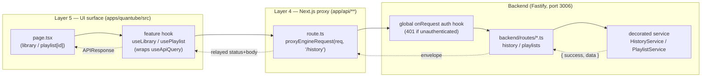
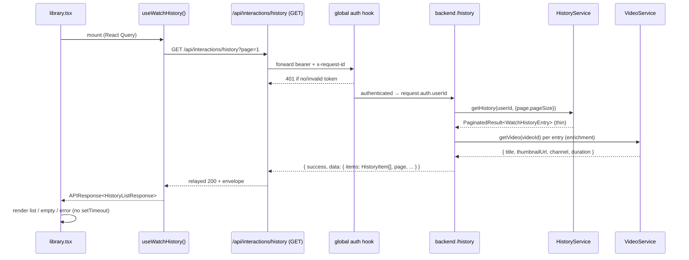
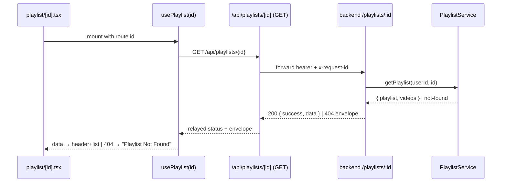

# Design Document: QuantTube Real-Data Wiring (First Slice)

## Overview

Five QuantTube pages currently render hardcoded `MOCK_*` arrays behind a fake
`await new Promise(r => setTimeout(r, ~400-600))` delay instead of calling the
backend. This design replaces that fake-async-with-mock pattern with the
**existing, sanctioned QuantTube data path**: typed React Query hooks
(`useApiQuery`/`useApiMutation` from `@quant/api-client`) → a same-origin
Next.js proxy route (`proxyEngineRequest`) → a Fastify backend route behind the
global auth hook → a decorated engine/service. This is the exact seam already
shipped for the creator-economy surface (`useCreator.ts` → `/api/creator/*` →
`backend/routes/creator.ts`), which this design mirrors verbatim.

The investigation surfaced a hard, source-grounded reality that shapes the
scope: **most of the data these screens display has no backend yet.** Only
**watch history** is served by a registered backend route today (`/history`),
and even that returns a thin entry that must be enriched with video metadata
before it satisfies the page's `HistoryItem` contract. The remaining domains
(playlists, watch-later, downloads, music, live, podcasts) have **no registered
backend route and no reusable engine package**. Several already have _dangling_
`app/api/*` proxy scaffolds that forward to backend paths that are never
registered (and one — `/live` — would silently bypass authentication).

This document therefore does two honest things: (1) it specifies the full
client→proxy→backend contract for every screen so the wiring is unambiguous,
and (2) it classifies each data domain as **Wire Now** (existing backend),
**Build Minimal Backend (this slice)**, or **Defer to a Follow-up Spec**, with
the reasoning grounded in what actually exists in the repository.

## Glossary

| Term                                 | Meaning                                                                                                                                                                                        |
| ------------------------------------ | ---------------------------------------------------------------------------------------------------------------------------------------------------------------------------------------------- |
| **Seam / call path**                 | The fixed chain UI hook → `/api/*` proxy → backend route → engine. The only sanctioned way a UI surface reaches backend data (no inline `fetch` in UI).                                        |
| **`useApiQuery` / `useApiMutation`** | Canonical Layer-5 React Query hooks from `@quant/api-client`. Wrap `apiFetch` against a same-origin proxy path and return the `APIResponse<T>` envelope.                                       |
| **`proxyEngineRequest`**             | Helper in `app/api/_lib/engine-proxy.ts` wrapping `@quant/api-client`'s `proxyToBackend`. Forwards the bearer + `x-request-id` to the backend and relays status/body. The **canonical** proxy. |
| **Legacy `proxyToBackend`**          | The older helper in `app/api/_lib/proxy.ts`. Used by the dangling `music`/`live`/`playlists` scaffolds. New routes should use `proxyEngineRequest` instead.                                    |
| **Envelope**                         | The `{ success: boolean, data: T, error?, metadata? }` JSON shape (`APIResponse<T>`) every backend route returns.                                                                              |
| **Decorated engine/service**         | A service composed once at boot via `app.decorate('name', ...)` and read per-request as `fastify.name` (e.g. `fastify.creatorEconomy`). Never per-request construction.                        |
| **Global auth hook**                 | server-core's `onRequest` hook that runs `requireAuth()` for every non-`PUBLIC_PATHS` route → `401` when unauthenticated.                                                                      |
| **`requireAuth({ scopes })`**        | Per-route `preHandler` enforcing fine-grained scopes (e.g. `creator:write`) → `403` when the scope is missing.                                                                                 |
| **`PUBLIC_PATHS`**                   | server-core allowlist that bypasses auth: `['/health','/healthz','/ready','/readyz','/live','/livez','/metrics']`. Note `/live` is present.                                                    |
| **Wireable now**                     | A screen whose data is served by a backend route already registered in `backend/app.ts`.                                                                                                       |
| **Enrichment**                       | Joining a thin backend record (e.g. a history entry holding only `videoId`) with video/channel metadata to satisfy the richer UI contract.                                                     |

## Scope

### In scope (this first slice)

1. **Library → History tab** — wired against the existing `/history` backend,
   with a video-metadata enrichment step (Wire Now + minimal backend enrichment).
2. **Library → Playlists tab** and **Playlist detail page (`playlist/[id]`)** —
   a new minimal in-memory `PlaylistService` + `/playlists` backend route,
   composed with the creator-economy decorator pattern.
3. **Library → Watch Later tab** — modeled as a system playlist served by the
   same `PlaylistService` (new minimal backend).
4. Replacing the fake `setTimeout` + `MOCK_*` loading flows on the above with
   real loading / empty / error states driven by the hooks.
5. Establishing the reusable per-domain pattern (feature folder + types + hooks
   - proxy routes + backend route) so the deferred domains can follow it.

### Out of scope (recommended follow-up specs)

These have **no backend and no reusable engine package today**; each is a
substantial new domain and is flagged for its own dedicated spec rather than
being half-built in this slice:

- **Music** (`music.tsx`: tracks/albums/artists/music-playlists + streaming) —
  needs a new music catalog engine; no `@quant/music` exists.
- **Live** (`live.tsx`: live-stream directory + schedule) — needs a new live
  engine; `@quant/quant-live` is a **voice/ASR assistant**, not live video.
  **Auth hazard**: must not be served under `/live` (see Architecture note).
- **Podcasts** (`podcasts.tsx`: podcasts/episodes + RSS import) — needs a new
  podcast engine; no proxy scaffold even exists yet.
- **Library → Downloads** — offline/DRM/expiry semantics warrant their own
  design; deferred.

### Non-goals

- No changes to authentication, the envelope, or the proxy mechanics.
- No new database schema; new backend services are in-memory (mirroring the
  as-shipped `HistoryService` and the creator-economy services).
- No real audio/video media delivery (streaming bytes) in this slice.
- No removal of unrelated `MOCK_*` constants outside the five target pages.

### Source-grounded backend availability matrix

| Page          | Data domain                     | Backend today                                                      | Reusable engine                    | Decision                                                 |
| ------------- | ------------------------------- | ------------------------------------------------------------------ | ---------------------------------- | -------------------------------------------------------- |
| library       | History                         | **Yes** — `GET /history` (registered)                              | `HistoryService` (in-memory)       | **Wire Now** + enrich w/ video metadata                  |
| library       | Playlists                       | No                                                                 | None                               | **Build minimal backend (this slice)**                   |
| library       | Watch Later                     | No                                                                 | None                               | **Build minimal backend (this slice)** (system playlist) |
| library       | Downloads                       | No                                                                 | None                               | **Defer** (follow-up)                                    |
| playlist/[id] | Playlist meta                   | No (`api/playlists` dangling)                                      | None                               | **Build minimal backend (this slice)**                   |
| playlist/[id] | Playlist videos                 | Video meta via `VideoService` exists; playlist membership does not | partial                            | **Build minimal backend (this slice)**                   |
| music         | tracks/albums/artists/playlists | No (`api/music` dangling)                                          | None                               | **Defer** (follow-up)                                    |
| live          | streams/schedule                | No (`api/live` dangling, **`/live` is PUBLIC_PATHS**)              | None (`@quant/quant-live` ≠ video) | **Defer** (follow-up)                                    |
| podcasts      | podcasts/episodes               | No                                                                 | None                               | **Defer** (follow-up)                                    |

## Architecture

### Layered integration seam (mirrors the creator-economy surface)



**Key rules carried over from the shipped seam:**

- UI surfaces never call `fetch` directly; they call a hook that wraps
  `useApiQuery`/`useApiMutation` against an `/api/*` path.
- Proxy route handlers are one line each; `proxyEngineRequest` forwards the
  bearer + `x-request-id` and relays the backend's status and body.
- Every backend route returns the `{ success, data }` envelope and sits behind
  the global auth hook; mutating routes add `requireAuth({ scopes })`.

### Architectural note — the `/live` PUBLIC_PATHS auth-bypass hazard

server-core's `PUBLIC_PATHS` includes `/live` and `/livez` (Kubernetes
liveness-probe paths). A backend route registered under the `/live` prefix would
match `path === '/live' || path.startsWith('/live/')` and **bypass the global
auth hook entirely** — every live-stream request would be treated as public.
The repository's own wiring history records a prior collision that was fixed by
moving a route prefix from `/live` to `/quant-live`. Therefore, when the live
domain is built (follow-up), its backend prefix **must** be something like
`/live-streams` or `/streaming`, and the existing dangling `app/api/live/*`
scaffolds (which proxy to `/live`) must be repointed accordingly. This design
records the hazard now so the follow-up does not reintroduce it.

### Current dangling scaffolds (to be reconciled)

`app/api/music/*`, `app/api/live/*`, and `app/api/playlists/*` already exist but
use the **legacy** `_lib/proxy.ts` and forward to backend paths
(`/music`, `/live`, `/playlists`, …) that `backend/app.ts` never registers. They
are non-functional today. This slice:

- **Playlists**: repoints `app/api/playlists/*` to the canonical
  `proxyEngineRequest` and backs it with the new `/playlists` backend route.
- **Music / Live**: left as-is (still dangling) until their follow-up specs;
  the design flags that `app/api/live/*` must be repointed off `/live`.

## Sequence Diagrams

### Read flow — Library History (Wire Now, with enrichment)



### Read flow — Playlist detail (new minimal backend)



## Components and Interfaces

### Component 1: Feature hooks (Layer 5)

**Purpose**: One feature folder per domain (`src/features/library`,
`src/features/playlist`) holding response DTOs (`types.ts`) and typed hooks
(`useLibrary.ts`, `usePlaylist.ts`) that wrap `useApiQuery`/`useApiMutation`.
Mirrors `src/features/creator/{types.ts,useCreator.ts}` exactly.

**Interface** (TypeScript):

```typescript
// src/features/library/useLibrary.ts
export function useWatchHistory(
  options?: UseApiQueryOptions,
): UseQueryResult<APIResponse<HistoryListResponse>>;

export function usePlaylists(
  options?: UseApiQueryOptions,
): UseQueryResult<APIResponse<PlaylistListResponse>>;

export function useWatchLater(
  options?: UseApiQueryOptions,
): UseQueryResult<APIResponse<WatchLaterListResponse>>;

export function useCreatePlaylist(): UseMutationResult<
  APIResponse<PlaylistData>,
  Error,
  CreatePlaylistInput
>;

export function useClearHistory(): UseMutationResult<APIResponse<void>, Error, void>;

// src/features/playlist/usePlaylist.ts
export function usePlaylist(
  id: string,
  options?: UseApiQueryOptions,
): UseQueryResult<APIResponse<PlaylistDetailResponse>>;
```

**Responsibilities**: expose typed, cache-aware reads/writes; never call `fetch`
directly; carry no UI state.

### Component 2: Next.js proxy routes (Layer 4)

**Purpose**: One-line same-origin handlers under `app/api/**` using
`proxyEngineRequest`.

**Interface** (TypeScript):

```typescript
// app/api/interactions/history/route.ts  (GET already exists for POST; add GET)
export async function GET(request: NextRequest) {
  return proxyEngineRequest(request, '/history', {
    searchParams: request.nextUrl.searchParams,
  });
}

// app/api/playlists/route.ts  (repoint from legacy proxy → engine-proxy)
export async function GET(request: NextRequest) {
  return proxyEngineRequest(request, '/playlists', {
    searchParams: request.nextUrl.searchParams,
  });
}
export async function POST(request: NextRequest) {
  return proxyEngineRequest(request, '/playlists', {
    body: await request.json().catch(() => ({})),
  });
}

// app/api/playlists/[id]/route.ts
export async function GET(request: NextRequest, { params }: { params: Promise<{ id: string }> }) {
  const { id } = await params;
  return proxyEngineRequest(request, `/playlists/${id}`);
}
```

**Responsibilities**: choose backend path + optional body/query; never contain
business logic.

### Component 3: Backend routes + services (Backend)

**Purpose**: Fastify routes returning the envelope, behind the global auth hook;
backed by decorated in-memory services.

- `HistoryService` — **exists** (`backend/services/history.service.ts`). Reused
  as-is; the route adds an enrichment join.
- `PlaylistService` — **new**, in-memory, decorated as `fastify.playlists`,
  registered at prefix `/playlists`. Holds playlists, membership, and the
  reserved system playlists (`Watch Later`, `Liked Videos`, etc.).

**Interface** (new service, TypeScript):

```typescript
export interface PlaylistService {
  listPlaylists(userId: string): PlaylistSummary[];
  getPlaylist(userId: string, id: string): PlaylistDetail | null;
  createPlaylist(userId: string, input: CreatePlaylistInput): PlaylistSummary;
  listWatchLater(userId: string): WatchLaterEntry[];
  addToWatchLater(userId: string, videoId: string): WatchLaterEntry;
  removeFromWatchLater(userId: string, entryId: string): void;
}
```

## Data Models

The page-local TypeScript interfaces are the **authoritative response
contracts** and are reused as-is. The backend (or proxy enrichment) is
responsible for producing exactly these shapes. Below, each UI type is mapped to
its backend source.

### History (`library.tsx → HistoryItem`)

```typescript
// REUSED from library.tsx (authoritative)
interface HistoryItem {
  id: string;
  videoId: string;
  title: string;
  thumbnail: string;
  channelName: string;
  duration: number;
  watchedAt: string;
  progress: number;
}
interface HistoryListResponse {
  items: HistoryItem[];
  total: number;
  page: number;
  pageSize: number;
}
```

**Source mapping** — `HistoryService.getHistory` returns the thin
`WatchHistoryEntry { id, userId, videoId, watchDuration, watchedAt }`. The route
**enriches** each entry by joining `VideoService.getVideo(videoId)` for
`title`, `thumbnail`, `channelName`, `duration`, and derives
`progress = clamp(watchDuration / duration, 0, 1)`. `watchedAt` is serialized to
ISO string.

| `HistoryItem` field                             | Backend source                              |
| ----------------------------------------------- | ------------------------------------------- |
| `id`, `videoId`, `watchedAt`                    | `WatchHistoryEntry` (direct)                |
| `title`, `thumbnail`, `channelName`, `duration` | `VideoService.getVideo(videoId)`            |
| `progress`                                      | derived: `min(1, watchDuration / duration)` |

### Playlists (`library.tsx → PlaylistData`, `playlist/[id].tsx → PlaylistData + PlaylistVideo`)

```typescript
// REUSED from library.tsx
interface PlaylistData {
  id: string;
  title: string;
  thumbnail: string;
  videoCount: number;
  visibility: 'public' | 'private' | 'unlisted';
  isSystem: boolean;
  updatedAt: string;
}
interface PlaylistListResponse {
  items: PlaylistData[];
}

// REUSED from playlist/[id].tsx (detail variant + videos)
interface PlaylistDetail {
  /* matches playlist/[id].tsx PlaylistData */
  id: string;
  title: string;
  description: string;
  coverUrl: string;
  creatorName: string;
  creatorAvatar: string;
  videoCount: number;
  totalDuration: number;
  isPublic: boolean;
  collaborative: boolean;
  createdAt: string;
  updatedAt: string;
}
interface PlaylistVideo {
  id: string;
  title: string;
  channelName: string;
  thumbnailUrl: string;
  duration: number;
  views: number;
  addedAt: string;
  position: number;
}
interface PlaylistDetailResponse {
  playlist: PlaylistDetail;
  videos: PlaylistVideo[];
}
```

**Validation rules** (backend Zod, mirroring `creator.ts`):

- `CreatePlaylistInput`: `{ title: string (1..200), visibility?: 'public'|'private'|'unlisted' }`.
- `visibility` defaults to `'private'`; `isSystem` is server-assigned (never client-set).
- `PlaylistVideo.position` is contiguous `1..n` and unique within a playlist.

### Watch Later (`library.tsx → WatchLaterItem`)

```typescript
interface WatchLaterItem {
  id: string;
  videoId: string;
  title: string;
  thumbnail: string;
  channelName: string;
  duration: number;
  addedAt: string;
}
interface WatchLaterListResponse {
  items: WatchLaterItem[];
}
```

**Source mapping** — modeled as the reserved system playlist `Watch Later`;
entries enriched from `VideoService` like history.

### Deferred-domain contracts (documented, not built this slice)

`Track`, `Album`, `Artist`, `PlaylistItem` (music.tsx); `LiveStream`,
`ScheduledStream` (live.tsx); `Podcast`, `Episode` (podcasts.tsx) are reused
verbatim from their pages and will become the response contracts for their
follow-up backends. They are listed here only so the follow-up specs inherit the
authoritative shapes.

## Algorithmic Pseudocode

### History enrichment (backend route handler)

```typescript
function getEnrichedHistory(userId, pagination):
  GET /history handler:
    ASSERT request.auth.userId is defined        // else global hook already returned 401
    result = historyService.getHistory(userId, pagination)   // PaginatedResult<WatchHistoryEntry>
    items = []
    FOR entry IN result.data:                    // preserves watchedAt-desc order from service
      video = videoService.getVideo(entry.videoId)  // may be null if video deleted
      IF video IS null: CONTINUE                  // skip orphaned history rows
      items.push({
        id: entry.id, videoId: entry.videoId,
        title: video.title, thumbnail: video.thumbnailUrl,
        channelName: video.channel.name, duration: video.duration,
        watchedAt: entry.watchedAt.toISOString(),
        progress: min(1, entry.watchDuration / max(1, video.duration)),
      })
    RETURN reply.send({ success: true, data: { items, total: result.total,
                                               page: result.page, pageSize: result.pageSize } })
```

**Preconditions**: caller authenticated (global hook); `pagination` Zod-valid.
**Postconditions**: every returned `HistoryItem` has all fields populated;
ordering matches the service's `watchedAt` descending; orphaned entries omitted.
**Loop invariant**: `items` only ever contains fully-enriched entries (the
`CONTINUE` guard preserves this).

### Page consumption — replacing the fake `setTimeout`

```typescript
// library.tsx (History tab) — BEFORE: useEffect + setTimeout + setHistory(MOCK_HISTORY)
// AFTER:
const historyQ = useWatchHistory();
const history = historyQ.data?.data.items ?? [];

if (historyQ.isLoading) return <LibrarySkeleton/>;          // replaces spinner-after-setTimeout
if (historyQ.isError)   return <ErrorState onRetry={historyQ.refetch}/>;
if (history.length === 0) return <EmptyState message="Your watch history is empty."/>;
return <HistoryList items={history}/>;
```

**Invariant**: no `MOCK_*` constant and no `setTimeout`-based loader remains
referenced in the in-scope pages after wiring (enforced by a correctness
property below).

## Loading / Empty / Error states

The fake `loading`/`error` `useState` flags + `setTimeout` are removed and
replaced by React Query's derived states from the hook:

| UI state | Driven by                          | Replaces                                 |
| -------- | ---------------------------------- | ---------------------------------------- |
| Loading  | `query.isLoading` (or `isPending`) | `loading` set true before `setTimeout`   |
| Error    | `query.isError` + `error`          | `catch` → `setError('Failed to load …')` |
| Empty    | `data.items.length === 0`          | mock arrays were never empty             |
| Success  | `data.items`                       | `setHistory(MOCK_HISTORY)` etc.          |

Each page keeps its existing visual loading/empty/error markup (spinner, "Retry"
button, empty-state card); only the _source_ of the booleans changes. Retry maps
to `query.refetch()`. Mutations (create playlist, clear history,
add/remove watch-later) use `useApiMutation` and invalidate the relevant query
key on success so the list re-fetches.

## Correctness Properties

Suitable for property-based testing (fast-check on the client/proxy contract,
Fastify `inject` seam tests on the backend — mirroring
`backend/__tests__/*.seam.test.ts`).

1. **Envelope invariant** — For every in-scope route, any `2xx` response body
   satisfies `{ success: true, data: <shape> }`; any error response carries
   `success: false` with an `error.code`/`statusCode`. _(∀ requests.)_
2. **Auth seam (401)** — For every non-public in-scope backend route, a request
   with no/invalid bearer yields `401` and never reaches the service.
   Specifically, the history/playlist routes are **not** under any
   `PUBLIC_PATHS` prefix. _(∀ unauthenticated requests.)_
3. **Scope seam (403)** — Mutating routes guarded by `requireAuth({ scopes })`
   return `403` when the scope is absent, `2xx` when present; never `500` for an
   authz failure. _(Mirrors the Bug-3 route-boundary classification.)_
4. **History enrichment totality** — ∀ history entries whose `videoId` resolves
   to a video, the emitted `HistoryItem` has every field defined and
   `0 ≤ progress ≤ 1`; entries whose video does not resolve are omitted (never
   emitted with `undefined` fields).
5. **Ordering invariant** — History items are returned in `watchedAt`-descending
   order; enrichment preserves the order produced by `HistoryService`.
6. **Pagination invariant** — For any `(page, pageSize)`, `items.length ≤
pageSize`, `page` echoes the request, and `total` is independent of `page`.
7. **Playlist position invariant** — In any `PlaylistDetailResponse`, `videos`
   positions form a contiguous permutation of `1..videos.length` with no
   duplicates.
8. **User isolation** — A playlist/history/watch-later read for user A never
   returns rows owned by user B. _(∀ pairs of distinct users.)_
9. **No-mock invariant** — After wiring, `grep -r "MOCK_"` over the in-scope
   pages returns no referenced constant, and no `setTimeout`-based fake loader
   remains. _(Static/AST property.)_
10. **No inline fetch** — The in-scope UI surfaces contain no direct `fetch(` to
    the backend; all reads/writes go through `useApiQuery`/`useApiMutation`.
11. **Proxy passthrough** — `proxyEngineRequest` relays the backend status code
    unchanged and forwards the bearer + `x-request-id` (no status rewriting).

## Error Handling

| Scenario                 | Condition                          | Response                                          | Page behavior                                                |
| ------------------------ | ---------------------------------- | ------------------------------------------------- | ------------------------------------------------------------ |
| Unauthenticated          | missing/expired bearer             | backend `401` relayed by proxy                    | hook `isError`; page shows error/redirect to auth            |
| Missing scope (mutation) | e.g. create-playlist without scope | `403` (classified at route boundary, never `500`) | mutation `onError`; toast/inline error                       |
| Playlist not found       | unknown `id`                       | `404` envelope                                    | `playlist/[id]` renders existing "Playlist Not Found" branch |
| Invalid input            | Zod parse failure on mutation      | `400` envelope                                    | mutation `onError`; surfaced inline                          |
| Backend down             | proxy fetch throws                 | `5xx`/network error                               | hook `isError`; "Retry" → `refetch()`                        |
| Orphaned history row     | `videoId` no longer resolves       | entry omitted from `items`                        | shorter list; no crash                                       |

Backend handlers follow the shipped pattern: Zod `safeParse` → throw on failure
(mapped by the global error handler), domain rejections classified to the right
status at the route boundary (the Bug-3 precedent), and `{ success, data }` on
success.

## Testing Strategy

### Unit

- `PlaylistService` (new): create/list/get, system-playlist reservation,
  position contiguity, user isolation — in-memory, no I/O.
- History enrichment mapping: thin entry + video metadata → `HistoryItem`,
  including the orphaned-video skip and `progress` clamp.

### Property-based

- **Library**: fast-check generators for `(userId, entries, pageSize)` asserting
  properties 4–8 against the enrichment + service.
- **Envelope/auth/scope** (properties 1–3, 11): Fastify `inject` seam tests in
  `backend/__tests__` mirroring `engine-surfaces.seam.test.ts` and the
  `creator-tier-upgrade.*.seam.test.ts` precedent (assert 401 unauthenticated,
  403 missing scope, envelope shape).
- **No-mock / no-inline-fetch** (properties 9–10): a repo-level test that scans
  the in-scope page files.

**Property test library**: `fast-check` for client/service properties;
`fastify.inject()` for backend seam assertions (both already used in the repo).

### Integration

- End-to-end per in-scope screen: mount page with a test React Query client +
  mocked proxy, assert loading → success/empty/error transitions and that the
  rendered rows equal the (now real) hook data, not `MOCK_*`.

## Dependencies

- **Existing, reused**: `@quant/api-client` (`useApiQuery`, `useApiMutation`,
  `proxyToBackend`, `APIResponse`), `@quant/server-core` (`createApp`,
  `requireAuth`, global auth hook, `createAppError`), `@tanstack/react-query`,
  `zod`, the QuantTube backend `HistoryService` and `VideoService`,
  `app/api/_lib/engine-proxy.ts` (`proxyEngineRequest`).
- **New (this slice)**: `PlaylistService` (in-memory) + `backend/routes/playlists.ts`
  decorated as `fastify.playlists`; `src/features/library/*` and
  `src/features/playlist/*`; a `GET` handler on `app/api/interactions/history`
  (or a new `app/api/library/history`) and repointed `app/api/playlists/*`.
- **Not introduced**: no DB schema, no `@quant/music|podcasts|live` packages
  (they do not exist), no payments/media-byte streaming.

## Open Questions

1. **History proxy path** — reuse the existing `app/api/interactions/history`
   surface (a `POST` exists there) by adding a `GET`, or introduce a dedicated
   `app/api/library/history`? Both are valid; the former keeps history calls
   co-located. _Recommendation: add `GET` to `interactions/history`._
2. **Watch Later modeling** — as a reserved system playlist within
   `PlaylistService` (recommended, fewer moving parts) vs. a standalone service?
3. **Enrichment ownership** — perform the history→video join in the backend
   route (recommended, keeps the UI contract server-authoritative) vs. a second
   client query? Backend join avoids N+1 over the network.
4. **Deferred-domain sequencing** — confirm music, live, and podcasts should
   each be their own follow-up spec (they are large, engine-less domains), and
   that Downloads is deferred pending offline/DRM decisions.
5. **Mutating-route scopes** — adopt a `library:write` scope for
   create-playlist / clear-history / watch-later mutations (mirroring
   `creator:write`)?
