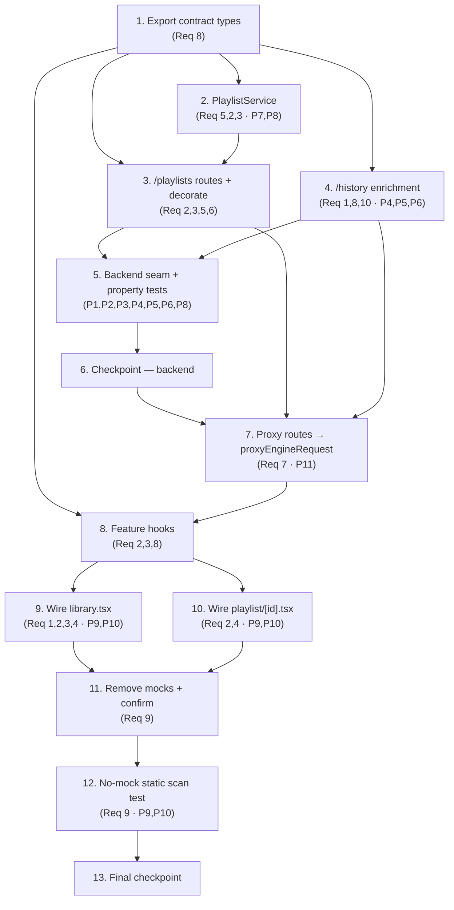

# Implementation Plan: QuantTube Real-Data Wiring (First Slice)

## Overview

This plan replaces the fake `setTimeout`+`MOCK_*` loading pattern on the QuantTube
Library (History / Playlists / Watch Later tabs) and the `playlist/[id]` detail page
with the sanctioned seam already shipped for the creator-economy surface:

```
UI page → feature hook (useApiQuery/useApiMutation) → /api/* proxy (proxyEngineRequest)
        → Fastify route (global auth hook + scope) → decorated in-memory service
```

It is sequenced **backend service + routes → proxy + hooks → page wiring → no-mock
static scan**, so every downstream layer builds on a layer that already exists and is
seam-tested. The implementation language is **TypeScript** (the design and the entire
seam are TypeScript; no language selection needed).

### Confirmed decisions folded into this plan

- **Auth scope (Req 6).** All mutating in-scope routes (create-playlist, watch-later
  add/remove, and — if surfaced — clear-history; i.e. every `POST/PUT/PATCH/DELETE`)
  share a single `library:write` scope via `requireAuth({ scopes: ['library:write'] })`,
  consistent with the repo's `creator:write` / `encryption:write` convention. Read
  (`GET`) routes require only a valid token behind the global auth hook — no extra scope.
- **Contract types (Req 8).** The page-local TypeScript interfaces remain the single
  authoritative source. This slice **exports** the nine interfaces from the in-scope
  page files and **imports** them into the feature hooks and (where needed) the backend
  route / proxy. **No new shared `types` module is created.**

### Grounding notes (read before coding)

- **`VideoService.getVideo()` THROWS, it does not return `null`.** `video.service.ts`
  is Prisma-backed and throws `createAppError('Video not found', 404, ...)` for a missing
  / soft-deleted video. The design's enrichment pseudocode assumed a nullable return; the
  implementation MUST wrap each `getVideo` in `try/catch` and treat a throw as the
  "orphaned entry → skip" path (Req 1.10, Req 3.6). Obtain `prisma` via
  `fastify.prisma` and build `new VideoService(prisma)` exactly as `videos.ts` does.
- **PBT convention.** `fast-check` is NOT a quantube dependency (only `@quant/server-core`
  declares it). The realized quantube property-test convention is a **seeded deterministic
  generator** (mulberry32) loop with ≥100 samples — see
  `backend/__tests__/creator-tier-upgrade.bug3.seam.test.ts`. Property sub-tasks below
  follow that convention (adding `fast-check` to `apps/quantube` devDependencies is an
  acceptable alternative but is optional and not required by this plan).
- **tsx-loader / vitest seam-boot convention (from the merged engine-wiring fix).** New
  backend seam tests boot the real `buildApp()` (like
  `backend/__tests__/engine-surfaces.seam.test.ts`). This resolves cleanly because
  (a) vitest/tsx resolves workspace `@quant/*` packages via their `.ts` source entries,
  and (b) `@quant/database`'s `dist` is built (the merged `engine-wiring-bugs-fix`,
  Bug 1 / PR #272) so the transitive `server-core → prisma plugin → @quant/database`
  import chain loads. New seam tests MUST use `// @vitest-environment node` and reuse the
  `engine-surfaces` HS256 `signToken(scopes, sub)` helper. (Pure-service unit/property
  tests that import only `PlaylistService` need no app boot and avoid the chain entirely.)
- **Dangling scaffolds to reconcile, not duplicate.** `app/api/interactions/history/route.ts`
  (GET → `/interactions/history`, an unregistered path) and `app/api/playlists/route.ts`
  - `app/api/playlists/[id]/items/route.ts` (legacy `_lib/proxy.ts`) already exist and are
    non-functional. This slice repoints them onto `proxyEngineRequest` and real backend paths.
- **Property tag format** for every property test: `// Feature: quantube-real-data-wiring, Property N: <property text>`.

---

## Tasks

- [x] 1. Establish the authoritative contract types (export page-local interfaces)
  - In `apps/quantube/src/pages/library.tsx`, add `export` to the existing `HistoryItem`,
    `PlaylistData`, and `WatchLaterItem` interfaces, plus add+export `HistoryListResponse`,
    `PlaylistListResponse`, and `WatchLaterListResponse` envelope-payload interfaces.
  - In `apps/quantube/src/pages/playlist/[id].tsx`, add `export` to the existing
    `PlaylistData` (detail variant) and `PlaylistVideo` interfaces, plus add+export
    `PlaylistDetailResponse`.
  - These nine interfaces are the single authoritative source (Req 8.8); no new shared
    `types` module. Downstream hooks (Task 7) and the backend route DTO mapping (Tasks 3–4)
    import from these files. Keep only interface-declared fields (Req 8.4).
  - _Requirements: 8.1, 8.4, 8.8_

- [x] 2. Implement the in-memory PlaylistService
  - [x] 2.1 Create `apps/quantube/backend/services/playlist.service.ts` exporting a
        `PlaylistService` class with exactly: `listPlaylists(userId)`, `getPlaylist(userId, id)`,
        `createPlaylist(userId, input)`, `listWatchLater(userId)`, `addToWatchLater(userId, videoId)`,
        `removeFromWatchLater(userId, entryId)` (Req 5.6). All state in-memory (no DB schema).
    - User isolation: every read/mutation filters/targets only `userId`-owned rows; a
      cross-user target is treated as not-found (no existence leakage) (Req 5.12, 5.13, 5.14, 2.7, 2.8).
    - `getPlaylist` returns `null` for an unknown or other-user id (route maps to 404) (Req 2.8, 5.9).
    - `createPlaylist`: trim+validate `title` (1..200), default `visibility` to `'private'`,
      server-assign `isSystem` (ignore any client `isSystem`) (Req 2.14, 2.15, 2.16).
    - Reserve the `Watch Later` system playlist with `isSystem=true`, server-set, per user (Req 3.3).
    - Playlist `videos` carry contiguous, unique `position` values `1..n` (no gaps/dupes);
      empty playlist → `[]` with the invariant holding vacuously (Req 2.10, 2.11).
    - `addToWatchLater` idempotent (no duplicate, order preserved); `removeFromWatchLater`
      idempotent no-op when absent; both apply a single atomic, user-scoped change (Req 3.8, 3.9, 3.10, 5.15).
    - Watch-later list ordered most-recently-added-first (Req 3.7).
    - _Requirements: 5.6, 5.9, 5.12, 5.13, 5.14, 5.15, 2.7, 2.8, 2.10, 2.11, 2.14, 2.15, 2.16, 3.3, 3.7, 3.8, 3.9, 3.10_

  - [x]\* 2.2 Write unit tests for PlaylistService
    - Create/list/get; system-playlist reservation; create defaults (`visibility='private'`,
      server-assigned `isSystem`); title trim/length rejection; cross-user get → null;
      watch-later add idempotency + ordering; remove-absent no-op.
    - _Requirements: 5.6, 5.9, 5.13, 2.14, 2.15, 2.16, 3.3, 3.8, 3.9_

  - [x]\* 2.3 Write property test — playlist position invariant
    - `// Feature: quantube-real-data-wiring, Property 7: In any PlaylistDetailResponse, videos positions form a contiguous permutation of 1..n with no duplicates.`
    - Seeded generator (≥100 cases) over playlists of random size (incl. 0); assert
      `positions` sorted == `[1..n]`, unique, no gaps.
    - **Validates: Requirements 2.10, 2.11**

  - [x]\* 2.4 Write property test — user isolation
    - `// Feature: quantube-real-data-wiring, Property 8: A playlist/watch-later read for user A never returns rows owned by user B.`
    - Seeded generator (≥100 cases) seeding rows for distinct user pairs; assert every row
      returned to A is A-owned and a create/add/remove by A leaves B's rows unchanged.
    - **Validates: Requirements 5.12, 5.13, 5.14**

- [x] 3. Add the `/playlists` backend routes and decorate the service
  - [x] 3.1 Create `apps/quantube/backend/routes/playlists.ts` exporting
        `createPlaylistService()` and the default `playlistRoutes` plugin, mirroring
        `routes/creator.ts` (Zod validation, `{ success, data }` envelope, `declare module 'fastify'`
        augmentation for `fastify.playlists`). Import the contract interfaces from Task 1 for DTO shaping.
    - `GET /playlists` → `listPlaylists(auth.userId)` → `{ items: PlaylistData[] }` (Req 2.5).
    - `GET /playlists/:id` → `getPlaylist`; `null` → 404 error envelope (no leakage) →
      `{ playlist, videos }` on hit (Req 2.6, 2.8, 5.9).
    - `POST /playlists` (mutating) guarded by `requireAuth({ scopes: ['library:write'] })`;
      Zod `safeParse` → throw on failure (→400); default visibility; ignore client `isSystem` (Req 2.12, 2.14, 2.15, 2.16, 2.17, 6.4).
    - `GET /playlists/watch-later` → `listWatchLater`, enriched from `VideoService`
      (`title/thumbnail/channelName/duration`), orphan entries skipped, most-recent-first →
      `{ items: WatchLaterItem[] }` (Req 3.4, 3.5, 3.6, 3.7).
    - `POST /playlists/watch-later` (add) and `DELETE /playlists/watch-later/:entryId` (remove),
      both guarded by `library:write`; idempotent → `2xx`, never 500 (Req 3.8, 3.9, 6.4, 6.8).
    - Map failure classes to deterministic `error.code`/`statusCode` (validation→400,
      not-found→404, authz→403 at the route boundary like the Bug-3 precedent, never 500) (Req 5.8, 5.10, 5.11, 6.8).
    - Enrichment uses `new VideoService(fastify.prisma)` with `try/catch` around `getVideo`
      (it THROWS on missing video) → skip orphan (Req 3.6).
  - [x] 3.2 In `apps/quantube/backend/app.ts`, `app.decorate('playlists', createPlaylistService())`
        exactly once at boot and `await app.register(playlistRoutes, { prefix: '/playlists' })`.
    - `/playlists` must NOT collide with any `PUBLIC_PATHS` entry — every `/playlists*` route
      requires auth (Req 5.1, 5.2, 5.3, 5.4).
    - _Requirements: 2.5, 2.6, 2.8, 2.12, 2.14, 2.15, 2.16, 2.17, 3.4, 3.5, 3.6, 3.7, 3.8, 3.9, 5.1, 5.2, 5.3, 5.4, 5.7, 5.8, 5.9, 5.10, 5.11, 6.4, 6.6, 6.7, 6.8_

- [x] 4. Add history enrichment to the backend `GET /history` route
  - In `apps/quantube/backend/routes/history.ts`, enrich the existing `GET /` handler:
    for each `WatchHistoryEntry` from `historyService.getHistory(userId, {page,pageSize})`,
    join `new VideoService(fastify.prisma).getVideo(entry.videoId)` inside `try/catch`
    (it THROWS on missing/deleted video → skip that entry; do not count it toward `total`)
    (Req 1.9, 1.10).
  - Map each surviving entry to `HistoryItem` with all fields defined: `title`, `thumbnail`,
    `channelName`, `duration` (whole seconds, ≥0) from video; `watchedAt` as ISO-8601 UTC;
    `progress = max(0, min(1, watchDuration / max(1, duration)))` (Req 1.9, 1.11, 8.2).
  - Return `{ success, data: { items, total, page, pageSize } }` conforming to
    `HistoryListResponse` (`total≥0, page≥1, pageSize≥1, items.length≤pageSize`); preserve the
    service's `watchedAt`-descending order (Req 1.8, 1.12, 5.5 → P5).
  - Pagination: defaults `page=1`, `pageSize=20`; clamp effective `pageSize` to `[1,100]`;
    reject non-numeric/non-integer params with a 400 naming the bad param; echo effective
    `page`; `total` independent of `page`; out-of-range page → empty `items` with same `total`;
    derive items/page/total from one consistent snapshot (Req 10.1–10.12). Reconcile the existing
    `paginationSchema` (currently `.min(1).max(100)` which rejects) toward clamp-where-required
    vs reject-where-required per Req 10.4/10.5 vs 10.6.
  - _Requirements: 1.8, 1.9, 1.10, 1.11, 1.12, 8.2, 10.1, 10.2, 10.3, 10.4, 10.5, 10.6, 10.7, 10.8, 10.9, 10.10, 10.11, 10.12_

- [x] 5. Backend seam + property tests (boot the real app)
  - [x]\* 5.1 Write `apps/quantube/backend/__tests__/playlists.seam.test.ts`
    - `// @vitest-environment node`; boot real `buildApp(testConfig)`; reuse the
      `engine-surfaces` HS256 `signToken` helper (tsx-loader convention; `@quant/database`
      dist built per the merged engine-wiring fix).
    - Assert: `fastify.playlists` decorated (reference-equal across requests); envelope shape;
      `GET /playlists` unauth → 401; authed (token only, no scope) → 200; `POST /playlists`
      unauth → 401, authed without `library:write` → 403, with `library:write` → 2xx;
      `GET /playlists/:unknown` → 404 (no leakage); invalid create body → 400; user isolation
      across two signed subjects; watch-later add/remove idempotent 2xx (never 500).
    - **Validates: Requirements 5.1, 5.2, 6.1, 6.4, 6.5, 6.6, 6.7, 6.8, 2.7, 2.8, 2.17, 3.8, 3.9**
    - Covers Properties P1 (envelope), P2 (401 seam), P3 (403 scope seam), P8 (isolation).

  - [x]\* 5.2 Write `apps/quantube/backend/__tests__/history-enrichment.seam.test.ts`
    - Boot real `buildApp`; seed history + videos; assert enriched `HistoryItem` totality
      (all fields defined, `0≤progress≤1`), orphan-video entries omitted and not counted,
      `watchedAt`-descending order, and the `HistoryListResponse` envelope.
    - **Validates: Requirements 1.8, 1.9, 1.10, 1.11, 1.12, 8.2**
    - Covers Properties P4 (enrichment totality), P5 (ordering), P1 (envelope).

  - [x]\* 5.3 Write property test — history pagination invariant
    - `// Feature: quantube-real-data-wiring, Property 6: For any (page,pageSize), items.length ≤ pageSize, page echoes the request, total is independent of page.`
    - Seeded generator (≥100 cases) over `(N entries, pageSize)`; read all pages and assert the
      ordered concatenation equals the full ordered set exactly once (no dupes/omissions),
      `total` constant across pages, clamp behavior holds.
    - **Validates: Requirements 10.3, 10.8, 10.10, 10.11**

- [x] 6. Checkpoint — backend layer
  - Ensure all backend unit, seam, and property tests pass (`vitest run` in `apps/quantube`),
    typecheck is clean, and `/playlists` + enriched `/history` return the envelope. Ask the
    user if questions arise.

- [x] 7. Repoint Next.js proxy routes onto `proxyEngineRequest`
  - [x] 7.1 Repoint `apps/quantube/src/app/api/interactions/history/route.ts` `GET` to
        `proxyEngineRequest(request, '/history', { searchParams: request.nextUrl.searchParams })`
        (replace the legacy `_lib/proxy.ts` import and the wrong `/interactions/history` path) (Req 7.1, 7.2, 7.3).
  - [x] 7.2 Repoint `apps/quantube/src/app/api/playlists/route.ts` `GET`/`POST` to
        `proxyEngineRequest(request, '/playlists', …)` (GET forwards `searchParams`; POST forwards
        parsed body) (Req 7.1, 7.4, 7.5).
  - [x] 7.3 Add `apps/quantube/src/app/api/playlists/[id]/route.ts` `GET` →
        `proxyEngineRequest(request, \`/playlists/${id}\`)` (Req 7.1).
  - [x] 7.4 Add watch-later proxy handlers (e.g. `app/api/playlists/watch-later/route.ts`
        `GET`+`POST` and `app/api/playlists/watch-later/[entryId]/route.ts` `DELETE`) onto
        `proxyEngineRequest` matching the backend paths from Task 3.1.
  - Each handler is one line beyond path/body/query selection, makes no auth/authz decision,
    and relays backend status + body unchanged (Req 7.4, 7.5, 7.6, 7.8).
  - _Requirements: 7.1, 7.2, 7.3, 7.4, 7.5, 7.6, 7.8_

  - [x]\* 7.5 Write proxy passthrough test
    - `// Feature: quantube-real-data-wiring, Property 11: proxyEngineRequest relays the backend status code unchanged and forwards bearer + x-request-id.`
    - Mock backend responses (2xx + 4xx/5xx envelope); assert status/body relayed verbatim and
      bearer + `x-request-id` forwarded; no status rewriting.
    - **Validates: Requirements 7.2, 7.3, 7.4, 7.5, 7.6**

- [x] 8. Implement the feature hooks (Layer 5)
  - [x] 8.1 Create `apps/quantube/src/features/library/useLibrary.ts` mirroring
        `features/creator/useCreator.ts`: `useWatchHistory`, `usePlaylists`, `useWatchLater`
        (`useApiQuery`), and `useCreatePlaylist`, `useAddWatchLater`, `useRemoveWatchLater`
        (`useApiMutation`). Type each against the contract interfaces imported from the in-scope
        pages (Task 1) and return `APIResponse<T>`; hold no UI state; never call `fetch` (Req 8.5, 8.6, 8.7).
    - Mutations invalidate the relevant query key on success (playlist-list key after create;
      watch-later key after add/remove) (Req 2.13, 3.11).
  - [x] 8.2 Create `apps/quantube/src/features/playlist/usePlaylist.ts` exporting
        `usePlaylist(id, options)` (`useApiQuery<PlaylistDetailResponse>('/api/playlists/'+id)`),
        typed against the imported `PlaylistDetailResponse` (Req 2.2, 8.5).
  - _Requirements: 2.2, 2.13, 3.11, 8.5, 8.6, 8.7_

- [x] 9. Wire `library.tsx` to the hooks (History, Playlists, Watch Later tabs)
  - Replace the single `useEffect`+`setTimeout`+`setHistory/Playlists/WatchLater(MOCK_*)`
    loader and the `loading`/`error` `useState` flags with `useWatchHistory()`,
    `usePlaylists()`, `useWatchLater()` per tab; derive loading/error/empty/data from query
    flags in precedence loading→error→empty→data (Req 4.1–4.8, 4 → P9/P10).
  - Render one row per `data.items` element in received order; empty → the existing empty-state;
    error → existing error markup with a Retry control calling `query.refetch()` (Req 1.4–1.7, 4.3, 4.4).
  - Wire the create-playlist form to `useCreatePlaylist` and Watch Later add/remove to
    `useAddWatchLater`/`useRemoveWatchLater` (Req 2.12, 3.x).
  - Remove the now-unused `MOCK_HISTORY`, `MOCK_PLAYLISTS`, `MOCK_WATCH_LATER` references and
    their state setters. Leave `MOCK_DOWNLOADS` and the Downloads tab untouched (deferred) (Req 9.2).
  - _Requirements: 1.1, 1.4, 1.5, 1.6, 1.7, 2.1, 2.12, 2.13, 3.1, 3.11, 4.1, 4.2, 4.3, 4.4, 4.5, 4.6, 4.7, 4.8_

- [x] 10. Wire `playlist/[id].tsx` to the hook
  - Replace the `setTimeout`+`MOCK_PLAYLIST`/`MOCK_VIDEOS` loader and `loading`/`error` state
    with `usePlaylist(id)`; render header + ordered video list from `data`; map query loading/
    error/empty to the existing markup; a backend `404` renders the existing "Playlist Not Found"
    branch (Req 2.2, 2.9, 4.x).
  - Remove `MOCK_PLAYLIST` and `MOCK_VIDEOS` references. Preserve the unrelated non-data-loading
    `setTimeout` (the share/copy notification at ~line 231) — it is permitted by Req 9.4.
  - _Requirements: 2.2, 2.9, 4.1, 4.2, 4.3, 4.4, 4.5, 4.6, 4.7, 4.8, 9.4_

- [x] 11. Remove in-scope mock constants and confirm wiring
  - Delete the now-unreferenced `MOCK_HISTORY`, `MOCK_PLAYLISTS`, `MOCK_WATCH_LATER` from
    `library.tsx` and `MOCK_PLAYLIST`, `MOCK_VIDEOS` from `playlist/[id].tsx` (keep `MOCK_DOWNLOADS`).
  - Confirm no in-scope page calls `fetch(` directly; all reads/writes go through the hooks (Req 9.5).
  - _Requirements: 9.2, 9.5_

- [x] 12. Add the no-mock / no-inline-fetch / no-loader static-scan test
  - Create `apps/quantube/src/__tests__/no-mock-wiring.scan.test.ts` that statically reads
    exactly `src/pages/library.tsx` and `src/pages/playlist/[id].tsx` (Req 9.1) and asserts:
    zero referenced in-scope `MOCK_` identifiers (`MOCK_HISTORY|MOCK_PLAYLISTS|MOCK_WATCH_LATER`
    in library, `MOCK_PLAYLIST|MOCK_VIDEOS` in detail; `MOCK_DOWNLOADS` explicitly allowed);
    zero data-loading `setTimeout` (a `setTimeout` not gating fetched-data rendering is allowed —
    Req 9.4); zero direct `fetch(` calls. Deterministic so two reviewers get identical results (Req 9.6).
  - `// Feature: quantube-real-data-wiring, Property 9 & 10: in-scope pages reference no MOCK_ constant, no data-loading setTimeout, and no inline fetch.`
  - **Validates: Requirements 9.1, 9.2, 9.3, 9.5, 9.6**
  - _Requirements: 9.1, 9.2, 9.3, 9.4, 9.5, 9.6_

- [x] 13. Final checkpoint — full slice
  - Ensure all unit, seam, property, and static-scan tests pass and typecheck is clean across
    `apps/quantube`. Confirm the History/Playlists/Watch Later tabs and `playlist/[id]` render
    real query-driven loading/empty/error/data states. Ask the user if questions arise.

---

## Task Dependency Graph



**Critical path:** 1 → 2 → 3 → (4) → 5 → 6 → 7 → 8 → 9/10 → 11 → 12 → 13.
Tasks 3 and 4 are independent of each other (both depend on 1; 3 also depends on 2) and may
proceed in parallel; both must complete before the seam tests (5) and proxy routes (7).

## Property → Task → Requirement Coverage

| Property                       | Test task | Requirements               |
| ------------------------------ | --------- | -------------------------- |
| P1 Envelope invariant          | 5.1, 5.2  | 2, 3, 5, 8                 |
| P2 Auth seam (401)             | 5.1       | 6, 5.1, 5.2                |
| P3 Scope seam (403)            | 5.1       | 6.4, 6.6, 6.7, 6.8         |
| P4 Enrichment totality         | 5.2       | 1.9, 1.10, 1.11, 8.2       |
| P5 Ordering invariant          | 5.2       | 1.12                       |
| P6 Pagination invariant        | 5.3       | 10.3, 10.8, 10.10, 10.11   |
| P7 Playlist position invariant | 2.3       | 2.10, 2.11                 |
| P8 User isolation              | 2.4, 5.1  | 5.12, 5.13, 5.14, 2.7, 2.8 |
| P9 No-mock invariant           | 12        | 9.2, 9.3                   |
| P10 No inline fetch            | 12        | 9.5                        |
| P11 Proxy passthrough          | 7.5       | 7.2–7.6                    |

## Notes

- Tasks marked with `*` are optional test sub-tasks and can be skipped for a faster MVP;
  core implementation tasks (and top-level tasks) are never optional.
- Each task references the specific requirement clauses and design properties it satisfies.
- Property tests follow the existing quantube seam-test seeded-generator (mulberry32) PBT
  convention with ≥100 samples; `fast-check` is not a quantube dependency (adding it is
  optional, not required).
- Backend seam tests boot the real `buildApp()` per the tsx-loader/vitest convention
  established by the merged engine-wiring fix; pure-service unit/property tests import
  `PlaylistService` directly and need no app boot.
- This slice touches only the five in-scope `MOCK_*` constants and the two in-scope pages;
  `MOCK_DOWNLOADS` and the Music / Live / Podcasts domains are deferred to follow-up specs
  (the `/live` PUBLIC_PATHS auth-bypass constraint is recorded in Requirement 11).
