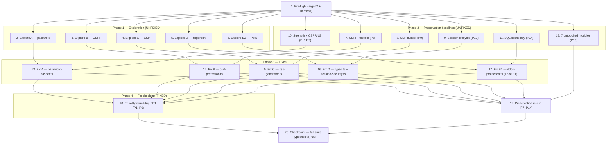

# Implementation Plan

This plan replaces the five fake-digest primitives in `@quant/security` with real cryptography,
following the bug-condition methodology: **explore** (reproduce each defect by showing the fake
digest differs from a `node:crypto`/`argon2` reference) → **preserve** (author observation-first
baselines for the untested modules) → **fix** → **fix-check + preservation re-run** → **checkpoint**.

Properties referenced below are the design's 15 correctness properties (single source of truth in
`design.md` § Correctness Properties): **P1–P6** are the fix (bug-condition) properties for defects
A–E; **P7–P15** are preservation properties.

> **IMPORTANT — Argon2id is intentionally slow (memory-hard).** Every password property/round-trip
> test (Task 2, Task 18.1) MUST instantiate `PasswordHasher` with **reduced** argon2 params
> (e.g. `memoryCost: 256` KiB or the library minimum that runs, `timeCost: 1`, `parallelism: 1`)
> so the suite stays fast. **Exactly one** test (Task 18.1) MUST additionally assert that the
> production `DEFAULT_PARAMS` are argon2id (`type === argon2.argon2id`, `memoryCost === 65536`,
> `timeCost === 3`, `parallelism === 4`, `hashLength === 32`) without running a full-cost hash in a
> hot loop. Keep sample counts small for password PBT (e.g. 10–15 random passwords), and use the
> seeded `mulberry32` generator convention (≥100 samples) only for the cheap digest properties
> (P3/P4/P5).

> **Tooling note:** `fast-check` is NOT a dependency of `@quant/security` (it exists only in
> `@quant/server-core`). Per repo convention for this package, write property-based tests with a
> seeded `mulberry32` PRNG (deterministic, ≥100 samples for cheap digests) defined inline in the
> test file. Do NOT add `fast-check` to this package.

---

## Phase 0 — Pre-flight

- [ ] 1. Pre-flight: confirm `argon2` is resolvable for `@quant/security` and the test harness is pure-unit
  - Add `"argon2": "^0.43.0"` to the `dependencies` of `packages/security/package.json` (mirrors
    `packages/auth`, which already declares it; `argon2@0.43.1` is present in the pnpm store at
    `/projects/sandbox/.pnpm-store/v10`).
  - Re-link the workspace: run `pnpm install` from the repo root (network is OPEN_INTERNET;
    node/pnpm are nvm-managed). Confirm `packages/security/node_modules` resolves `argon2` and that
    `import argon2 from 'argon2'` type-checks (`pnpm --filter @quant/security typecheck`).
  - Confirm the test harness: `packages/security/vitest.config.ts` sets `globals: true` and
    `environment: 'node'`; tests are colocated `*.test.ts` run via `pnpm --filter @quant/security test`
    (`vitest run`). Verify these are **pure unit tests** — no server/DB/network/app boot; classes are
    instantiated directly and `node:crypto` is used inline to compute reference values.
  - Run the existing suite once to capture a green baseline before any changes.
  - _Requirements: 2.1, 3.8, 3.9_
  - _Design: Overview; Testing Strategy → Validation Approach / Repo vitest conventions; Fix Implementation → Bug A (Add dependency)_

---

## Phase 1 — Exploration (reproduce each defect on UNFIXED code)

> Each exploration test is written, per the design, as a **"differs from the real reference"**
> observation: it asserts the fake digest is NOT equal to the `node:crypto`/`argon2` reference (or
> has the tell-tale short shape). These assertions **PASS on UNFIXED code** and thereby document the
> counterexample/root cause. In Phase 4 each is converted to the corresponding equality/round-trip
> property (which then PASSES on FIXED code). **Do NOT implement any fix during this phase.**

- [ ] 2. Write exploration test for Bug A — fake Argon2id KDF & hand-rolled verify
  - **Property 1: Bug Condition** - Password Hash/Verify Round-Trip with Real Argon2id
  - **IMPORTANT**: Write BEFORE any fix. **GOAL**: surface counterexamples proving the password
    digest is not real Argon2id.
  - In `src/core/password-hasher.test.ts` (extend the existing file), assert on UNFIXED code that
    `hasher.hash('x').hash` does **NOT** begin with `$argon2id$` and instead matches the 64-hex
    fake-digest shape (`/^[0-9a-f]{64}$/` for default `hashLength: 32`) — demonstrating the FNV
    `argon2idHash`/`multiRoundHash`/`xorStrings` placeholder.
  - Document that `verify()` currently compares via a hand-rolled `timingSafeEqual` char loop rather
    than `argon2.verify`.
  - Run on UNFIXED code; **EXPECTED OUTCOME**: assertion PASSES (documents the defect). Record the
    counterexample (the 64-hex digest) in the task notes.
  - _Requirements: 1.1, 1.2_
  - _Design: Bug Details → Bug A; Testing Strategy → Exploratory (case A)_

- [ ] 3. Write exploration test for Bug B — CSRF integrity tag ≠ HMAC-SHA256 reference
  - **Property 3: Bug Condition** - CSRF Integrity Tag Equals HMAC-SHA256 Reference
  - **IMPORTANT**: Write BEFORE any fix.
  - Create `src/core/csrf-protection.test.ts`. Instantiate `CSRFManager` with a known `secretKey`,
    then assert on UNFIXED code that `computeHMAC('t', 's')` (accessed via the manager) is **NOT
    equal** to `crypto.createHmac('sha256', secretKey).update('t:s').digest('hex')` — proving
    `sha256Simulate` is a forgeable pseudo-HMAC and that `secretKey` is concatenated, not keyed.
  - Run on UNFIXED code; **EXPECTED OUTCOME**: inequality assertion PASSES. Record the counterexample.
  - _Requirements: 1.4, 1.5_
  - _Design: Bug Details → Bug B; Testing Strategy → Exploratory (case B)_

- [ ] 4. Write exploration test for Bug C — CSP inline hash ≠ browser base64 reference
  - **Property 4: Bug Condition** - CSP Hash Equals Browser Reference
  - **IMPORTANT**: Write BEFORE any fix.
  - Create `src/core/csp-generator.test.ts`. Assert on UNFIXED code that
    `computeHash('alert(1)', 'sha256')` is **NOT equal** to
    `"'sha256-" + crypto.createHash('sha256').update('alert(1)').digest('base64') + "'"` — proving the
    FNV/bespoke-base64 expression never matches what a browser computes.
  - Run on UNFIXED code; **EXPECTED OUTCOME**: inequality assertion PASSES. Record the counterexample.
  - _Requirements: 1.6_
  - _Design: Bug Details → Bug C; Testing Strategy → Exploratory (case C)_

- [ ] 5. Write exploration test for Bug D — session fingerprint is 8-hex 32-bit, not a keyed digest
  - **Property 5: Bug Condition** - Session Fingerprint Equals Keyed Digest and Is Stable
  - **IMPORTANT**: Write BEFORE any fix.
  - Create `src/core/session-security.test.ts`. Assert on UNFIXED code that
    `generateFingerprint('1.2.3.4', 'UA')` matches `/^[0-9a-f]{8}$/` (only 32 bits) and is **NOT
    equal** to the HMAC reference `crypto.createHmac('sha256', fingerprintSecret).update('1.2.3.4:UA').digest('hex')`
    — proving the short, collision-prone FNV fingerprint.
  - Run on UNFIXED code; **EXPECTED OUTCOME**: assertions PASS. Record the counterexample.
  - _Requirements: 1.7_
  - _Design: Bug Details → Bug D; Testing Strategy → Exploratory (case D)_

- [ ] 6. Write exploration test for Bug E2 — proof-of-work ≠ iterated SHA-256 reference
  - **Property 6: Bug Condition** - DDoS Proof-of-Work Uses Real SHA-256 Derivation
  - **IMPORTANT**: Write BEFORE any fix.
  - Create `src/core/ddos-protection.test.ts`. Compute the reference by iterating
    `crypto.createHash('sha256').update(hash + i.toString()).digest('hex')` `difficulty` times and
    truncating to `difficulty * 2`. Assert on UNFIXED code that `computeProofOfWork(nonce, 4)` is
    **NOT equal** to that reference — proving the FNV `simpleHash` derivation a client cannot
    reproduce with a standard library.
  - Run on UNFIXED code; **EXPECTED OUTCOME**: inequality assertion PASSES. Record the counterexample.
  - _Requirements: 1.9_
  - _Design: Bug Details → Bug E (E2); Testing Strategy → Exploratory (case E2)_

---

## Phase 2 — Preservation baselines (observation-first, must PASS on UNFIXED code)

> `csrf-protection.ts`, `csp-generator.ts`, `session-security.ts`, and `ddos-protection.ts` have **no
> colocated tests**. For each, first OBSERVE the behavior on UNFIXED code, then author baseline tests
> capturing the observed outcomes. Every baseline below MUST PASS on UNFIXED code and MUST still pass
> unchanged after the fixes. `password-hasher.test.ts` and `sql-injection-guard.test.ts` already exist
> as partial baselines.

- [ ] 7. Author CSRF lifecycle + reason-code preservation baseline
  - **Property 8: Preservation** - CSRF Protocol/State Semantics and Reason Codes Unchanged
  - In `src/core/csrf-protection.test.ts`, observe and assert every `reason` code path —
    `token_mismatch`, `token_not_found`, `token_expired`, `session_mismatch`, `token_already_used`,
    `hmac_invalid`, `valid` — plus double-submit (header-vs-cookie), expiry, single-use replay
    prevention, session binding, per-session max-10 token cap, rotation, and invalidation.
  - Run on UNFIXED code; **EXPECTED OUTCOME**: all baseline assertions PASS (captures behavior to
    preserve). Note: the `hmac_invalid` path is exercised here against the current pseudo-HMAC; after
    the fix it must still trigger `hmac_invalid` only when the real keyed MAC genuinely differs.
  - _Requirements: 3.3_
  - _Design: Expected Behavior → Preservation (CSRF); Testing Strategy → Preservation (case 1)_

- [ ] 8. Author CSP builder preservation baseline
  - **Property 9: Preservation** - CSP Builder Logic Unchanged
  - In `src/core/csp-generator.test.ts`, observe and assert presets (`strict`/`moderate`/`relaxed`/
    `api-only`), directive add/remove, nonce injection, policy merge, report-only mode, and
    header-name selection.
  - Run on UNFIXED code; **EXPECTED OUTCOME**: all baseline assertions PASS. (Do NOT baseline the
    `computeHash` value here — that value is expected to change; it is covered by Task 4 / Task 18.4.)
  - _Requirements: 3.4_
  - _Design: Expected Behavior → Preservation (CSP); Testing Strategy → Preservation (case 3)_

- [ ] 9. Author session lifecycle + binding-outcome preservation baseline
  - **Property 10: Preservation** - Session Lifecycle Outcomes Unchanged
  - In `src/core/session-security.test.ts`, observe and assert concurrent-session-limit eviction,
    idle timeout, absolute timeout, rotation-on-privilege-escalation, fixation prevention,
    secure-cookie attributes, and binding **outcomes**: identical `(ip, userAgent)` still validates;
    changed attributes still fail with `fingerprint_mismatch`.
  - Run on UNFIXED code; **EXPECTED OUTCOME**: all baseline assertions PASS. Assert on binding
    _outcomes_ (pass/fail), not on the fingerprint string value (which changes after the fix).
  - _Requirements: 3.5_
  - _Design: Expected Behavior → Preservation (Session); Testing Strategy → Preservation (case 2)_

- [ ] 10. Author password strength + CSPRNG salt-randomness preservation baseline
  - **Property 11: Preservation** - Password Strength Scoring Unchanged
  - **Property 7: Preservation** - CSPRNG Generation Unchanged
  - In `src/core/password-hasher.test.ts`, ensure existing `assessStrength` assertions (score, level,
    entropy, crack-time, feedback) remain as baselines (P11). Add/confirm a CSPRNG baseline (P7): two
    `hash()` calls for the same password yield different `.salt` AND different `.hash` (salt via
    `crypto.randomBytes`).
  - Run on UNFIXED code; **EXPECTED OUTCOME**: assertions PASS. (Use reduced argon2 params only after
    the fix; on unfixed code the fake digest is instant.)
  - _Requirements: 3.1, 3.2, 3.6_
  - _Design: Expected Behavior → Preservation (assessStrength, CSPRNG); Testing Strategy → Preservation (cases 4, 5)_

- [ ] 11. Confirm SQL query-hash cache-key preservation baseline
  - **Property 14: Preservation** - SQL Query Hash Remains a Non-Crypto Cache Key
  - In the existing `src/core/sql-injection-guard.test.ts`, confirm the baseline at line ~120
    (`expect(q.hash).toMatch(/^[0-9a-f]{8}$/)`) and that every query is independently analyzed so a
    cache-key collision cannot bypass detection.
  - Run on UNFIXED code; **EXPECTED OUTCOME**: assertion PASSES. This baseline must remain unchanged
    after the fixes (E1 is intentionally not modified).
  - _Requirements: 2.8_
  - _Design: Bug Details → Bug E (E1); Fix Implementation → Bug E (E1 no change); Testing Strategy → Preservation (case 6)_

- [ ] 12. Confirm the 7 untouched real-crypto module suites pass (regression-prevention baseline)
  - **Property 13: Preservation** - Untouched Real-Crypto Modules Unchanged
  - Confirm the existing suites for the seven already-real-crypto modules pass on UNFIXED code and
    that these files are NOT modified by any fix task: `encryption.ts`, `api-key-manager.ts`,
    `oauth2-security.ts`, `honeypot.ts`, `audit-logger.ts`, `compliance-framework.ts`,
    `privacy-compliance.ts`.
  - Run `pnpm --filter @quant/security test`; **EXPECTED OUTCOME**: these suites PASS. Record the
    baseline result.
  - _Requirements: 3.8_
  - _Design: Expected Behavior → Preservation (untouched modules); Testing Strategy → Preservation (case 7)_

---

## Phase 3 — Apply the fixes (one task per defect)

> Apply only after Phases 1–2 are complete and their tests are green on UNFIXED code. Each fix is
> surgical: only digest/comparison internals change; all surrounding protocol/state/lifecycle logic
> and CSPRNG generation are preserved verbatim.

- [ ] 13. Fix Bug A — real Argon2id in `core/password-hasher.ts`
  - Add `import argon2 from 'argon2';` (keep `import crypto from 'crypto';`).
  - `hash(password)`: keep `this.hashCount++` and `salt = this.generateSalt(16)` (`crypto.randomBytes`,
    preserved). Call `argon2.hash(password, { type: argon2.argon2id, memoryCost, timeCost,
parallelism, hashLength, salt: Buffer.from(salt, 'hex') })` using the mapped `DEFAULT_PARAMS`
    (memoryCost 65536, timeCost 3, parallelism 4, hashLength 32). Return the existing
    `PasswordHashResult` shape with `.hash` = the returned PHC string, `.algorithm = 'argon2id'`
    (now truthful), `.version = 19`, `.params`, `.createdAt`, `.salt` = hex salt.
  - `verify(password, stored)`: `return argon2.verify(stored.hash, password)` (PHC string is
    self-describing; remove the `this.params = stored.params` swap and fake re-hash).
  - `checkBreach(password)`: derive the prefix via
    `crypto.createHash('sha256').update(password.toLowerCase()).digest('hex')`; keep the
    common-password set, length<6 logic, and `crypto.randomInt` counts unchanged.
  - **Delete** `argon2idHash`, `multiRoundHash`, `xorStrings`, `simpleHash`, and the hand-rolled
    `timingSafeEqual`. **Keep** `assessStrength`, `calculateEntropy`, `generateSalt`, `getStats`.
  - **Update the two shape assertions** in `password-hasher.test.ts` (keep all behavioral assertions):
    (a) the default-params test `expect(result.hash.length).toBe(result.params.hashLength * 2)` →
    `expect(result.hash).toMatch(/^\$argon2id\$/)`; (b) the custom-params test
    `expect(result.hash.length).toBe(32)` → `expect(result.params.hashLength).toBe(16)` (+ optional
    `m=,t=,p=` PHC check). Salt-randomness, verify true/false, strength, breach, and stats assertions
    are preserved as-is.
  - _Bug_Condition: isBugCondition_A — every call to hash()/verify()/checkBreach()_
  - _Expected_Behavior: Properties P1, P2 (real Argon2id PHC + argon2.verify; SHA-256 breach prefix)_
  - _Preservation: P7 (salt CSPRNG), P11 (assessStrength), P12 (PasswordHashResult shape), P15 (updated shape assertions)_
  - _Requirements: 2.1, 2.2, 2.3, 3.1, 3.6, 3.7, 3.9_
  - _Design: Fix Implementation → Bug A; Tests That Must Be Updated_

- [ ] 14. Fix Bug B — real HMAC-SHA256 + constant-time compare in `core/csrf-protection.ts`
  - `computeHMAC(token, sessionId)`: `return crypto.createHmac('sha256', this.config.secretKey)
.update(`${token}:${sessionId}`).digest('hex');` (secret as the **key**; drop the
    `:${secretKey}` suffix from the message).
  - In `validateToken`, replace `this.timingSafeEqual(storedToken.hmac, expectedHmac)` with a
    **length-guarded** `crypto.timingSafeEqual(Buffer.from(storedToken.hmac, 'hex'),
Buffer.from(expectedHmac, 'hex'))` — return `false` / `reason: 'hmac_invalid'` if buffer lengths
    differ (do the length check first). **Delete** the hand-rolled `timingSafeEqual`.
  - Preserve the existing production secret-key guard and ALL reason codes / lifecycle logic.
  - _Bug_Condition: isBugCondition_B — every call computing/comparing a CSRF integrity tag_
  - _Expected_Behavior: Property P3 (computeHMAC == createHmac reference; timingSafeEqual compare)_
  - _Preservation: P8 (reason codes & lifecycle), P7 (token CSPRNG)_
  - _Requirements: 2.4, 2.5, 3.2, 3.3_
  - _Design: Fix Implementation → Bug B_

- [ ] 15. Fix Bug C — real SHA digest + standard base64 in `core/csp-generator.ts`
  - `computeHash(content, algorithm)`: `return `'${algorithm}-${crypto.createHash(algorithm)
    .update(content).digest('base64')}'`;` Remove the FNV mixing and bespoke base64 routine.
  - Everything else in the class is untouched.
  - _Bug_Condition: isBugCondition_C — computeHash output != browser reference_
  - _Expected_Behavior: Property P4 (computeHash == createHash(algo).digest('base64') reference)_
  - _Preservation: P9 (CSP builder logic), P7 (nonce CSPRNG)_
  - _Requirements: 2.6, 3.2, 3.4_
  - _Design: Fix Implementation → Bug C_

- [ ] 16. Fix Bug D — keyed fingerprint in `types.ts` + `core/session-security.ts`
  - In `types.ts`: add `fingerprintSecret: string` to `SessionConfig`; give `DEFAULT_CONFIG` the
    sentinel `'default-fingerprint-secret-change-in-production'`. In the `SessionSecurity`
    constructor add a production guard **mirroring `CSRFManager`**: if
    `process.env.NODE_ENV === 'production'` and `fingerprintSecret` equals the default, throw
    `'SessionSecurity requires an explicit fingerprintSecret in production'`.
  - `generateFingerprint(ip, userAgent)`: `return crypto.createHmac('sha256',
this.config.fingerprintSecret).update(`${ip}:${userAgent}`).digest('hex');` Remove the FNV loop
    (now 64 hex chars, stable for identical inputs). All `createSession`/`validateSession`/
    `rotateSession` logic is unchanged.
  - _Bug_Condition: isBugCondition_D — fingerprint is a 32-bit FNV digest, not a keyed crypto digest_
  - _Expected_Behavior: Property P5 (fingerprint == HMAC reference, stable, distinct)_
  - _Preservation: P10 (lifecycle + binding outcomes), P12 (API shape; new optional-with-default config field)_
  - _Requirements: 2.7, 3.5, 3.7_
  - _Design: Fix Implementation → Bug D_

- [ ] 17. Fix Bug E2 — iterated SHA-256 PoW in `core/ddos-protection.ts` (and document E1)
  - `computeProofOfWork(nonce, difficulty)`: replace the `simpleHash` iteration with
    ```
    let hash = nonce;
    for (let i = 0; i < difficulty; i++) {
      hash = crypto.createHash('sha256').update(hash + i.toString()).digest('hex');
    }
    return hash.substring(0, difficulty * 2);
    ```
    Remove `simpleHash` if no longer referenced. Preserve `generateRandomHex`/challenge-ID/nonce
    CSPRNG generation and the `issueChallenge`→`verifyChallenge` flow.
  - **E1 (`sql-injection-guard.ts` `hashQuery`)**: NO code change. Add a brief code/test comment
    documenting it is an intentional non-cryptographic cache/comparison key (every query is
    independently analyzed, so collisions cannot bypass detection) — Property P14.
  - _Bug_Condition: isBugCondition_E2 — PoW uses FNV simpleHash instead of a real crypto hash; isBugCondition_E1 == false (documented)_
  - _Expected_Behavior: Property P6 (PoW == iterated SHA-256 reference; round-trip accept/reject)_
  - _Preservation: P14 (SQL cache key unchanged), P7 (challenge CSPRNG)_
  - _Requirements: 2.8, 2.9, 3.2_
  - _Design: Fix Implementation → Bug E (E1 + E2)_

---

## Phase 4 — Fix-checking (re-run exploration as equality / round-trip, with PBT)

- [ ] 18. Convert exploration tests to fix-checking equality/round-trip property tests
  - **IMPORTANT**: Re-use the SAME test files from Phase 1 — flip each "differs from reference"
    observation into the corresponding equality/round-trip assertion. **EXPECTED OUTCOME**: all PASS
    on FIXED code. Use the inline seeded `mulberry32` PRNG (≥100 samples for the cheap digest
    properties P3/P4/P5).

  - [ ] 18.1 Password verify round-trip + truthful algorithm (reduced params)
    - **Property 1: Expected Behavior** - Password Hash/Verify Round-Trip with Real Argon2id
    - Using a `PasswordHasher` configured with **reduced** argon2 params (fast), over ~10–15 random
      passwords `p`: assert `hash(p).hash` starts with `$argon2id$`, `verify(p, hash(p)) === true`,
      and `verify(p + 'x', hash(p)) === false`.
    - Add ONE assertion that the production `DEFAULT_PARAMS` are argon2id (type/memoryCost 65536/
      timeCost 3/parallelism 4/hashLength 32) — config-level check, not a hot-loop full-cost hash.
    - _Requirements: 2.1, 2.2_

  - [ ] 18.2 Breach prefix uses real SHA-256 with unchanged decision outcomes
    - **Property 2: Expected Behavior** - Breach Prefix Uses Real SHA-256
    - Assert the prefix derives from `crypto.createHash('sha256').update(pw.toLowerCase()).digest('hex')`
      and that decision outcomes are unchanged (`'123456'`→breached, `'ab'`→breached via length<6,
      a long unique password→not breached).
    - _Requirements: 2.3_

  - [ ] 18.3 CSRF HMAC equals `createHmac` reference (PBT)
    - **Property 3: Expected Behavior** - CSRF Integrity Tag Equals HMAC-SHA256 Reference
    - For ≥100 seeded random `(token, sessionId)` pairs, assert `computeHMAC(token, sessionId) ===
crypto.createHmac('sha256', secretKey).update(`${token}:${sessionId}`).digest('hex')`. Add an
      edge case: length-mismatched buffers in the compare path yield `hmac_invalid`, not a throw.
    - _Requirements: 2.4, 2.5_

  - [ ] 18.4 CSP hash equals browser base64 reference (PBT over content + algorithm)
    - **Property 4: Expected Behavior** - CSP Hash Equals Browser Reference
    - For ≥100 seeded random `content` strings × random `algorithm ∈ {sha256, sha384, sha512}`,
      assert `computeHash(content, algorithm) === "'" + algorithm + "-" +
crypto.createHash(algorithm).update(content).digest('base64') + "'"`. Include empty-content edge.
    - _Requirements: 2.6_

  - [ ] 18.5 Session fingerprint equals keyed digest, stable, and distinct (PBT)
    - **Property 5: Expected Behavior** - Session Fingerprint Equals Keyed Digest and Is Stable
    - For ≥100 seeded random `(ip, userAgent)`, assert `generateFingerprint` equals
      `crypto.createHmac('sha256', fingerprintSecret).update(`${ip}:${userAgent}`).digest('hex')`, is
      stable across repeated calls, and differs for distinct inputs.
    - _Requirements: 2.7_

  - [ ] 18.6 DDoS proof-of-work round-trip accepts correct / rejects tampered (PBT)
    - **Property 6: Expected Behavior** - DDoS Proof-of-Work Uses Real SHA-256 Derivation
    - For seeded random `(nonce, difficulty)`, assert `computeProofOfWork` equals the iterated
      `createHash('sha256')` reference and that `issueChallenge`→recompute→`verifyChallenge` accepts
      the correct answer and rejects a tampered one. Include `difficulty = 0` edge.
    - _Requirements: 2.9_

---

## Phase 5 — Preservation re-run & checkpoint

- [ ] 19. Re-run all preservation baselines on FIXED code
  - **Property 7–14: Preservation** - re-run Tasks 7–12 unchanged.
  - **IMPORTANT**: Re-run the SAME tests authored in Phase 2 — do NOT write new ones. **EXPECTED
    OUTCOME**: all still PASS (no regressions). Confirm CSRF reason codes (P8), CSP builder (P9),
    session lifecycle + binding outcomes (P10), assessStrength (P11), CSPRNG salt randomness (P7),
    SQL 8-hex cache key (P14), and the 7 untouched module suites (P13) are all green.
  - _Requirements: 3.1, 3.2, 3.3, 3.4, 3.5, 3.6, 3.7, 3.8, 2.8_
  - _Design: Testing Strategy → Preservation Checking_

- [ ] 20. Checkpoint — full suite green + typecheck + property coverage
  - **Property 15: Preservation** - Existing Suite Passes (with Updated Shape Assertions)
  - Run `pnpm --filter @quant/security test` (all green) and `pnpm --filter @quant/security typecheck`
    (clean). Confirm the only updated assertions are the two `password-hasher.test.ts` shape
    assertions (Task 13); all behavioral assertions preserved.
  - Verify each of **P1–P15** is covered: P1–P6 by Tasks 18.1–18.6; P7–P15 by Tasks 7–12/19/13/20.
    Confirm the 7 untouched modules + `sql-injection-guard.ts` still pass.
  - Ask the user if any questions arise.
  - _Requirements: 3.9_
  - _Design: Testing Strategy → Validation Approach; Tests That Must Be Updated_

---

## Task Dependency Graph



**Reading the graph:** Pre-flight (1) unblocks all Phase 1 exploration and Phase 2 preservation
baselines, which are authored and verified on UNFIXED code. Each fix (13–17) depends on its matching
exploration test and the relevant preservation baseline(s). After all fixes, Phase 4 fix-checking
(18) flips the exploration observations into equality/round-trip property tests, and the preservation
re-run (19) re-confirms Tasks 7–12. The checkpoint (20) gates on both the fix-checking and
preservation re-run being green.
