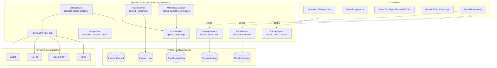

# Design Document — Unified Quant Credits & Creator Payouts Economy

## Overview

The authoritative credits subsystem already exists inside QuantMail
(`apps/quantmail/backend/modules/billing/`) over four Prisma models
(`CreditLedgerEntry`, `PlanSubscription`, `PaymentRecord`, `OverageSetting`). This design
**extracts** that subsystem into a shared, app-agnostic package `@quant/credits` and **migrates**
every ecosystem consumer onto it, replacing the four in-memory duplicates. No new ledger/wallet/
overage Prisma models are introduced — the existing ones are the single source of truth.

Strategy: **strangler-fig migration**. Extract first (no behavior change), then redirect each
legacy service to delegate to `@quant/credits`, then delete dead code. Each step keeps typecheck +
tests green and lands as its own PR.

## Architecture



## Components and Interfaces

### 1. Package extraction (`@quant/credits`)

- Move `apps/quantmail/backend/modules/billing/services/*` → `packages/credits/src/`.
  - `CreditWallet`, `UsageGate` (+ in-memory ports), `OverageService`, `PlanService`,
    `BillingService`, `PricingEngine`, `payment-provider.port`, adapters.
- The one cross-cutting dependency is `shared/ownership-authz`. Decision: move the authz **port
  interface** into `@quant/credits` and inject the concrete rule at the call site (quantmail keeps
  its `ownerOnlyAuthz` and passes it in), so the package stays domain-free.
- `@quant/credits` depends only on `@prisma/client` (types) + `@quant/server-core` (createAppError)
  - `zod`. It must NOT import any app.
- QuantMail re-exports from `@quant/credits` so its existing imports keep working (compat shim),
  then are updated to import directly.
- **Acceptance:** `@quant/database`, `@quant/credits`, `@quant/quantmail` typecheck; quantmail
  billing tests pass unchanged after re-pointing imports.

### 2. PaymentProvider port + adapters (Req 2)

```ts
interface PaymentProvider {
  id: 'stripe' | 'razorpay' | 'paypal' | 'crypto';
  createCheckout(input: CheckoutSessionInput): Promise<CheckoutHandle>; // provider-hosted; no PAN stored
  verifyWebhook(rawBody: Buffer, signature: string): PaymentEvent; // throws on bad signature
  isConfigured(): boolean; // false → fail closed
}
```

- Stripe + Razorpay/UPI adapters reuse existing real SDK code in `packages/payments`.
- PayPal + crypto adapters are new, behind the same port (fail-closed when keys absent).
- `BillingService.handleWebhook` stays idempotent via `PaymentRecord.providerEventId` (@unique).

### 3. PayoutService + `Payout` model (Req 3, 4)

- **New Prisma model `Payout`** (the only schema addition): `id, ownerRef, amountCredits, method
(upi|crypto|bank), status (pending|processing|completed|failed), providerRef?, requestedAt,
settledAt?`. Migration `00xx_payouts`.
- `requestWithdrawal(owner, amount, method)`:
  1. compute `earnedTotal = CreditWallet.getEarnedTotal − sum(prior non-failed payouts)`.
  2. reject if `amount > earnedTotal` (no overdraw) or beyond daily limit.
  3. in a transaction: `CreditWallet.debit` (actionKey=`payout:{id}`) + create `Payout(pending)`.
  4. dispatch to rail adapter; on terminal failure → append reversing credit + mark failed.
- Daily limit + compliance hold threshold are config (Req 9).

### 4. MarketplaceLedger (Req 8)

- `purchase(buyer, seller, listingId, priceCredits, commissionRate)`:
  - single idempotent unit (actionKey=`mkt:{listingId}:{buyer}:{nonce}`): debit buyer,
    credit seller earned-balance `price*(1−commission)`, record commission entry.
  - reject if buyer insufficient (overage OFF). Boost purchases reuse `debit` then activate boost.
- Reuses `CreditWallet` only; no new balance store.

### 5. Migration of legacy in-memory services (Req 1)

| Legacy (in-memory)                                   | Action                                                                                    |
| ---------------------------------------------------- | ----------------------------------------------------------------------------------------- |
| `payments/compute-credits.service`                   | replace deduct/purchase with `UsageGate`/`CreditWallet` calls; keep API, delegate.        |
| `payments/unified-wallet.service` + `wallet-service` | delegate balance/add/spend/cashout to `CreditWallet`/`PayoutService`; drop internal Maps. |
| `quant-economy/coins/*` (CoinWallet, earn)           | map coins→credits; delegate to `CreditWallet` (earn-kinds).                               |
| `creator-economy/credits/quant-credits` + `payouts`  | delegate to `CreditWallet`/`PayoutService`.                                               |
| `user-owned-ai/daily-allowance`                      | delegate to `CreditWallet.grantDaily`/`UsageGate` (real atomic ledger).                   |

- Each legacy class keeps its public method names (callers unaffected) but its body delegates.
  Where a caller can be repointed directly to `@quant/credits`, do so and delete the shim.

### 6. QuantTrinity config wiring (Req 9)

- Move QuantTrinity's in-memory `CreditConfig` to a persisted store (new tiny `PlatformConfig`
  row OR reuse a settings table) read by `PricingEngine`/`PlanService`/`OverageService` defaults.
- Expose owner-only endpoints to set `usdPerCredit`, dailyFreeCredits, commissionRate, plan catalog.

## Data Models

Existing (unchanged): `CreditLedgerEntry`, `PlanSubscription`, `PaymentRecord`, `OverageSetting`.

New:

```prisma
model Payout {
  id           String   @id @default(cuid())
  ownerRef     String
  ownerType    String   @default("user")
  amountCredits Int
  method       String   // upi | crypto | bank
  status       String   @default("pending") // pending|processing|completed|failed
  providerRef  String?
  reason       String?
  requestedAt  DateTime @default(now())
  settledAt    DateTime?
  @@index([ownerRef, status])
  @@map("payouts")
}
```

(Optional `PlatformConfig` single-row table for owner credit config if no settings table exists.)

## Error Handling

- Money paths fail closed: `OUT_OF_CREDITS` (402), `UPGRADE_REQUIRED` (402/403), `OVERAGE_DISABLED`,
  `PROVIDER_NOT_CONFIGURED` (503), `WITHDRAWAL_EXCEEDS_EARNED` (400), invalid webhook → 400, no grant.
- All ids/keys via `crypto.randomUUID()` / crypto-strong; never `Math.random()`.
- Negative derived balance → hard 500 `BALANCE_INVARIANT_VIOLATED` (never serve).

## Testing Strategy

- **Unit:** CreditWallet (credit/debit/grantDaily idempotency + bucket order), UsageGate reserve/settle,
  OverageService default-OFF + ceiling, PlanService entitlements, BillingService webhook idempotency,
  PayoutService no-overdraw + failure-refund, MarketplaceLedger atomic + commission + double-spend.
- **Migration safety:** each repointed legacy service keeps its existing tests green (delegation
  preserves behavior); add tests asserting no in-memory Map balance remains authoritative.
- **Contract:** payment-provider port has a deterministic `FakePaymentProvider` for tests.
- Per touched package: `pnpm --filter <pkg> typecheck` = 0 and `test` green before each PR.

## Rollout (PR sequence)

1. Extract `@quant/credits` (move + re-export shim; quantmail green).
2. Add `Payout` model + migration + `PayoutService` (+ tests).
3. PaymentProvider port + PayPal/crypto adapters (+ FakeProvider tests).
4. MarketplaceLedger (+ tests) and wire one marketplace (quant-economy store).
5. Migrate legacy services to delegate (one package per PR).
6. QuantTrinity persisted credit config + owner endpoints.
7. Wire creator payouts (tube/sync/neon/max/edits) + QuantAds revenue → earned credits.
   Each step is independently shippable and reversible.

## Correctness Properties

These invariants must hold across every consumer and every PR in the rollout. They are the
acceptance backbone for the test suite.

### Property 1: Ledger is the only source of truth

Any owner's spendable balance equals `sum(CreditLedgerEntry.amount)` for that owner (credits
positive, debits negative). No in-memory `Map`/`Set` is ever authoritative for money after
migration. Test: after each migrated service, grep finds no surviving authoritative balance Map.

**Validates: Requirements 1.1, 1.6, 10.1**

### Property 2: Append-only ledger

Ledger entries are never updated or deleted. Reversals are new compensating entries. A derived
balance is never persisted as a mutable field.

**Validates: Requirements 1.1, 10.1, 10.2**

### Property 3: Idempotency

Every credit/debit/grantDaily/settle is keyed by a stable `actionKey` (`payout:{id}`,
`mkt:{listingId}:{buyer}:{nonce}`, reservation key, `providerEventId`). Replaying the same key
produces no second balance change.

**Validates: Requirements 7.5, 8.5, 10.3**

### Property 4: Fail closed

When a payment/payout provider is not configured, or balance is insufficient and overage is OFF,
the action is rejected (402/503) and no credits move. Overage defaults OFF for every owner until
explicitly opted in.

**Validates: Requirements 2.6, 5.5, 6.1**

### Property 5: No overdraw on payouts

`requestWithdrawal(amount)` is rejected unless `amount ≤ earnedTotal − sum(prior non-failed
payouts)` and within the configured daily limit. On terminal rail failure a compensating credit
restores the balance.

**Validates: Requirements 4.1, 4.6, 3.4**

### Property 6: Atomic marketplace settlement

A purchase debits the buyer and credits the seller (minus commission) within a single transaction
keyed by one actionKey; partial application is impossible. Insufficient buyer balance (overage OFF)
rejects the whole unit.

**Validates: Requirements 8.1, 8.5**

### Property 7: Crypto-strong identifiers

All ids, nonces, secrets, and codes on money paths use `crypto.randomUUID()` /
`crypto.randomBytes` / `crypto.randomInt`. `Math.random()` never appears on a money path.

**Validates: Requirements 10.1**

### Property 8: Balance invariant

A derived balance that computes negative for a non-overage owner is a hard fault
(`BALANCE_INVARIANT_VIOLATED`, 500); the system never serves a corrupt balance.

**Validates: Requirements 10.1, 10.2**
